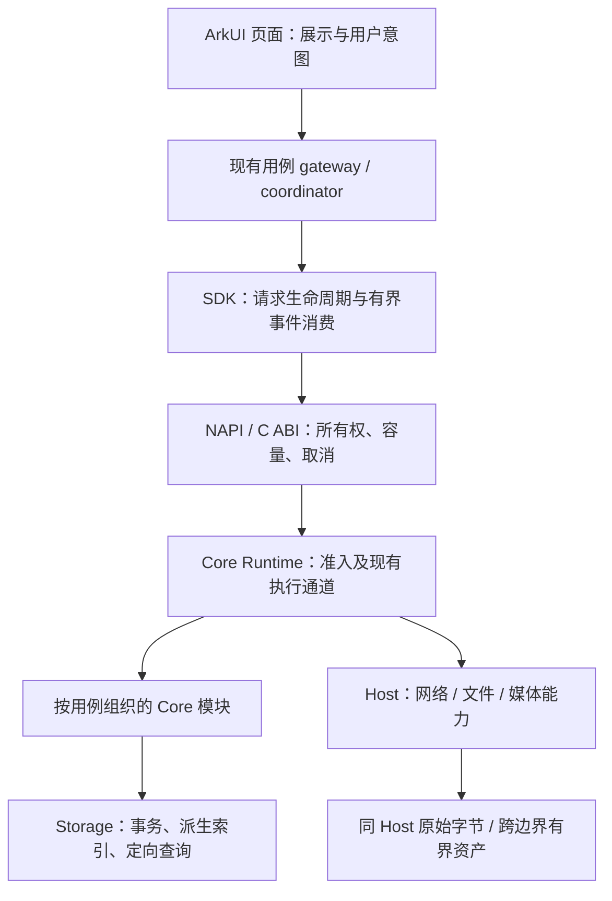
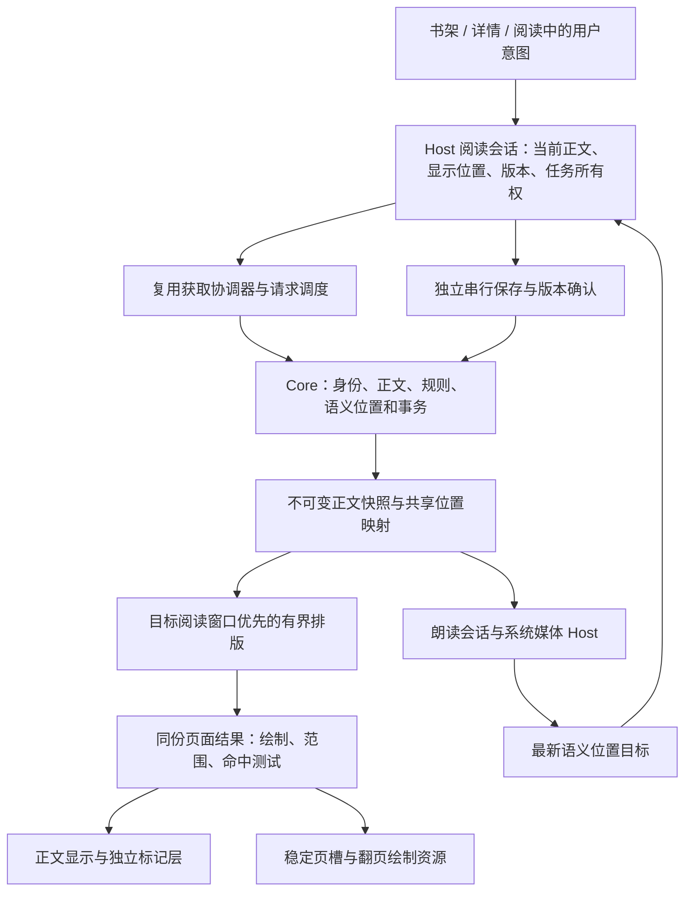
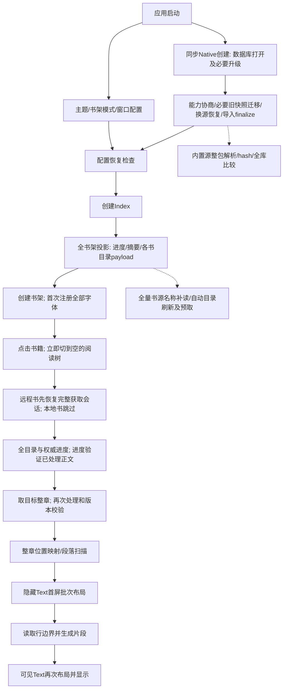

# Reader 修复实施规格

版本：2026-09-13 基础规格，含后续明确修订；§17 为架构与性能优化及其实施证据，§18 为 2026-09-20 Legado 对照全量架构方案。§18.1–18.9给出方向，§18.10–18.16补齐全范围承接、数据合同、实施切片、依赖、回退及验收。各条“当前”绑定其记录时点，不能将历史待修项直接当成最新缺陷；最新执行约束以§18.11和用户后续决定为准。方案、实现和验收始终分开。

执行授权更新：用户随后明确“那就全量实行，可以适当开子 agent 执行”。本规格全量进入实施，包括本规格明确提出的菜单、默认边距、Night补色和导入时序；它们的来源仍标记为实施提案，不改称Figma原值或历史决定。此授权覆盖下文审计当时的“不执行”与“实施前确认”限制。实际实现、回归、构建、设备及用户验收分别更新根总账，不随授权自动完成。

本文是专项实施合同，当前任务状态只维护于根 `DEVELOPMENT_BACKLOG.md`，包括既有任务及 AP/LA。下列“当前”均指对应审计输入快照；实施后不在本文另开第二份待办。修改需求时先更新合同版本、来源及差异，再改实现和测试，不得由代码反向改写需求。

2026-09-14真机审视补充：[41项反馈及包身份](../evidence/2026-09-14-physical-review/FEEDBACK.md)是本合同的新输入，覆盖对应旧的局部规则，不撤销未涉及的完整范围。最新明确差异：搜索历史两行及“展开/收起”；单书操作弹窗改为与书架封面一致的外边距且底角直角；详情元信息统一行高/字样并优先书源名称宽度；外观页去掉与设置重复的翻页/对齐入口；阅读主题色块使用实际纸色预览。胶囊生产时间域统一压缩至原设计的0.5倍（有效运动1150ms、语义完成1750ms），原始3500ms Figma数据保留，页数/胶囊/状态栏/控制栏/资源释放同轴映射；中间帧增加页数与胶囊不相交约束。亮度复用固定版本AOSP HLG分配低亮度操作距离，不将系统设置0–255误称设备nits/舒适区校准。下拉在线书刷新按用户要求登记功能缺口，不能只接旧缓存路径冒充完成。实际源定位、实现、本地门禁与待验状态见根总账及分项证据，补充反馈不等于全项已验收。

## 0. 授权、依据与证据边界

2026-09-14追加PH48–55：小横条统一位置来源，完整下拉沿用已定关闭整体、点击回Quick，持有触摸直至Up/Cancel；搜索底线贴实际查询行、按钮轮廓明确；自动翻页恢复顶部模块/状态行，保留无返回按钮。新增替换规则明确夜间输入色、小圆角/小字号、取消重复输入备注、固定底部保存/取消、顶部返回仅关闭编辑；阅读入口新建默认真实书名/在线书源范围，沿用Core任一命中，编辑旧规则及独立管理入口不改。章节滑条连续调节成功后保持控制栏开启，目录/搜索结果跳转保持原策略。详细原因、参考出处、实现和验收边界见[PH48–55](../evidence/2026-09-14-physical-review/FOLLOWUP_48_55.md)。

2026-09-14追加纠正（PH43–PH47）：上一段“阅读主题色块使用实际纸色预览”是错误修复方向，已被用户驳回。原Make八个色块为阅读背景基色依据；恢复原色块，更新正文、离屏页与状态栏对应基色，保留主题ID/日夜联动/文字色/既有纹理。作者沿上一包ReaderInter Regular 13fp/17.55行高，保留“作者：”前缀；详情书名至分组整个右栏与86×122封面等高，不靠放大外卡容纳超高。朗读状态资料在首个稳定正文后后台准备，不能自动播放；源名缺失不能被推断为删除。独立发现、因果和验证见 [PH43–PH47](../evidence/2026-09-14-physical-review/FOLLOWUP_43_47.md)，PH42多级目录适配仍为功能缺口。

本轮授权是：完整定位、写方案、按内容提交已有修改。不是继续执行整个新方案。整理提交不改变原有生产文件字节；既有错误和半成品用 WIP 提交保存，禁止作为可交付候选。

审计起点：Harmony `50cad401ffc6d235f4ac388136ee5213b9b736ad` 加既有工作树；Core `e0e4b550bcffd3b959d7b90fa599c1df713f479e` 加既有工作树。整理后的精确提交见 `evidence/2026-09-13-current-gap-register/workspace-commit-receipt.json`。Reader-UI 和其他根层仓库/工作树单独核对，不把根目录初始化为新 Git 仓库，不搬移或删除历史工作树。

依据优先顺序：用户最新明确决定 → 本轮取得的 Figma/Make 设计与动效 → 当前源码事实 → 旧文档/记忆。旧助手的“已完成”“设计没定义”“待决定”都不是产品授权。互相矛盾的原始记录保留为证据，本文明确覆盖相应旧结论。

禁止继承以下错误口径：

- 320/260/200/220ms 属于控制栏，不是胶囊；胶囊有完整 3500ms Figma 轨道。
- 控制栏改为全不透明的旧规划已被撤回。应用配色归属改变，既有透明度/阴影/模糊/层级按现有实现和对应设计保留；单书操作弹窗的不透明要求单独有效。
- `ReaderControlThemeStyle` 忽略参数、Panel 未消费它，不等于主题模块已完成。
- 远程 TOC 已有缓存、同源身份与去重；旧 envelope/数组兼容问题已修，不能重复列为当前根因。
- 字体/分页/亮度/持久化不能只以正则匹配、构建通过或 HDC 返回成功证明真实效果。
- 原列表四行不允许借重新排版改变原有文字字号、字重和字体。
- 源码、本地测试、HAP、VM、真机、用户验收分六层，不能互相替代。本轮无新 HAP、安装或设备测试结论。

## 1. 原反馈完整映射

用户原编号重复了“8”，实际有 21 个独立条目。保留原编号，用 U01–U21 防止后续漏项。下表是审计快照，不是新建状态总账。

| 合同 ID / 用户原号 | 当前已有实现 | 尚需完成的具体内容 | 对应规格 |
|---|---|---|---|
| U01 / 1 | 收起/唤起会触发 window policy；已传阅读 ink | 多处误以 reader 激活当 control 可见；统一一开关与系统状态栏所有权 | §3 |
| U02 / 2 | sourceName 字段与 source.list 回填 | 移除 URL/sourceId 的显示回退；冷恢复、删源仍有可靠名称 | §5.1 |
| U03 / 3 | 主列表分作者/章节，并拆 source/progress | 多选列表仍拼字符串；窄屏固定宽度重叠；共用四行投影 | §5.1 |
| U04 / 4 | 检查更新移除系统 Button 最小高；图标切资源 | 筛选展开态的背景/轮廓/间距未对齐；区分筛选与整理 | §5.2 |
| U05 / 5 | 四入口、共享 sampler、快照/圆点/终态胶囊 | 启动等待、capture空档、换树、暂停键错组、文案延后、页码跳位、尺寸/旧测量 | §4 |
| U06 / 6 | 阅读8套基础纸色/文字色；应用固定Day tokens | 两套应用/八套阅读注册、角色、联动、迁移、持久/同步及所有消费者 | §2 |
| U07 / 7 | 两个旧设置字段和安全区计算存在 | 合并一个可见开关；状态栏与自绘顶部信息互斥/同高；不重复留白 | §3 |
| U08 / 8a | 完整面板已避让 topBar，按 viewport 限高 | 内部实际内容滚动、IME/短屏/横屏、所有模块统一预算和收起命中 | §3.3、§6 |
| U09 / 8b | More 已被接成当前页书签切换 | 此接法不是完整 More 定义；按 §5.3 的来源边界修复，不能称已完成 | §5.3 |
| U10 / 9 | 单行成功/失败图标；结果 Scroll；按数量缩高 | 摘要仍固定警告图标；刷新SVG/裁剪；真实行高、短屏、按钮尺寸 | §7 |
| U11 / 10 | 中央区域已可点；picker 在 importing 前 | 防双开；取消返回；离页后旧 bool 回写；资源和事务生命周期 | §7 |
| U12 / 11 | 导入三个静态状态树 | 进行、成功反馈、结果交接动效；不能假进度或仅旋转一张静态图当全部完成 | §7.4 |
| U13 / 12 | 顶More四路由；工具栏已接完整管理页 | 恢复已定轻量分组选栏；菜单样式图与业务决定分离，书架设置进入实际设置区 | §5.2 |
| U14 / 13 | 搜索历史有收起、独立尾行按钮 | 按实际宽度填满折叠区域；固定操作槽；长词/旋转/字体缩放 | §8.1 |
| U15 / 14 | 清理 lrm/rlm、全角分号及部分方向字符 | 用既有通用实体解析能力，统一各入口；安全保留正常文本和身份 | §8.2 |
| U16 / 15 | loading/results 共用一个原生 loader 容器 | 全搜索生命周期保持 actor 与屏幕位置；按参考动效，不以系统默认代替设计 | §8.3 |
| U17 / 16 | version/identity校验、TOC非空检查及diagnostic字段 | 已复现 bookUrl 缺失；错误分类/变量/卷标题/分页/诊断消费 | §9 |
| U18 / 17 | 书架命中传 shelfSnapshot、缓存快路径、singleflight | 旧 acquisition 绕缓存；catch-all；删源离线读；持久事实优先 | §9 |
| U19 / 18 | 正文32/44.44vp与共享layout；新增profile参数 | Math.max仍锁32，24不生效；单事实宽度与重排位置保护 | §3.4 |
| U20 / 19 | 自动亮度状态/无障碍文案；1/.72透明度差 | 正确显示自动/手动状态与原生失败回滚，遵循设计选中态 | §10 |
| U21 / 20 | MOVE实时预览、16ms节流回调 | lookup代次淘汰会饿死所有中途写；单在途+latest pending、末值flush | §10 |

追加范围不得遗忘：旧快捷设置标题/边框/圆角、TTS副文案/0.50x、自动翻页无返回/速度/播放框、收起按钮、书架永久模式、原翻页14项和12类性能证据、Make/TTS七组；分别并入 §5/6/10/11。

## 2. 主题架构与颜色约束

### 2.1 一处定义，两个作用域

建立一个跨平台主题定义注册表，建议放 `Reader-UI` 的设计配置目录；平台只保留颜色格式、窗口、资源与响应式尺寸适配。Core 保存选择配置和同步合同，不负责把 ArkUI/SwiftUI/Android 绘制对象写入备份。

定义包含：`schemaVersion, themeId, scope(app|reader), scheme(day|night), displayNameKey, order, roles, effects, provenance`。ID 稳定，不以展示名/数组位置为身份。角色必须有完整类型，缺值构建失败；不得隐式回退 Day 色块。渐变、纹理、阴影、透明度、状态色和图标着色均在表内，不能仅集中背景色。

| 作用域 | 消费位置 |
|---|---|
| AppPalette，固定Day/Night两套 | 书架/搜索/导入/设置/详情/目录/换源/控制栏全部模块、TTS、自动翻页、播放胶囊及应用弹层 |
| ReaderPalette，初始8套且可扩展 | 正文纸色/纹理/文字、阅读顶部及底部信息、状态栏/导航栏、正文选区/高亮/搜索命中、仿真纸张正反面和翻页阴影 |

“跟随应用主题”不等于同一色值涂满所有控制模块。现有TTS与通用控制栏的主色/次级色差别保留为App角色。应用表面换色时保留当前alpha合成层次；不能从某个子层62%直接声称最终画面38%透正文。先列实际父子表面、motion opacity、mask、blur的合成关系，再做同主题对照。

### 2.2 已存在的8套阅读基础色必须原样迁入

来源：`ReaderAppearanceRenderStyle.ts`。选择器swatch不是正文paper。

| ID | scheme | paperStart → paperEnd | ink | 纹理/光照 |
|---|---|---|---|---|
| day | day | #FFFFFF → #FFFFFF | #2B241D | 无/无 |
| warm | day | #FFF6E9 → #FFF6E9 | #2C241D | 无/无 |
| paper | day | #FBF4E9 → #EFE2D0 | #2B241D | 有/有 |
| green | day | #EEF5E8 → #EEF5E8 | #263423 | 无/无 |
| night | night | #26231F → #26231F | #E9DECE | 无/无 |
| warmNight | night | #27231F → #27231F | #E7D8C8 | 无/无 |
| paperNight | night | #302B26 → #211F1C | #E9DECE | 有/无 |
| greenNight | night | #202B26 → #202B26 | #D8E2D2 | 无/无 |

新安装默认日/夜阅读主题分别为排序中的第一个 `day/night`；迁移已有有效 active/default ID 必须保留，不把当前 `paper/paperNight` 默认配置粗暴清空。用户修改默认项以前已选中该主题，因此“设为默认”只写当前theme对应scheme的默认ID，不额外跳另一主题。不能将夜主题设为默认日主题。

阅读角色补齐规则：status background 对齐纸色顶部实际端点，status foreground 精确使用 ink（无额外 alpha）；顶部信息使用阅读palette的专属meta角色，迁入现有 `#766C61/#C8C0B4` 并记录对应scheme，不能误改为App色。正文高亮/标记/选区和纸背/阴影从现有消费者提取成独立角色，保留已有状态和强度，不通过主题ID的字符串包含night来散落判断。

### 2.3 App颜色完整性门禁

当前生产 `ReaderTokens.ets` 主要是Day，不能说已经存在完整Night。必须把App运行角色逐项列全：paper、surfaceSolid、card、cardHi、panel、panelSoft、elevated、field、mask、ink、muted、controlInk、icon、primary、onPrimary、accent、success、warning、danger、line/lineStrong、divider、selected/pressed/disabled、shadow，以及TTS/目录/换源局部角色。

已确认必须保留的Day举例：paper `#F8F4EC`；solid `#FFFCF8`；card `#E6FFFCF8`；panel `#9EFFFCF8`；panelSoft `#A3EEE6DB`；ink `#1F1B17`；muted `#756F69`；primary `#2D4A3E`；onPrimary `#FFFAF4`；control ink `#332C25`；control primary `#2F6373`。`#AARRGGBB`与平台RGBA转换只能在适配器完成一次。

本轮现场枚举证明Figma `Reader · App Color`（245:3）确有Day245:1与Night254:0，88项均有双模式值，37项不同、51项相同。**“Figma没有Night”旧结论作废；生产未接Night和设计未定义Night是两回事。** 完整88项和变量ID/解析值见[配色证据](../evidence/2026-09-13-current-gap-register/theme-figma-app-colors-audit.md)，这是本合同组成部分。

可直接复用的Night：runtime paper `#24211E`、bright `#2C2824`、paperSolid `#1C1A18`、surface `#E52A2622`、ink `#EADFCE`、muted `#BAAD9C`、border `#33E2D1B9`、primary `#D2BD96`、primaryDark `#7A684F`、accent `#D69B5F`；另27项书架/设置/书源/换源专用Night逐项原样迁入。注意：Figma原始8位为RRGGBBAA，本段已换成ArkUI AARRGGBB；注册表采用明确RGBA字段，适配器转换一次。

Night补齐的完整候选（**本方案推导，尚未回写/确认Figma**）如下；保留每个实际消费层原alpha，用已有Night基色，不从零制定新色系：

| 角色 | Night候选（AARRGGBB） | 规则 |
|---|---|---|
| panel / panelSoft | #9E2A2622 / #A32C2824 | Night surface/bright + 原alpha |
| elevated / field / disabled | #C72C2824 / #C72C2824 / #C22C2824 | bright + 原alpha |
| surfaceSolid / translucent | #EB2A2622 / #6B2A2622 | surface RGB + 原alpha；solid名称不意味着强改FF |
| select top / bottom / card | #FF2C2824 / #FF24211E / #FF2A2622 | 保留渐变与卡片层级 |
| line / strong / hard | #2EE2D1B9 / #57E2D1B9 / #66E2D1B9 | 已有Night border RGB + 各层原alpha |
| primarySoft / bg / strong / border | #17D2BD96 / #1FD2BD96 / #47D2BD96 / #6BD2BD96 | primary派生，不用Day绿染Night |
| selectChevron | #FFBAAD9C | Night muted |
| selectTrigger / selectedPhone / selectedTablet | #0FD2BD96 / #0ED2BD96 / #0FD2BD96 | 原状态alpha |

10个浅色surface候选用于补齐明确残留；11个line/primary/select候选须逐组合对照；7个同值语义常量先沿用。不能把所有51个同值都判错。当前onPrimary浅色与Night primary亮色组合需要单独检查：建议Night通用App实心动作底用primaryDark、强调文字/描边用primary，通用onPrimary继续当前浅色；控制/TTS亮色主按钮另用深色onControlPrimary，不能套同一前景角色；若原组件实际用法不同，以该组件合成样张登记，不能默认浅字配浅底。完整消费者映射表是本合同组成部分：[theme-control-role-mapping.md](../evidence/2026-09-13-current-gap-register/theme-control-role-mapping.md)。它逐项覆盖TOK_READ、18项TOK_TTS、7个controlTheme字段、共享表面、动态渐变和所列裸色，分别给Day实际值、Night候选RGB与原alpha，不能只拿88个Figma变量清单当完成。

尤其拆分TOK_TTS_PAPER：容器surface候选#FF2A2622、亮主色上的onPrimary候选#FF1C1A18、slider/switch thumb候选#FFEADFCE；TOK_READ_BODY_INK正文和目录消费者也拆Reader/App角色。FigmaE5与当前E6量化差别保留各自来源，不在迁移中偷偷修改Day。Night控制局部主色保持独立键，即使候选RGB暂相同也不合并掉未来扩展角色。

现有App surface与Night专用source-switch等alpha若不同，以冻结的对应模式值为依据；用户“按现有实现来”所保留的是透明效果和层级，不允许未经记录统一抹成opaque。单书75%菜单的实色要求独立优先，使用对应Night surface RGB的FF host底。

实现结构、联动和持久化不依赖这些候选的视觉确认，可先做；全量视觉验收必须等待所有角色有来源/候选和样张，不能把复制Day写成已完整支持Night。

### 2.4 联动状态机：只处理一次用户意图

持久配置为 `appThemeMode(day|night|system), readerThemeId, defaultDayReaderThemeId, defaultNightReaderThemeId`。`systemScheme/effectiveAppScheme` 是运行时派生值，不进备份。单个 reducer/事务产生新快照，一次发布给各平台消费者，带origin防派生事件回流。

| 事件 | 必须得到的结果 |
|---|---|
| 设置页手动选Day/Night | app改固定模式；reader切对应默认主题 |
| 设置页选跟随系统 | appMode=system；按当时系统scheme切对应默认reader |
| system变化且appMode=system | 两作用域按新scheme原子更新，reader切对应默认 |
| system变化且appMode固定 | 不改变用户配置 |
| 阅读选任意与当前effectiveApp同scheme主题 | reader保留该具体ID；appMode原样保留，尤其不能取消system |
| 阅读选相反scheme主题 | reader保留用户明确选的ID；app改对应固定模式并取消system；不得被第二次“app改变”事件重置成默认reader |
| 当前阅读主题设默认 | 只更新它所属scheme的default ID，active ID不变 |
| 同步恢复 | 一个事务校验/迁移全部选择；冲突由用户手动选择，不按时钟自动覆盖 |

备份结构固定为 `themeSelection: { version:1, appMode, reader:{ id, scheme }, defaultDayReaderId, defaultNightReaderId }`。这仍是四项逻辑选择，reader.scheme只是所选ID的明暗分类元数据，default分类由字段名表达；不携带RGB、纹理文件、平台渲染结果或主题定义。运行时四字段快照与此envelope单点编码/解码，不维护两套配置事实。

未知ID回退到备份reader.scheme对应的有效默认主题；默认无效用内置day/night。已知ID以registry真实scheme校验，拒绝伪造分类。旧四字段备份先用历史ID迁移表求scheme；旧未知ID依次使用备份固定appMode、当时解析的systemScheme、当前effectiveApp，并记录具体回退原因，不按名称猜。网络失败不能重置本机选择。

### 2.5 迁移与验证

迁移保持字体、字号、阅读模式、进度、书签、WebDAV地址/凭据不变。配置写入由一个串行owner处理，快照带changeId；失败仅回滚仍为当前意图的整份快照，旧T1失败不能覆盖新T2。禁止出现App已夜间而reader仍旧值的半状态。启动先恢复选择再挂首屏，迟到读取不能覆盖本次显式选择。平台订阅解绑、配置changeId去重、同scheme事件幂等。

每个事件运行真值表；覆盖system Day/Night、8主题、2默认、未知/已删除ID、失败写入、跨平台恢复。逐角色静态检查禁止生产页面新增裸色/二次palette；旧token仅过渡，消费者迁完后删除失效分支。视觉矩阵覆盖2App×8Reader的合法/中间切换组合，胶囊App色与页码Reader色分别核对。

## 3. 状态栏、安全区、完整控制栏与正文边距

### 3.1 一个开关与三种画面

产品只显示一个“拓展到刘海”开关，不再并列“隐藏状态栏”。值关闭：阅读保留系统状态栏区域，背景是阅读纸色、图标文字是阅读ink，自绘顶部信息在其下；值开启：纯阅读隐藏系统状态栏，自绘顶部信息放在原状态栏高度的顶部区域。无论开关如何，唤起控制栏时系统状态栏都显示，顶部控制栏在其下，自绘重叠顶部信息隐藏。退出控制栏按开关恢复；退出阅读恢复应用chrome。

旧字段迁移必须在normalize补默认值之前读取原始record。当前V4只有整体schema version，没有字段mtime；默认hideStatusBar=true、extendIntoCutout=false，不能臆造“最后编辑项”。确定迁移表：

| 原始记录 | 新单开关 |
|---|---|
| 已有新schema合法单开关 | 原样保留 |
| 旧V1–V4明确存在boolean extendIntoCutout（无论hide值） | 用该extend值；false就是关闭，true就是开启 |
| extend字段缺失，V3/V4存在合法hideStatusBar | 按同义值迁入 |
| extend缺失，只有V1/V2 hide或字段损坏/无配置 | 用新默认false；旧版本hide默认不能当显式选择 |

因此常见V4 true/false组合迁为false，遵循保留当前“拓展到刘海”开关位置并修正状态栏行为的明确规则，不作为需要用户逐条处理的冲突。迁移原子保存新schema并保留其他设置；写失败不消费迁移标记。只显示/落盘一个统一语义，旧字段仅用于一次兼容读取。

### 3.2 唯一窗口所有者

`ReaderWindowCoordinator` 接收 `{ownerGeneration, readerActive, controlsPresented, extendIntoCutout, readerPalette, appPalette, metricsRevision}`。所有启动、偏好修改、失败回滚、前后台、控制收起/重开、离页路径均调用同一policy推导，不允许一部分调用传 `windowChromeActive` 冒充 `controlsPresented`。

`controlsPresented`生命周期固定如下：opening从有效唤起意图开始为true；quick/full稳定态为true；普通closing直到顶部控制actor退出并完成owner交接前仍true；胶囊启动0–700ms顶部控制退场段仍true，700ms顶部退场确认后false；snapshot/capture完成不决定它。打开子模块不改变它，已退出阅读则由应用owner接管。系统API晚回执按ownerGeneration拒绝，不能让逻辑hideControl当帧抢先隐状态栏。

在系统状态栏仍显示的阶段，自绘信息中与其重叠的**顶部子区域**保持遮挡；底部信息/页码仍执行胶囊Figma100–500ms轨道。700ms系统栏归还阅读时，同一metrics样本显示顶部信息的当时采样值。这是用户最新系统栏规则对顶部重叠区的明确适配，不隐瞒成原稿全部像素不变。

顶部条高度取真实系统status区域（px转vp）并保留隐藏前的有效测量；隐藏导致系统inset=0时不能把自绘顶栏高度也归零。cutout只决定内容禁入区域，不能把整块刘海面积重复加为顶部高度。若横屏/分屏确无顶部status条，使用当前方向有效metrics，不复用竖屏高度。

状态栏色使用paper顶部采样端点和ink。白纸主题的字色是 `#2B241D`，按阅读主题对齐，不是无条件纯黑。当前曾有 `#99000000` 的透明黑造成发淡；精确ink写入已有代码，但仍需实机API实际着色证据。平台如只接受黑白tone须报告能力差异，不能声称成功设置任意ink。

旧generation的窗口Promise不能覆盖新owner。切换系统栏和阅读布局使用同一metrics快照，避免一帧双重padding；只有排版预算实际改变才重排。顶部信息/正文/控制栏三者不能各自再补一份状态栏高度。

### 3.3 控制栏自适应

沿用当前topBar实际高度54vp、safeTop外间距10vp、bar与fullPanel间距8vp。`topBarTop=max(authoredTop, safeTop+10)`；`panelTop=max(authoredPanelTop, topBarTop+54+8)`；`availableHeight=max(0, viewportHeight-panelTop-max(bottomSafe,20)-keyboardOcclusion)`。键盘仅扣实际相交区域，不重复扣系统resize已减少的viewport。

模块最终高度=min(对应Figma内容高度, availableHeight)。Header/拖拽柄/关闭与必要底部操作保持可达，内部body独立Scroll。文字行高按真实字体；禁止整体等比压缩字号/命中区来塞满屏幕。屏幕极矮时缩减装饰空白、保留固定操作高度并滚动内容，必要时让整个sheet可滚而顶栏仍有独立退出入口；不能负高度/覆盖顶部bar。

完整TTS配置弹窗采用header+scrollBody+fixedFooter，IME打开后保存/取消可见。四个主模块与子弹层共用预算，不能只给设置页加maxHeight。旋转/键盘/安全区变更按revision原子rebasing，当前动画进度和可见位置连续，不重放展开。

### 3.4 正文宽度：历史与本方案新建议必须分开

历史Harmony基准：手机左右32vp，大屏44.44vp；390vp屏幕实际正文326vp。不是应用页面352vp内容列。当前新profile被 `max(profile.contentHorizontal, configuredHorizontal, safeHorizontal)` 钳住，所以传24仍为32；对应测试还在要求该错误限制。

沿用当前实际断点：有效viewport W<600vp为compact，W≥600vp为expanded，优先实际尺寸而非设备型号/旧hint。显式用户inset配置（若存在）优先auto profile；auto才使用以下默认。旧硬编码32不是用户配置，不能作为下限再次max。

本方案建议新手机默认：`base=clamp(16,24*W/390,28)`；实际左右边距均为 `max(base, safeLeft, safeRight)`。320→19.69，360→22.15，390→24，430→26.46vp；正文分别约280.62/315.70/342/377.08vp。大屏先保留44.44vp基准，超宽正文最大720vp并居中：`textWidth=min(W-2*max(44.44,safeLeft,safeRight),720)`。720在此是本方案阅读列新上限建议，不援引书架720作为历史阅读决定。

这组数值是针对用户要求“合理自适应方案”的具体建议，尚不伪装成既有Figma决定。结构修复先消除旧硬下限/重复padding，再由一份profile同时供隐藏测量、屏幕正文、仿真纹理、滑动/覆盖槽位、连续阅读、选区/高亮坐标使用。不能测量342而显示326。

宽度改变用Core语义章/字符锚保位置；禁止用旧页号直接恢复。layoutSignature必须包含inset与viewport revision；图片宽度/缩进/行高只算一次。验收覆盖长行、全角/emoji、段落缩进、图片、字体倍率和《绍宋》第34章6/11页44%历史位置，正文无丢字/重复/裁剪。几何数值样张属于视觉确认点，不影响根因已定位。

## 4. 胶囊：四入口完整轨道与呈现事务

### 4.1 本轮现场设计来源

Figma文件 `klhs2jMM4MncaJFqZMfqEK`。快捷自动C `1307:3126` / source `1308:3236` 286×196；快捷TTS D `1353:3288` / source `1353:3304` 286×190；完整自动E `1392:4012` / playback source `1392:4862` 316.675×104.384；完整TTS F `1392:5024` / playback source `1392:5053` 312×128。完整design/motion原始返回保存 `capsule-figma-live.json`，不是对旧截图的推测。

固定12个产品actor为：ImmersiveInfo incoming、PageLabel incoming、TopBar outgoing、DockShell/FullPanel outgoing、TriggerMorphProxy稳定父容器、MorphSurface canonical shell、SourceRegion true-scale background、sharp content、blurred content、CapsuleContent reveal clip、CapsuleTransitionContent persistent leading、CircleState Pause。四场景完整原名称/ID在上述控制角色附录§1；C的Review title/timing/rule三个说明文字不进入产品。sharp和blur分别采样translate+scale+opacity，SourceRegion与canonical surface独立，不能只实现scale/opacity而漏位移。

四场景duration均3500ms。应用每次有效启动只播一次；审视页面的loop不搬到产品。2300ms动作已到终态，之后是hold，不能再要求用户等尾部hold才能控制播放。

| actor/阶段 | 原始时间 | 实施值与行为 |
|---|---|---|
| 顶控制栏、Dock/FullPanel退场 | 100–700ms | 顶部上移，其余外壳下移；源播放区独立持有 |
| 沉浸信息出现 | 100–500ms | opacity 0→1 |
| 源区域飞行/收束 | 200–1400ms | 对应入口宽高→24×24，飞向最终右缘；bezier(.4,0,.2,1) |
| 源内容scale | 200–1400ms | quick 1→.084；full auto 1→.076；full TTS 1→.077 |
| sharp内容 | 700–1100ms | opacity 1→0，ease-in |
| blur副本 | 600/900/1200ms | opacity 0/.6/0；独立曲线，源blur为3.5px，不替换成固定12 |
| sourceSurface→canonicalSurface | 1100–1400ms | 两个surface独立1→0与0→1 |
| pauseCircle首次出现 | 1100–1400ms | 与canonical surface同轴0→1，圆点hold时已可见 |
| 圆点hold | 1400–1700ms | 24×24，固定右缘 |
| shell向左展开 | 1700–2300ms | 自动24→96，TTS24→94；bezier(.2,0,0,1)，右缘不动 |
| leadingIcon+label | 1700–2300ms | 1700ms step-end显现；clip内x=-72/-70→0，与展开同时结束 |
| pauseCircle展开位移 | 1700–2300ms | 相对shell x=4→76/74；屏幕右缘不动，不随文字从左飞入 |
| 右下页码 | 100–1400、1400–1700、1700–2300ms | 先让圆点、停留、再随展开左移；C偏移101.45→72→0，D101.452→72→2，E101→72→0，F99→70→0 |
| 最终hold | 2300–3500ms | 原actor保持，不换树、不重播 |

静态自动胶囊96×24、TTS94×24，padding6、gap4、暂停圆钮16×16。响应式只映射实际源/目标坐标及平台单位，不能拉伸文字或把四入口用一个快照尺寸代替。所有未在简表列出的property以原始轨道为准；归档时保留hash，禁止人工抄表丢曲线。

### 4.2 已确诊偏差及对应改法

1. `startTtsSession`等待`start→whenStarted`才morph，自动翻页也等待TTS停止屏障才动。把**视觉启动**移到有效点击当帧：创建呈现事务、接管source、启动轴；业务仍异步准备/互斥，状态为preparing，不能假报playing。成功只更新业务投影，不重播；失败撤销本事务并给可操作错误状态。
2. `beginSessionCapsuleMorph`先hideControl再await snapshot，capture阶段又不渲染胶囊，产生空档。真实source必须保持挂载直到新owner接管；优先直接用稳定组件source actor。快照只能用已校验revision的预备副本，或作为不阻断源显示的异步替代。失败不能先删源、再直跳终态掩盖。
3. 当前flight Image、dot Row、expand Capsule、staticShell轮换。改为固定Stage与固定actor集合，phase只控制交互/诊断，不能决定树是否创建。结束保留同一shell在终态，释放仅供飞行的缓存资源。
4. 当前pause键和leading文字同Row并共用offset。拆sourceSharp、sourceBlur、sourceSurface、canonicalSurface、revealClip、leadingIconLabel、pauseCircle及footer actor；逐轨道采样。
5. 当前480+120+240+160再加revealOverlap是人为近似。删除启发式重叠，直接编译/采样3500ms设计keyframes；不私自“加速”或把控制栏320ms借给胶囊。
6. 页码当前只收sessionVisible与最终宽度，展开时整段跳位。页码必须接收同一个PresentationSample，并执行自己的两段轨道。不能让正文分页/纹理为页码每帧重建。
7. 启动时从隐藏投影反推sessionType可能把TTS当auto，产生96→94二次调整。事务显式携带type/sourceKind/目标rect，不能fallback错误类型。
8. source measurement必须校验lifecycle、book、moduleVisit、viewport、scroll、layout/theme/font revision；失效测量不得用于飞旧位置。迟到snapshot必须release，不能hide新页面。

### 4.3 状态、并发、取消、性能合同

`SessionLaunchPresentation`最少包含：generation/lifecycle/bookIdentity/moduleVisit、type/sourceKind、sourceRect/targetRect/layoutRevision、paletteRevision、monotonic startTime、businessStatus、cancelReason。每个时刻只生成一次不可变sample，所有actor读取同一sample。

点击的第一时间是当帧接管源/按压和准备态反馈并启动轴，**不是第一帧就在右下显示完整胶囊**；保留设计开头100/200ms的轨道保持，不额外等音频或快照。控制壳退场由胶囊事务轨道驱动，不能再并行跑普通hide动画形成第二时钟。

暂停/恢复只更新当前圆钮/文字和业务状态，不重启飞行；停止、离页、后台、切书、source/module改动失效旧generation。自动/TTS业务互斥保留停止屏障，stop失败不得启动另一业务。重复点击同意图幂等；启动中重新唤起控制栏按当前姿态交还owner，不能无条件跳终点。没有用户拖拽胶囊的需求，不借此新增能力。

异常/中断落点按下表固定为本方案实现合同，不能用“跳终态”四字代替：

| 事件 | 业务与呈现落点 |
|---|---|
| preparing时点已出现的pause | 接受desiredPlaying=false；准备可继续，但真正发声/开始自动计时前检查此意图，进入readyPaused；恢复点击再启动业务。不得先播一句再补pause，文案只在ACK后称已暂停，不重播morph |
| TTS↔自动的stop屏障失败 | 不启动目标业务，保留原业务真实状态；撤销目标启动事务，从当前姿态交回原source模块，显示可重试错误，不把原业务伪造已停止 |
| 启动失败/权限拒绝 | 保留错误事实，失效本次业务；恢复触发时的quick/full模块和scroll锚。原control模型一直保留，按当前几何rebasing接管，再沿现有控制打开轨道恢复；飞行actor在新source ready后走现有capsule exit淡出，不先清空/不跳到完整胶囊 |
| 启动中主动stop | desiredPlaying=false并阻止未开始业务；从当前视觉姿态走现有exit淡出，页码从当前偏移回静态无胶囊端点；不强制完成未走完的向左展开。late success不能复活 |
| 中途唤起控制 | 冻结本次sample并把源模块/壳/输入交给控制Runtime；使用当前screen rect和现有layout rebase继续打开，不重放启动。系统栏按§3先显示；保留实际playing/paused状态 |
| 后台/离页/切书 | 停止视觉帧并失效所有snapshot回调；按业务后台配置决定是否继续TTS，不能仅因停动画杀掉允许后台的朗读。返回同业务用静态终态，不重播入场；已停止则无胶囊 |
| 途中开启Reduce Motion | 立即取消视觉轨道，投影当前业务静态终态；不等待3500ms，不停止业务。关闭Reduce Motion不重播已经发生的启动 |

恢复路径统一交接原则：在新owner确认ready前旧actor仍提供可见内容；按source revision保证只有一份交互owner。恢复时可以执行既有exit/控制打开动效，但不能私自改变成功路径3500ms keyframes。此表新增的是失败/打断实现规则，不冒充Figma包含了所有错误场景。

每帧禁止Core请求/设置写入/全文测量/新PixelMap/分页cache失效。快照数量和像素预算受目标区域约束，创建/释放平衡；frame callback统一失效。Reduced motion直接显示静态结果与真实业务状态，不保留飞行/ghost。

### 4.4 关闭门禁

四入口分别取0、100、200、500、600、700、900、1100、1200、1400、1700、2300、3500ms及各点±1ms；比对rect/opacity/scale/blur/clip/右缘/页码。1700ms壳、leading和页码第二段同时起动；2300ms全部到位；pause在圆点阶段可见。每帧只一份source owner，无空白/重影，动画终态与静态layout一致。

注入TTS准备0/100/1000ms、失败、旧success、snapshot延迟/拒绝/尺寸0/旧revision、重复点、停止再启动、换页/旋转/字体变化。检查数据互斥、资源释放与首帧可见反馈。旧测试中“等待TTS成功才morph”“capture不显示接管actor”“morph/static两个builder”必须替换成真实状态转移与sampler测试，不改成另一组只验字符串的断言。

代码根因已明，先改代码和本地；之后同manifest VM录制四入口及中断逐帧对照。真实触控/呈现耗时若仍无法由代码/VM解释，再按授权和代码优先原则最小真机取证。

## 5. 书架：展示、四种入口与本机配置

### 5.1 列表和批量管理

统一 `ShelfBookPresentation` 供普通列表与批量列表消费；不得复制两份排版。四行：书名；作者；最新章节；来源+进度。标题/作者/章节/来源原有字体、字重、字号、行高、颜色角色保持，变的是行的组织。最新章节取最新元数据，缺失用明确缺省文案，不能把当前阅读章节冒充最新。

sourceName优先使用当前书源注册名称，再用书架保留的最后有效显示名；书源已删除时用“书源已移除”等明确短文案，绝不显示URL/sourceId或统称“网络书”。本地导入用本地来源语义。读书源名不触发每本书远程搜索；批量加载一次、revision缓存、不可变更新，不覆盖title/author/lastChapter/进度等Core字段。

第四行用同一信息区域的稳定三段网格：左段source（单行省略）、中段progress（中心对齐）、右段与左段对称的保留空间；不能一条字符串居中，也不能因source过长挤偏progress。窄屏按真实宽度分配，source可截断，不缩小字号。普通和批量两模式沿用同组、同排序、同筛选后的identity集合，新增勾选控件不能重新按另一套字段排序。

### 5.2 四类入口不混用

| 入口 | 已有决定/证据 | 实施约束 |
|---|---|---|
| 顶栏竖三点More | 独立锚定弹窗样式图，Figma4572:1796；不是单书操作弹窗 | 采用一体尖角、圆角、描边/阴影及紧凑动作行；菜单内容必须按下文收口，不能把图标三个点推导成三个动作 |
| “我的书架”右侧工具栏 | 已定宫格、列表、筛选、整理四动作，只有顶栏搜索 | 图标visual20、外框34、命中44按原节点；列表整理资源bookshelf_settings源271:472，不是More菜单settings源4575:24 |
| 工具栏整理 | 原用户明确第一版仅默认分组、轻量单选栏，不去独立管理页 | 恢复选择栏；只显示默认，选中后筛该组；禁止暴露Core已有CRUD/统计/实体ID。保留历史数据，禁止把已有自定义分组重写成默认 |
| 单本更多/长按 | 用户明确不透明、约75%屏宽 | host实色+正确card/border/radius/shadow；宽度=.75×可用viewport并安全区钳制；原内容等比例适配其容器但保留文字和命中底线，不影响顶More176vp样式 |

补齐同一原始分组决定中的两个入口：书籍详情在书源行下显示“分组：默认”；长按单书增加“编辑分组”，复用同一个默认单选栏。它们不打开CRUD页、不新增第二套分组数据，也不破坏历史非默认分组归属。

筛选图标的问题是点击后的呈现：展开/收起/有筛选条件/无条件分别按参考的背景、轮廓、色和图标态；不能以换实心图标作答。筛选行保留检查更新的独立动作属性，不能把更新当分组选项。按钮按原文字行高+内边距测量，现有12/18与上下6为30vp视觉高度，扩大命中区域不能扩大可见按钮。

本方案对顶More内容的具体收口建议：保留“批量管理／本地导入／书架设置”，移除重复“分组管理”项，由工具栏整理唯一承担轻量分组。三行与style-only图数量相同只是结果，不能反称该图早已确认业务内容。书架设置打开真实书架/搜索设置分区，至少复用已存在的自动检查更新、书架显示方式配置；设置主页面“书架与搜索设置”的当前空回调也接同一路由，返回恢复原书架列表/筛选/滚动。不能仅跳通用Settings首页就称闭环，也不新增不相干的Core管理能力。

这部分明确区分：轻量整理定义已确认；顶More菜单最终动作与书架设置分区内容属于本方案收口提案，历史尚未查到用户对业务名单的明确确认。实现前确认此具体差异即可，不能把所有菜单/已有样式重新提问。

### 5.3 阅读顶栏More

当前Figma933:59只给34×42命中框/20图标的正常actor；本轮已有代码把它接到toggleCurrentPageBookmark。这不构成“更多”功能完成，更不能据注释推导用户已定。

本方案提供可审阅的最小功能提案：More弹出阅读操作菜单，复用已有书籍信息、添加/移除当前页书签、进入该书目录三个真实动作；在线书另列换源，离线本地不显示；任何动作继续走已有Core/Host身份和busy门禁，关闭回原控制态，不静默切源。弹出样式复用当前应用popover体系、随App主题，正文/状态栏仍Reader主题。若历史最终定义被追回，以实际用户决定替换此名单并记录差异，不以当前bookmark toggle维持一个语义错误的“更多”。本项动作名单与样式扩展明确列为提案，不能未经确认发布。

### 5.4 永久本机配置与WebDAV

用户要求：书架模式作为WebDAV本机配置的一部分，未手动修改或恢复默认就永久保留。当前Preferences与Asset并行保存会竞态：已用真实方法复现list→cover后Preferences=cover、Asset=list，读取又优先Asset，可能重启反转。

改为**非秘密本机配置单事实源**（Preferences/既有本机配置域），Asset只承载凭据；一次迁移仅在Preferences模式键不存在时读取旧Asset模式；本地键已存在即为权威，不被旧Asset覆盖。旧Asset原始字段缺失时，不能把load()补出的cover当有效用户选择；本机模式值和迁移标记一起提交。记录迁移版本后不再用旧Asset覆盖它。未配置WebDAV也能持久保留模式，不能为保存模式伪造凭据。

序列化整个本机配置读改写和flush，变化带revision；快速切换只提交最新有效值，失败UI保留最近确认状态并可重试。WebDAV保存/删除凭据不得重置模式；只有显式恢复默认重置cover。启动hydrate先于首屏，await后重验ability/lifecycle，迟到hydrate不覆盖本次手动切换。

WebDAV配置备份中保留该非秘密选择，恢复遵循用户明确选择的配置集合；凭据走既有秘密存储边界。主题仅传选择状态，不能把主题配色定义塞入本机备份。旧数据、未配WebDAV、连续反向切换、写失败、重启、恢复默认、保存/删除凭据和恢复备份分别验。

## 6. 快捷/完整控制内容与旧视觉反馈

实施文件：ReaderControlPanel、ReaderControlSettingsContent/Geometry/OptionModifier、ReaderControlAutoPageContent/PlaybackGeometry、ReaderControlTtsContent/TtsStyle、ReaderTtsConfigOverlay；布局和输入统一走现有Runtime，不另建通用动效引擎。

- 设置标题：当前quick标题与选项已改几何，但需要按真实字形高度确保标题lane、子标题lane、选项bar不重叠；compact/full及每个中间p都校验。标题不截字；lineHeight不足不能靠负translate掩盖。父clip覆盖圆角外沿但不裁掉描边。
- 选项和外框：保留原圆角6/8、bar/card边框和alpha；稳定态、中间态、选中/禁用态分别核对。AttributeModifier保留原生差分，不能为补边框让每帧重复下发所有静态字体/事件属性。
- 自动翻页：快捷内部不再渲染返回按钮；速度标题/值/滑轨/±各有独立bbox且同progress插值，不混用full坐标；播放控制框和圆角保持。速度以同一秒值供快捷/完整/业务，变更无重复启动。
- TTS：播放副文案常驻两行明确空间，不能用110vp临时扩宽就认为所有状态可读；长状态省略/可访问文案不挤压播放命中区。0.50x在最左，五预设等分原间距，总宽受容器约束；Core为整数50–200，展示倍速和后台值可逆转换。
- 收起：shell纯视觉HitTestMode.None，header在正确z层，收起有稳定hit target；一次点击只发一次collapse，拖动释放不能重复点击。快捷/完整/动画再抓/键盘开启/子弹层关闭的意图不能串。
- 固定角色与动态角色分开：位置/大小/blur/opacity随progress，字体/事件/不变边框只在必要时更新。不能为了性能擅删设计blur、文字或alpha，也不能用整块截图替代可操作控制内容。

TTS功能保留已经实现的五字段（名称、URL、API key、发音人、MP3/WAV/PCM）、跟随高亮/来电暂停/后台/常亮/混音、章末定时与配置持久。当前独立音色试听仍缺：增加受限试听事务，使用当前候选配置和固定短试听文本，不入书籍进度、不冒充正式朗读；停止/换音色/离页取消旧事务，失败不覆盖原正式引擎。保留试听音频/正式播放互斥策略和权限回执。

在线引擎编辑/删除/激活入口不得在重做五字段表单时丢失。密钥留空保留，显式清除另有动作；失败留草稿，Core配置/Host secret/当前引擎选择整体回滚。真实系统与HTTP引擎、GET/POST、三格式、后台/来电/耳机/网络中断分别验。当前波形属于Make装饰样式，不虚构为音量计。

## 7. 导入入口、结果与动效

### 7.1 一次导入一个owner

保留当前已拆好的选择与导入网关。状态为idle/fileSelection → pickerOpening → importing → settling → result，另有cancelled/failed；`importAttemptId + navigationGeneration + runtimeGeneration` 三者共同校验。pickerOpening即防重；中央区域和底部导入按钮共用同一意图。保留书架More→导入选择页的既有入口层级；用户点击中央“从系统文件中选择”或页内导入文件按钮时立即进系统picker，不先闪出“正在导入”。不借修picker时序未经确认跳过设计中的选择页。

每次await后重新读当前route和generation，不缓存isStillOnBookshelf跨await。当前已复现：导入中离页后，旧bool仍导致applyBookshelfState与result写入。入库已成功就保留Core数据并失效旧书架读取；只有同一页面同一attempt才更新弹窗。旧失败/取消/成功不能重开弹窗或覆盖新导入。

同路由内关闭导入弹窗、重新打开选择页也立即撤销旧importAttemptId，不能只清展示状态；route/navigationGeneration未变不代表旧任务仍有呈现权。已提交的Core导入继续按真实结果落盘，展示撤销与业务取消分别处理。

picker取消回原画面，不显示完成结果、不制造失败书名。文件访问权限/临时副本只活到任务需要的期限，关闭/失败清理未使用资源；不能为修复UI撤销已提交成功的书籍。少量文件瞬时完成也先有明确操作反馈，不为演示动效强制延迟解析/持久化。

### 7.2 结果事实和图标

列表每行从Core真实结果投影成功、失败、恢复待确认，保留具体失败原因。摘要从整个batch推导全成功/混合/全失败/待确认；全成功使用成功资源和相应App角色，不能无条件红色感叹号。计数必须与逐行结果相等；防重复触发不能把Core合法的“已存在/幂等复用成功”改成失败。展示区分新增成功、已存在/复用、失败、待确认，以实际Core结果映射；用户取消不伪造成功，未新增书籍不能冒充新增数量。

当前行右侧已有success/failure分支；真正错误之一是摘要固定import_summary。import_refresh资源内已有transform/clip，UI又旋转-113.93°；按对应Figma节点重新导出干净SVG/viewBox及完整stroke，不用放大容器掩盖裁剪，也不把两次旋转继续叠加。

### 7.3 hug内容、超出滚动、固定操作

设计来源2657:917；现场metadata确认Footer2657:905为350×76，Button2657:906在x16/y16、318×40。导出代码的`flex-[201_0_0]`是grow权重，**不是201vp固定宽度**。恢复 `buttonWidth=panelWidth-32`，40高、原字体/圆角20；两侧16，保持完整图标和文字。此项是恢复设计，不是新增fullwidth提案。

外壳 `min(measuredContentHeight, safeViewportHeight - topGap - bottomGap)`。header/summary/footer固定；列表分配剩余高度，超出**滚动**（用户已定，不再问分页）。行高来自原生动态测量/列表布局，不能用count×61估计带两行错误的行；61仅作为原设计最小行高。单本hug实际一行而不占半屏，空批次不生成伪行；长批次可滚到最后，完成按钮不随列表滚走。

极矮窗口中，若header+summary+footer已超过可用高度，则header/summary并入滚动内容，只固定完成操作；所有剩余高度钳制非负。完成操作必须可达，不能为坚持固定三块让按钮越界。

约束：零/单/双/7/50项、长中文名、错误两行、字体放大、窄/宽/横屏、IME、safeArea，尺寸重算不能闪回固定636/410。边框与内滚动clip独立，不能切右侧图标。

### 7.4 动效合同

业务和呈现分开：进行态只表达等待，不伪造百分比；停止转动和成功/失败反馈由真实batch决定。halo、track、arc、状态图标、文案、外壳和结果内容各有owner，不能只把三张SVG放一起算“动效已接”。spinner转弧线，文案不转；完成后从同一shell交接到结果，不先卸载产生空白。

本轮现场设计原始返回见`import-search-motion-raw/`及其报告。该导入树本轮未返回motion轨道；搜索Make源码也不包含导入，故本方案明确提出以下候选，不冒称Figma已有这些时值：32×32 arc绕(16,16)以1000ms linear连续转，halo/track固定；真实结束时保留当前angle，0–120ms进行内容淡出，0–220ms同shell从228高变到实测result高度，80–220ms结果内容淡入，曲线bezier(.2,0,0,1)。完成标记由真实摘要状态同时出现，不新增庆祝或勾线轨道。直接瞬时成功可进result，不人为等一圈。必须覆盖瞬时完成、失败、取消、后台、旧attempt、Reduced motion。过渡时间不得套用胶囊或控制栏时长。

## 8. 搜索历史、简介与加载

### 8.1 历史布局

保留已有展开/收起和viewState，修复硬取4项。按可用宽度、实际字体、chip内边距/gap计算折叠两行（两行作为本方案布局收口），在能完整放入chip的前提下填充；长词单chip省略，不按字数猜宽、不切半个chip。

更多/收起放同一操作槽、同一右边锚点，不跟着最后chip漂移。若全量可放入折叠区域则不显示无意义操作；展开保留全部历史并允许所在页面滚动，收起恢复历史区域稳定锚点，不丢输入/键盘/查询。宽度/字体变更重新测量，不修改历史数据顺序或去重身份。

### 8.2 简介清理

当前BookIntroText新增lrm/rlm/全角分号只解决一类残留。通用HTML/entity解码复用已锁定的开源解析能力，Core输出展示plainText或在已有标准解码边界统一处理；不再维护不断扩大的实体手写表。Reader薄适配仅负责已观察到的损坏分号归一、必要方向控制符清理、空白折叠和展示长度。

顺序明确：界定输入是HTML/纯文本 → 标准解析/实体解码 → 受限重复转义处理（有上限、达到稳定即停）→ 删除无展示意义控制符 → 空白规范 → 投影简介。不得全局替换用户书名/正文/URL/规则/源身份。测试`&lrm;`、`&lrm；`、`&amp;lrm;`、数字实体、正常&、emoji、段落分隔、已纯文本、合法语言方向；搜索、详情、书架同一展示逻辑，不以UI过滤反写源数据。

### 8.3 搜索加载连续性

当前共同Stack中的一个LoadingProgress是已有修复；但groupScopeRow插入会改变容器，文案和spinner都bottom48也有重叠风险。改为query generation持有的稳定加载组合，锚在整个搜索安全视口，spinner和文案作为有间距的组，loading→首批结果→流式结果不换节点/时钟。

新query重新开始，旧query晚结果不能驱动当前动画；停止/完成/失败结束并保持结果可操作。loader不阻挡点击，不因列表重排重建。已有Figma导出资源优先复用；系统默认LoadingProgress只有在轨道/形状一致时可用，否则按原actor实现，不把“原生”当自动等于设计。本轮已读取原始Make搜索源码及预览computed CSS：spinner是1000ms、linear、infinite、0→360°；13/36px两尺寸分别中心旋转。它现在是已取证参考，不是本方案猜值。演示1800ms搜索timer不可进入生产，源码没有专门结果crossfade，不能自行添加。准确出处见动效附表。

## 9. 远程目录与已入架复用

完整调用链、两组生产探针、输入hash及源码见`toc-current/REPORT.md`，实施不得略过其上下文和错误合同。

### 9.1 两个已复现根因

- Core `reader-runtime/src/remote.rs:toc_with_next`只写current_url，没有把BookTocParams.bookId送到context.book_url；reader-content默认book_url为空，user_variables又会删built-in bookUrl。完全同一HTML/身份，章节规则用bookUrl条件返回0章，只改成baseUrl条件即1章。正常依赖此上下文的书源被错误执行为空。
- `BookAcquisitionCoordinator.openBook`把持久目录资格绑到acquisition.sourceVersion/catalogAt/24小时。旧行缺字段时，已有非空持久目录却没有调用cache.book.status，直接detail→toc，远程空导致emptyToc。缓存快路径确实存在，错误在准入条件和覆盖入口。

### 9.2 上下文与目录语义

Core统一构造source/book/toc/chapter上下文：canonical book身份不随目录分页变，current/baseUrl随真实重定向/页变；built-in由Core写入，用户continuation变量只覆盖允许的业务字段。首目录/后续目录页/正文规则都检查bookUrl/book/chapter真实值，不给空对象冒充已支持。

沿用现有规则引擎、QuickJS、URL库、HTTP continuation、page budgets，禁止第二套TOC解析器。合同新增字段必须同步schema/Core/Host binding/fixtures。

区分卷标题/非跳转目录行和可读章节；保留顺序/identity，无URL卷标题可显示不可点，不因一行缺URL拒整本书。只有可读章节数0才是empty-readable-catalog。索引和进度引用由Core统一定义/迁移，禁止UI过滤后私自重编。空首页如有合法nextUrl继续有限分页，保留循环检测、总页数/耗时/请求预算；失败不发布部分目录覆盖旧完整目录。

### 9.3 缓存、刷新和失败

所有入口以Core持久事实判断同源同书，不以页面内存shelfBooks已加载为资格。已有非空有效目录先可读；缺/过期acquisition只触发元数据补齐/后台刷新，不剥夺缓存读取。旧规则变量不得混入新规则网络请求；已缓存正文不因规则更新失效而被删除。

删源/停源仍可读已有缓存；缺正文明确提示联网能力不可用，不能要求重加书源才能读本机内容。缓存miss/可重建派生损坏可受控同源获取；取消、identityMismatch、存储故障、sourceVersion变化必须保留类别，不用catch-all吞掉后重新联网。

在线空/HTTP错误/格式错/规则错不能覆盖旧非空TOC、章节、进度、书签。旧缓存仍可用时保留阅读并提示刷新失败；无缓存时保留详情、重试当前源、用户主动换源，不白屏、不静默同名换源。后台刷新不清visible TOC/滚动位置，不能在阅读中被旧目录迟到回执重新定位。

现有(sourceId,bookId,sourceVersion) singleflight继续复用，搜索预取/点击/详情/书架/换源加入同任务；阅读优先、有界后台并发、旧sourceVersion不能发布到新状态。使用现有initiatedAt/generation/条件写保护，不新造缓存引擎。

### 9.4 诊断必须可消费

分类至少覆盖CACHE_MISSING、CACHE_DERIVED_CORRUPT、STORAGE_FAILURE、CANCELLED、IDENTITY_MISMATCH、SOURCE_VERSION_CHANGED、SOURCE_HTTP_FAILED、SOURCE_RESPONSE_FORMAT、SOURCE_RULE_FAILED、SOURCE_TOC_EMPTY、SOURCE_CONTENT_EMPTY。当前diagnostic仅赋值无消费者，必须贯通到错误呈现、问题记录和受控回放，不再只记message或统一parseFailed。

关联attemptId/requestId、source/book摘要、规则版本/hash、入口/cacheDecision/stage、HTTP状态、response类型/长度、finalUrl摘要、原始/可读条数和耗时。不要公开完整含token URL、cookie、密钥、正文/变量。真实失败响应单独受控留存并绑定hash；首次缓存失败cause不能在网络fallback后丢失。

不以Reader执行错误修改书源健康状态；不对“正常书源”作无证据反驳。两探针证明两类原因存在，尚无用户每个现场的源/响应回放，不能宣布全部失败已归因或虚构次数。

### 9.5 必测组合

bookUrl与baseUrl正对照均出同章；多页/重定向/变量优先级；持久目录×旧/缺/过期acquisition；冷SQLite裸数组/envelope；五入口同身份；删源离线；同名异源隔离；缓存故障分类；旧非空+新空/旧响应；卷标题/空首页/循环/预算耗尽；诊断消费者脱敏。每个失败探针转为正式回归，再做同包VM入口和离线恢复。旧英文错误现场样本作为额外归因门禁，不阻塞先修这两类确诊缺陷。

## 10. 亮度：真实跟手、自动状态与失败恢复

### 10.1 现根因

当前MOVE每16ms调用一次并不代表设备实时变化。生产方法探针中Window lookup耗时24ms、MOVE间隔16ms，所有中间写被generation检查淘汰，只有停指后最后一次真正setWindowBrightness。这足以解释“必须停下/脱手才变”，不能继续称只缺真机验证。

### 10.2 写入模型

窗口句柄由lifecycle owner缓存/复用，换window时才重新获取。`brightnessRequestId`与`windowOwnerGeneration`分开：新亮度值只能替代pending，不取消同owner正在执行的有效窗口查找/写；一个在途native write + 一个latestPending槽，写完立即排空最新值。中间样本可合并，但连续输入不能让系统写长期为0。

UI预览当帧更新，native writer按显示帧/合理限频提交；被限频掉的最新MOVE必须安排一次尾部frame flush，即使手指停住但仍按着也会写到最后值，不能只在UP flush。释放时flush最后真实坐标值，ack前不清preview跳回旧值。native慢/乱序回执不能覆盖新预览。本方案明确Cancel实现规则（非声称历史已定）：停止接收该手势新样本、丢弃未派发pending；已派发write经同一writer完成后，以其成功ACK/最后confirmed值为停留值，不跳回拖拽起点。Cancel不是脱离writer的独立回滚，新自动/手动意图可在同队列接续且旧ACK不得覆盖新意图。失败恢复最后confirmed亮度并给轻量反馈，不假称成功。

跟随系统时窗口亮度使用平台约定自动值；按钮状态由真实应用策略/最后成功应用值投影，不能只翻一个本地bool。拖动手动值即退出自动，自动按钮重新开启时取消pending手动请求，旧手动ack不能把自动状态冲回。“自动”表示窗口跟随系统亮度策略，不等于应用已开启设备全局环境光自动调节；文案和状态不得混淆。自动图标/轨道按设计选中态和App palette完整显示，不能仅靠1与.72微弱opacity把功能当验收。

窗口系统栏策略与亮度用各自写队列，不能每MOVE重复设置状态栏、安全区或重排正文。离开阅读失效旧owner；窗口级跨ReadingExperience实例的唯一writer在仍拥有窗口时恢复进入前应用策略，旧页迟到restore不能覆盖已获得窗口的新reader。该操作不影响系统全局设置；前后台重入重新确认当前owner。

### 10.3 回归

真实方法注入lookup0/24/100ms、write延迟/失败/乱序，连续MOVE、同值、快速反向、结束/取消、自动↔手动、离页/换窗口。专测最后MOVE落在节流窗口后停指且保持按住，末值无需后续MOVE或UP即可提交；专测阅读A退出→阅读B进入→A恢复晚到，不得覆盖B。确认连续输入中有持续系统写、最终值精确、队列至多一在途一pending、无饥饿/无旧值回闪。随后VM记录输入/请求/ACK/屏幕变化对应时间；真正物理亮度/自动环境响应仅在代码不能回答时按最小真机验证。

## 11. 原翻页、页面渲染、Make与性能范围完整保留

### 11.1 已有代码作为保护基线，不重复重写

本轮`prior-gaps-current-audit.md`逐项复核旧C段14项。已存在：冷准备保留DOWN+最新样本、flat/Native再抓、最终UP原子采样、tracking非tap保护、纵向previous映射、none取消复位、rapid边界净目标清理、连续图片锚补偿、首指锁、滚动上章尾锚直达、无条件A/B常驻。各项生产方法回归已通过，但没有把原生生命周期/屏幕帧/性能门禁改成完成。

**所有页模式继续支持**仿真、平移、覆盖、滚动、无动画，不为对齐某版Make的四项列表偷偷删除覆盖/滚动，也不把仿真重命名为淡入。如果要新增淡入，必须作为独立样式能力/菜单版本决定，当前修复先保持五模式语义不变。

### 11.2 呈现和持久提交的状态约束

沿用现有统一翻页事务及Native/ArkUI适配。显式区分tracking、settling、commitQueued、writing、durable、presentationPending、released，记录source/destination identity、layout/texture revision、pointer epoch、surface epoch、lifecycle和目标语义锚。phase与事实不能仅依赖多个互相矛盾bool。

- 仿真可见时禁止透明初始化/clear帧；paper正反面和底页始终有不透明阅读底，纹理更新失败保留上一合法画面。
- slide/cover的A/B物理实例固定，角色只换数据，隐藏slot不因idle/tracking/terminal切条件树；当前已有实现必须保留。使用原生attach/detach计数证明，而非仅看`.id`。
- `postFrameCallback`仅是调度回调，不是display fence。逻辑SLOTS_COMMITTED、目标内容ready、Native提交buffer、实际呈现与terminal释放分别记事件；不得“等两帧”当实际上屏证明。优先采用当前平台可验证的提交/呈现回执，真实无对应API时记录能力边界。
- 无精确display fence时，安全退路依赖常驻opaque目标/终帧和可恢复2D呈现所有权，不能为追求清理及时主动提交透明帧。目标版本/内容未准入前不释放旧画面；失败保留可操作源页或已确认目标的稳定二维页，不让UI永久等一个失联回执。
- Native surfaceLost、drop/迟到回执、初始化/上传/绘制/clear失败、旋转/后台/切模式都按同一generation释放资源，旧事务不能clear新surface。故障恢复不回滚已确认落盘进度。
- unknown写结果不能当failed。queued可取消；writing超时保留unknown并向Core串行查同身份目标锚。权威目标确认只promote一次，权威原锚且明确未写才回滚；结果不明保持可读页并提供重试查询，不重复写或猜测结果。
- continuous已有单drain与loadProgress对账，补永不返回、读失败、晚成功、外国写入/新会话、离页/重启的收敛状态；不能await任意Promise就报告最新滚动位置已保存。

### 11.3 对称跟手与性能实施

每个physical DOWN即拿pointer lease；手指停住仍按着时ready只能把最新样本交给同owner，不启动另一来源的自动动画。最终UP坐标先采样再决定提交；稀疏MOVE、反向UP、第二/三指提前UP与系统CANCEL分开。自动翻页/音量键/rapid/准备完成共用仲裁，不能绕过活跃pointer。

next/previous/verticalPrevious使用镜像基线比较：热同章、冷同章、冷跨章、前驱索引缺失、图片/超长章、再抓。按当前意图调度准备，前驱索引版本化复用；滚动尾章直达与分页真实页边界测量分开。无动画在内容/保存ready后不得额外补视觉时长，但不能假装无需真实排版/读取。

每个阶段记录input时间、采样/owner授予、资源ready、first visual、settlement、durable、release；输入事件时钟与VSync建立来源映射，异常时间不污染速度。MOVE只走已授权的轻量revision检查，watchdog按实际活动期限而非每事件新建。热MOVE不得重新测量全文、分配整页纹理或重绑全部17参数；已有provider/cache/二分索引保留。

控制栏性能沿用原生AttributeModifier差分、同帧几何/clip缓存、背景命中区域稳定对象、List可见行锚/逐行通知。继续隔离Panel响应式更新、真实宽高layout、文本重排、约20个blur actor和GPU成本；不得从属性调用减少百分比推导同等帧率收益，不删设计blur代替优化。

### 11.4 原52项逐项不丢的关联与关闭门禁

原52个ID是缺陷、保护约束和未验证项混合，不能称52个仍在发生的bug。下表完整覆盖F01–F09、C01–C08、N01–N15、P01–P15、R01–R05；原账每个具名包/通过/失败样本仍保留，当前门禁不继承旧包通过。

| 原ID | 本规格承接内容/关闭证据 |
|---|---|
| F01/F02/F06/F09 | 不透明底、禁止透明clear、主题alpha与交接；逐帧无闪白/露底，§11.2 |
| F03/N14/N15 | surfaceEpoch/lifecycle、丢回执/迟到/旋转/后台/clear重建故障；源目标无误释放，§11.2 |
| F04/N04/N06/N07/N10 | 正/背/相邻页角色、纹理寿命、图片冷解码、分钟/主题/高亮身份、色域/过滤/暗带；逐actor像素与资源计数 |
| F05/P06 | 常驻A/B，所有内容与快速交错原生实例计数；不能以离屏快照树build冒充正文重挂载 |
| F07/N09 | glyph/UTF16/scalar矩形、64矩形预算及显式降级、夜间/图片/动态高亮与终帧连续性 |
| F08 | 五模式完整功能与故障矩阵；保留800次等历史样本范围，不把新包自动标通过 |
| C01/C02/C03/C07/N11/N13/P12/P14 | UI/Native/GPU/GC、帧预算、分配峰值、缓存上界/长期资源；已有差分/索引/轻量MOVE不回退 |
| C04/C05 | 深目录fraction、滚动/排序/筛选/书签变化、动画中迟到数据/删除/下载状态；固定可见锚，不回顶部 |
| C06/N05/P15 | 停指冻结、自动动画再抓/反向/释放连续速度、异常时钟；十轮连续MOVE再抓和中段像素 |
| C08 | “最近书签”的语义旧项保留；本次不偷偷改选择规则，见§13提案边界 |
| N01/N02/N03/P01/P02/P03/P11 | 最新物理样本、首指、最终UP、next/previous/纵向、冷热准备/停住仍按着；输入到首像素分布 |
| N08 | 调度≠display fence；独立呈现回执/opaque安全退路及屏幕连续性，§11.2 |
| N12/P05 | 快速点击吞吐、边界无效方向/立即反向；正确净目标和提交次数，不把HDC耗时当应用吞吐 |
| P04/P13/R04 | none/CANCEL、首指与多来源仲裁、自动/音量键/多指/程序滚动，不额外跨章 |
| P07/R02 | 慢/失败/未知持久写结果、实际锚对账、离页/重启收敛，不误回滚 |
| P08 | 《绍宋》第34章6/11页44%同页码但首行不同；复现必须绑定原文hash、canonical scalar、layout/page身份，别拿新样例oracle关闭旧案 |
| P09/P10/R05 | none冷ready延迟、前驱/邻章读、滚动上章尾部与超长章耗时；禁止把滚动和分页准备混成一项 |
| R01/R03 | scalar量化/内边距、图片fragment+fraction、慢解码/多图/字体变化/章尾/模式切换锚保护 |

性能输出至少含sample数量、设备/频率、输入/内容/状态、p50/p95/p99/max、长帧数、主线程/Native/GPU边界、资源峰值和source/manifest。60/120Hz按实际刷新率预算16.67/8.33ms统计，不承诺凭VM达到物理120Hz。历史57.926/28.515/27.118ms和PSS/heap变化是历史样本，必须保留来源，不能写成当前已改善/无泄漏。

GPU、触控到屏幕、温升功耗和长时资源仍独立开放。优先现有录像/trace和代码归因，再用绑定候选的VM。真实硬件指标只有代码无法回答时按最小问题取证，HDC命令耗时与屏幕帧不混算。

### 11.5 本次整理额外发现的本地书回归

Core `5aac38327349ed7089d262b3a8173e1ed794c1d3`仅WIP归档，不能交付。大文档≥128KiB切streaming出现四个实际失败：` `丢换行；script字符串含`<style>`吞掉后续正文；textarea字面标签被当结构；4097+锚点因take(4096)丢失。253常规测试通过没有覆盖这些，四个新探针全失败；安全前置`c42af9a1f`独立252测试通过。

实施复用已锁定scraper/html5ever 0.27.0标准HTML语义/tree builder，性能优化只作用于Reader文本/图片/锚点投影和复用，禁止大小阈值切换不等价解析器。优先标准语义单路径；如果上游现成能力能完整承担，必须用上游，不能再补手工script/textarea深度计数。必要的定制适配给出不等价样本和退出旧路径步骤。

锚点预算覆盖实际目录需要；超出明确完整性失败，不能静默截断。按阈值两侧、br/rawtext/RCDATA、4096/4097、Unicode、图片偏移、元数据、spine首中尾与进度/书签做差分。性能仍是每本真实样本10秒目标，不以平均值掩盖慢书；大图/字体/CSS、真实MOBI6语料等旧缺口保留。这是本地格式独立问题，不归因远程book.toc。

## 12. 实施拆分、依赖、提交与验收

| 批次 | 修改范围与顺序 | 独立完成门禁 |
|---|---|---|
| S0 合同冻结 | 本规格、来源hash、旧错误声明作废、配色/几何/状态真值表；本轮已整理旧工作树 | 每个ID能追到来源/现源码/具体改法/失败测试；明确提案和用户决定 |
| S1 数据正确性 | Core TOC上下文、Host缓存准入/诊断；本机配置单源；导入attempt；本地streaming修正分独立提交 | 6个新生产方法缺陷探针和4个parser探针转为通过；保进度/凭据/书架；无设备依赖 |
| S2 主题/窗口基础 | registry与两scope、4选择状态、迁移/同步、双向reducer、1开关/metrics/window owner、亮度writer | 真值表/迟到/失败恢复/跨平台配置回放；所有消费者有明确角色和能力边界 |
| S3 胶囊 | 准备事务与稳定actor→四入口几何→共享keyframes→footer→打断/资源/降级 | Figma全采样点、业务延迟与snapshot故障、单owner/无换树、无布局/分页每帧更新 |
| S4 视觉和业务接缝 | 列表/source/progress/批量，轻量整理与菜单，控制内容、导入result/motion、搜索history/loader、正文inset | 逐ID几何/字体/命中/状态回归；已知图稿尺寸精确；提案不得擅作已批准设计 |
| S5 翻页与性能剩余 | 保留已改保护链，补fence安全交接、unknown写入、故障/场景矩阵、独立试听及性能分层 | 原52ID逐一更新对应证据；不重写已有通过方法；每次优化须同输入差分 |
| S6 构建与VM | 停止共享源写入→本地相关测试→ArkTS/Core门禁→isolated pipeline构建/verify→明确target保数据安装 | immutable manifest绑定所有源码/依赖、签名/运行BuildId；非裸HAP/非DevEco Run替代；本轮未执行 |
| S7 最小硬件与用户验收 | 仅剩代码侧无法解释的原生触控/实际系统栏/音频/物理亮度/性能问题 | 每次先记录已审计/已排除/具体待答问题，合法目标与独占锁；VM/真机/用户三栏独立关闭 |

共享文件LocalReadingExperience/Index/ReaderControlPanel由一个集成owner串行编辑，独立Core/模型/设计取证可并行；Agent不能同时占同一个Git index或同一设备。每个提交只含一个业务切片及对应测试/证据；对跨文件hunk按实际依赖切分，禁止让测试静默放松到错误实现。发现新问题先记根总账，并优先代码定位，不继续真机重复抓。

每个实现完成声明须给：合同ID、源码hash/提交、变化前后行为、生产方法失败→通过证据、剩余证据层。测试总数不是完成百分比。当前198组本地通过只能作为整理前后保护基线；存在错误设计断言的套件必须替换，不把新文档当修复。

交付前必需：WIP项目全部实现并回归，源码指纹稳定；无未经批准的菜单/视觉替换；所有可达按钮有确定动作和失败状态；本地数据保留；同manifest VM逐项检查；无法取得的真机/视觉/用户证据明确OPEN，不能用安装成功写“全量完成”。

## 13. 仍需确认/补证的精确边界

已经定下、不得再提为产品待决：胶囊图标/文案/暂停键/页码完整轨道；TOC同源缓存与上下文修复；一个刘海开关和状态栏优先级；顶部信息/系统栏Reader色、胶囊App色；App两套/Reader八套、同scheme不取消system的双向联动；ID同步/手动冲突；书架四行不改字体、source名称与progress分列；单书75%不透明；超高结果滚动；轻量默认分组整理。

本方案已给出具体可执行提案、但不能冒称历史已确认的范围：

1. **顶More动作名单/书架设置分区、阅读More名单**：§5给出完整建议。已确认的图只定样式，轻量整理有原始用户原文；没有证据授权当前恢复CRUD或More直接改书签。
2. **正文新默认边距**：旧值32/44.44已核实，根因已复现；§3.4给出明确新公式与样例，需要对新视觉数值确认，不需要再讨论是否要共享测量/渲染宽度。
3. **Night剩余浅表面和状态对色**：现有88项中可复用部分已取证，补齐候选附表列明；需要成对合成预览确认，不要求用户重新定义所有颜色。
4. **导入/搜索精确motion参考**：搜索Make源码/CSS已取得，1000ms线性旋转已定；导入目标树递归motion为空，且该Make仅包含搜索而不包含本地书导入。导入附表给出明确候选。不把此边界扩成“Figma没有完整胶囊动效”。
5. **旧C08最近书签与淡入选项集合**：保持当前规则/五模式，不借本轮修复私改；若要求改语义或新增淡入，须明确其单独产品差异。它们不阻塞已确认21项中的代码正确性修复。

证据不足而非产品未定：用户每个历史TOC失败源的原始响应归因；《绍宋》原案当时scalar/layout；当前同包Native呈现/GPU/120Hz/温升功耗/实际音频/真实亮度/系统栏着色。为这些补证前仍先做本地复放，不能把缺证据说成方案不能实现。

## 14. 证据索引

本轮原始取证集中在 `evidence/2026-09-13-current-gap-register/`：

- `capsule-current-audit.md`、`capsule-figma-live.json`：四入口完整设计/轨道与十类根因。
- `toc-current/REPORT.md`及同目录探针/日志/hash：两类远程TOC生产复现、当前缓存链与十组门禁。
- `surface-current-audit.md`、`surface-current-probe.mjs`：导入、持久模式、边距、亮度四类真实方法复现。
- `bookshelf-more-history-audit.md`：原始用户决定、9张历史图的实际位置与最新样式节点。
- `theme-figma-app-colors-audit.md`、`theme-figma-app-colors-live.json`：完整88项日夜颜色、直接复用及补齐候选。
- `theme-control-role-mapping.md`：控制/TTS逐消费者映射、混用token拆分与四场景48个actor ID。
- `import-search-motion-current-audit.md`与`import-search-motion-raw/`：真实按钮318宽、静态actor几何、motion返回边界及候选。
- `prior-gaps-current-audit.md`：旧14项/Make七组/性能继承当前复核。
- `current-local-contracts.log`：本轮198组现有本地检查通过，非全量行为验收。
- `core-commit-review/`：3个Core整理提交和streaming4个失败探针。
- `workspace-commit-receipt.json`：提交边界、原始字节保留、各工作树状态与未交付声明。

历史设备/构建/失败日志保留原目录，附历史快照说明；旧CURRENT_GAP_REGISTER/THEME_ARCHITECTURE_AUDIT等文件不再作为当前决策入口。根总账§11维护后续状态，本规格只在需求/实施合同变化时显式修订。

## 15. 2026-09-14 人工审视 PH56–PH67 新约束

以 `evidence/2026-09-14-physical-review/FOLLOWUP_56_67.md` 原始清单为准，本节覆盖上文对应旧局部行为；不是新增一轮需要用户重新确认的完整方案。

- 系统栏仍跟阅读背景与文字。控件避让按将要显示的真实状态栏区域计算，阅读自有背景必须覆盖系统栏下面的区域，不能因调用系统接口的字符串正确就认定合成正确。
- 隐藏系统栏后，顶部信息使用当前窗口、显示方向、实际状态区域、切口和可用圆角度量动态排布；隐藏期间仅复用同一几何/方向的实测值。API21降级与API22/23能力边界明确，禁止用机型表或固定25vp冒充系统栏文字位置。平台未公开OEM字形基线，不能承诺用区域居中获得所有厂商的像素级基线一致。
- 阅读 More 移除重复书签/目录/换源项，保留书籍信息并提供“刷新本章”。刷新本章沿原Core/Host源规则链，明确绕过当前章缓存读，不绕开URL规则/变量/Host能力检查；新内容成功发布前保留旧页、缓存与阅读锚点。默认读取不强刷；本地章只重新加载可用本地内容。
- 显式刷新取得并准入有效新正文后必须更新本章，旧位置不能否决整章刷新：按当前正文版本逐项可靠迁移，无法恢复的阅读进度/临时锚点退本章开头，不能定位的书签/划线保留原记录、原摘录与旧版本证明，不伪造新坐标。刷新成功、源正文无变化和刷新失败明确区分；网络/解析/身份/并发/存储失败不得返回旧正文假称成功。新章发布后重读书签投影，旧scope不得生成新摘录、点亮页角或参与当前页下拉删除，失败恢复亦必须同时匹配正文/处理版本，不能因数字偏移相同恢复旧正文。
- 下拉书签在无书签时为空心、已有时为填充；达到触发条件回弹至新目标状态。保存尚未完成时保留同一页面锚点的目标预览，成功由真实投影接管，失败回滚并反馈，不在回弹结束时闪回旧投影；未达到触发条件不写入。
- 书架列表行末以左进度/右书源固定分栏，文字左对齐，进度用原生条形填充。普通/批量共享，宽度随可用行宽适配，同屏不随文案漂移；书名/作者/最新章节前三行字体保持。
- 最近搜索取消原28vp额外顶距，保留已有8vp间距；两行测量和展开/收起规则不重定义。结果三个标签的文字框/内边距/圆角一致，长源省略，必要时标签换行。
- 图片类来源不能进入小说候选，保留原规则、身份与用户启停；来源配置变更/恢复后缓存必须失效。减少重复全量结果发布和未变行通知、缓存已有规范化结果、分片处理大响应；进行中的已确认别名不得被下一批结果或计数更新丢弃，不以缺失作者/同标题猜测合并。
- 详情换源按钮保持52×18外框、9fp字体，内部12vp文字行盒居中；保留长源截断和真实点击目标。
- **2026-09-14 用户“按你的建议来吧”已批准 PH60/PH67。** 筛选只做阅读状态（全部/未读/在读/已读）和类型（全部/本地/在线），与单独的分组条件AND组合；整理仍仅默认分组，面板互斥、折叠保留激活提示、可分别清除。普通/批量共用排序及筛选，批量移除提交前剔除不可见选择。More四项为批量管理/本地导入/检查更新/书架设置，保留原样式宽度，小高度按实际宿主滚动；检查更新移出筛选，范围为整个在线书架，必须绕过prepared/持久TOC准入缓存，强制请求不能被普通在途缓存结果吞掉。保留自动节流/并发/数据保护，空书架与检查中有禁用反馈。模式永久保存不变，新筛选属于与分组分开的路由会话状态，恢复默认时清除。具体实现合同及验证见 `PH60-applied.md`、`PH60-update-audit.md`。
- **2026-09-17 PH120用户新决定：“删除齿轮按钮，其他按钮右移”。** 覆盖上述工具栏分组入口：普通/空书架只保留宫格、列表、筛选三个按钮，整体右对齐，删除对应分组选栏和展开态，清理其旧瞬态过滤条件；不改书籍分组数据。顶More四项、其书架设置与平板侧栏设置入口沿用原职责。
- **PH67 已批准基色**：day #F7F3EA、warm #F2E8D3、paper #EEE4D0、green #E3EBDD，每套paperStart/paperEnd/swatch/statusBackground/paperBack一起更新。唯一registry生成跨平台adapter；正文文字、顶部信息/状态栏前景、纹理效果、夜间四套、App日夜配色、主题ID/默认/联动不变。原Make色仅作为历史基线保留，不改原稿证据。具体范围与独立色值锚点见 `PH67-applied.md`。

以上代码与本地修复不关闭原PH42多级目录、PH30下拉刷新、PH45终宋具体源身份以及原全量方案中的设备/性能/用户验收缺口。状态栏实际系统字形基线、搜索真机帧率和当次未合并结果原始身份仍须按证据边界处理。

## 16. 搜索—详情—换源—试读：合并审计后的实施合同

本节合并 Legado 对照与独立工程审计，作为这条动线的统一实施入口。基准为 Harmony `99cdeb02e3d80f3dd73d15d6fdd80826a8ab952b`、Core `316ed8362d4d820756f22f22bee35fd4d5f932a9`、只读 Legado `6763d061bc92b2164ac274363a807e4ed4be34e2`。**本节为已授权执行的实施合同；修前基准与探针保留，当前实施和分层验证状态见[实施回执](../evidence/2026-09-14-physical-review/search-flow-implementation/IMPLEMENTATION.md)。** 上文其他动线的未完成项继续保留。

证据入口：[Legado 八项对照](../evidence/2026-09-14-physical-review/LEGADO_SEARCH_OPTIMIZATION_AUDIT.md)、[独立工程审计及十一项问题](../../AUDIT_2026-08-12.md#当前搜索到试读链的独立工程审计2026-09-14)、[生产方法探针原始回执](../evidence/2026-09-14-physical-review/engineering-search-current/probe-receipt.json)。本节以 L1–L8、E1–E11引用上述顺序。这些是重叠问题的来源编号，不是十九个互不相关的新缺陷。

### 16.1 固定目标、已有能力与复用边界

1. 本地与在线结果各自准备好即可出现；首批有效结果立即发布，大量后续结果有界合并。用户停止搜索时保住已收到结果、当前位置和失败原因。
2. 搜索得到的候选、详情、目录、续传变量和已验证正文在后续动线中交接；只在证据失效或用户明确刷新时重做必要步骤。点击详情不等无关来源、后台刷新或全库扫描。
3. 维持搜索可见候选的有限目录预解析，以及同一书籍的有限目录失败回退。搜索命中、目录成功、某一章正文成功分别表达，不把目录成功标成正文已验证，不给所有候选预取正文。
4. 候选身份始终是 `sourceId + bookId`。书名/作者/别名用于同书归组，不替代存储身份；缺作者不是任意作者通配。图片来源不能成为小说候选。用户明确手选来源、固定书架来源不被静默替换。
5. 未入架试读不自动入架；阅读返回原详情，再返回原查询/筛选/排序/滚动位置。换源失败保留当前可读预览；入架事务、真实首屏提交与阅读锚点保护沿用。
6. 保留现有共享任务、前台优先、来源版本保护、候选持久化、LazyForEach、行通知、导航恢复、正文规范化与格式版本；改进它们的缺口，不重写为第二套业务系统。已修的字面转义、HTML处理、替换规则执行时机列入回归，不冒称仍全部未实现。
7. 复用现有 SQLite / `rusqlite 0.31`、既有哈希、已引入的 HTML/regex 能力及 ArkUI API。Legado 提供数据衔接、合批、布局恢复的参照；不直接搬其 URL 单主键、1秒合批值、清理策略或取消语义。此方案不引入新的通用解析器、缓存淘汰器、匹配或列表差分引擎。实施发现需要新的通用算法时先核对成熟依赖、固定版本与许可证。

### 16.2 覆盖矩阵与实施单元

| 单元 | 合并来源 | 交付内容 | 主要依赖 |
|---|---|---|---|
| R1 会话与验证事实 | E1/E2/E7，L6 | 最后有效会话与刷新分离、原始新鲜度、正文证据与持久事实归属 | Core事实合同先定，再接Host |
| R2 任务所有权 | E8，L7 | 消费者贯穿实际派发，撤销无人使用的排队任务，已启动共享链收敛 | R1会话/任务区分 |
| R3 搜索运行状态 | E5/E9，L4 | 两支独立发布，停止先flush，失败事实完整 | 可与Core工作并行 |
| R4 原子发布 | E3 | 单次书源搜索响应跨表事务、失败回滚、提交后可见 | R1事实字段与R5派生索引合同 |
| R5 范围查询 | E10，L2/L3 | 身份批量/同书查询、来源版本批内复用、别名索引 | Core协议/迁移与R4事务 |
| R6 增量展示 | E4，L1 | 私有delta暂存、受影响组投影、有界合批、SDK原生批量通知 | R3/R5 |
| R7 返回与滚动 | L8 | 当前查询/页面/布局绑定的锚点恢复与用户手势让位 | R6稳定卡片身份 |
| R8 SDK唤醒 | E6 | 已完成Host回调直接唤醒，保留取消/超时 | 可独立实现与测试 |
| R9 详情/换源/试读交接 | E2/E11，L5 | 完整会话及实际验证章交接、单入口会话安装 | R1/R2，沿用R7返回上下文 |
| R10 联合回归与交付 | 全部 | 生产探针转正式回归、规模/时序/故障测试、分层验收 | R1–R9 |

### 16.3 R1：一个完整会话合同，分开缓存、刷新与可读证据

**当前修改点。** `entry/src/main/ets/app/BookAcquisitionCoordinator.ts:116/226/238/251/280/383`；`entry/src/main/ets/pages/Index.ets:950/2244/2570/2633/2790/4634`；Core `crates/reader-runtime/src/remote/acquisition.rs:196–256`及对应contract/存储投影。当前不仅jobs先于prepared查找，详情阶段完成还会删除prepared；只交换两段判断不能解决刷新失败时丢失最后完整会话的问题。

**协调层合同。** 每个完整书籍/规则身份分别维护：最近完整可用会话、普通获取任务、后台/显式刷新任务、消费者。命名可沿项目约定；不得用一个Promise槽同时表达这四种状态。

- 普通进入先返回当前规则允许复用的完整缓存；过期时另外订阅同一次刷新。目录旧不等于目录不可读。显式强刷等待真实请求，不能被普通缓存结果吞掉；同身份同时强刷可以共享真正的刷新任务。
- 刷新取得详情但尚未取得合法目录时，保留原完整会话；成功后一次性替换完整会话。刷新失败只记录刷新失败，原目录/正文保持；首次无可用内容的获取失败才进入相应失败状态。
- 同源规则版本变化不得用旧续传变量发新在线请求。来源停用/删除时的既有离线缓存阅读路径保留；不能把“在线不可请求”扩大成“本地缓存必须清空”。
- 显式目录强刷与正文强刷均等待真实刷新；失败返回给强刷调用者，同时保留旧内容供普通进入。离线阅读成功不发布当前在线规则readable事实。当前 `RemoteReadingFlowGateway.ts:437` 后的离线正文forceRefresh可绕过普通离线分支，Core正文入口的停用源在线门禁也不等同搜索入口；本次补齐这条强刷检查，不能把它当作已有完整保护。源停用/删除不得新发在线请求，保留可用缓存并明确刷新不可用。
- 会话持有Core原始 `catalogAt`；每次命中重新计算目录年龄。对象留存时间只管理内存生命周期，访问、重包装或重入prepared不得把目录变新。跨过现有24小时目录边界只触发一项共享刷新，时钟异常采取保守刷新建议且仍保留可读缓存。

**正文证据合同。** 单独的验证代次绑定不可变证据键，至少包含来源/书籍身份、规则版本、目录语义版本、续传上下文版本、实际目标章索引及URL。已物化正文再绑定现有contentVersion及影响显示的处理/投影版本。目录/上下文版本由Core按语义变化产生，复用现有哈希能力，不在UI每次更新时重新散列整目录。

- 迟到成功、失败与finally清理都必须同时匹配会话证据键和验证代次；同导航内A→B也不能让A改B的状态。目录异步投影同样受会话归属约束。
- 书名、封面、作者、简介、下载标记等纯展示变更走统一元数据合并入口；保留 `requiresContextRefresh` 等语义字段及有效正文证据。废除Index手工重建会话而遗漏字段的支路，不重置整个导航以规避竞争。
- 可读性按具体目标章表达。首个可读章成功不表示指定书签章、恢复章或整本书均成功；这些目标仍需实际校验。

**持久事实一并修。** 当前schemaVersion=1的acquisition事实主要靠sourceVersion和时间排序，失败只有时间/文案；无法判断迟到结果针对的是哪份目录/上下文。扩展Core typed contract与事实版本：失败阶段（详情/目录/正文/刷新）、目录/上下文/目标章证据范围、结果代次或相应发布身份。Core校验归属后再合并，时间顺序不能代替内容身份。

历史事实可读、保留，但缺乏证据范围的旧“成功”不能授权当前章已可读；旧“失败”也不能否定新目录。单章失败不能永久封禁整书/整源；网络、解析、存储、渲染与取消分别归因。搜索/换源排序使用的事实与详情状态来自同一合同。Core继续拥有发现、详情、目录事实，Host只提交协议允许且可校验的验证结果。迁移不清用户数据，协议/SDK/生成产物同时更新。

兼容采用“读旧、写新、旧正文结论降级”：无事实或旧v1仍保留元数据/目录/时间/变量；新v2按范围校验；未知将来版本仅降级无法解释的事实，原JSON与书籍/正文/位置保留，不拒绝恢复整个备份。普通元数据upsert不丢既有事实，旧v1 verdict不得覆盖有范围的新结论。已有acquisition_json/snapshot JSON可承载升级，事实schema、SQLite DDL与备份格式不是同一个版本号；仅增加事实字段不重建数据库。

**目录快照须与验证身份一起可靠发布。** 当前Core `remote.rs:7577–7619` 在进程锁下依次put_cache、reconcile_refreshed_catalog、publish_catalog，不是同一SQL事务。新增目录/上下文版本不得依赖这三个独立写入“恰好全成功”：补目录业务级事务，一次提交规范TOC、对应续传变量/版本、acquisition目录事实及既有书架目录/位置对齐结果。读合并在同一事务，按已有源版本、请求先后与位置保护判断，保持锁顺序；失败保留上一完整快照。证据版本也写入该规范TOC快照，Core只按同份快照校验，迟到旧请求即使有parsed结果也不能安装为当前会话。目录排序映射继续使用既有逻辑，不混成PH75正文字符位置迁移。

**回归。** 有缓存+冻结刷新再次进入立即返回；刷新成功/失败/详情成功目录失败；23h缓存入内存再过23h；同导航A成功晚于B创建、A失败晚于B成功、A finally晚于B启动；仅元数据变化无新正文probe；旧事实不提升或压低新上下文候选；源变更/删除与离线准入；目录各写入点故障不产生TOC/变量/版本失配；v1/未知事实版本数据库与备份往返保留正文和位置；普通进入、目录强刷、正文强刷分别覆盖有效/停用/删除源与正文缺失。

### 16.4 R2：消费者所有权到达真正的请求派发点

修改 `BookAcquisitionCoordinator.ts:244/373/440`、`BookRequestScheduler.ts:46/116`。复用当前总并发6、前台保留1、后台最多2；在线搜索4，可见预解析最多6组/2并发，未知候选失败恢复上限3。数值改变必须有新测量理由，不用增加并发掩盖关键链问题。

1. 可见候选、详情、换源、阅读各自订阅同一身份任务；调度器在出队及实际executor调用前再查消费者和源版本。入BookJob、读缓存、排队均不等于网络已开始。
2. **“已开始”唯一边界：该获取链的首次详情/目录请求已经真实派发。** 在此之前，无消费者则撤销；活跃搜索暂时隐藏可暂停，停止/换查询/销毁解除订阅。前台接管保留并提升任务优先级，旧页面离开不能取消别人的工作。
3. 实际开始后由进程持有有限detail→TOC链，正常完成并保存有效事实；规则失效、运行时关闭、超时、请求错误仍终止。页面离开不导致半份获取永久废弃。无人使用时完成后不追加正文预取、下一候选或重试。
4. 本条明确收敛旧L7的措辞：**不再采用“已开始详情但离屏后取消下一阶段目录”的建议**。只撤销尚未真实开始且无人使用的投机链，与前台共享/既定有限目录预解析保持一致。

回归覆盖队列拥堵后停止、隐藏/恢复、换词后旧任务出队、前台接管、多个消费者先后离开、已开始链完成以及源规则在派发前失效；计数断言无人使用的未派发任务网络调用为0，共享前台只发一次。

### 16.5 R3：本地/在线各自运行，终态保留结果与错误

修改 `features/search/SearchOrchestrator.ets:194/216/431–438/448/523/548`、`SearchViewState.ts`、`SearchGateway.ts:216`、`SearchPage.ets:1162`。建立一次query run所有的branch状态、累计候选、待发布delta、计数与flush函数；不再仅靠闭包中的桶与页面最后一帧快照重建stop结果。

- 本地检索一完成就发布；来源清单准备好即派发在线请求，二者不互相await。共用查询代次，但独立记录running/done/failed及原因。
- 正常终态须本地和在线都settled。某支失败但另一支有结果时保留结果并给对应错误；无来源、本地失败、在线部分失败、全部成功无结果分别表达，不能全部显示“书源搜索失败”。
- stop先同步接纳已收到且已校验的暂存delta、计数和错误，再关闭本代发布入口/撤销未派发任务；不等待未完成网络。失败事实不因停止消失，迟到payload不能混入新query。
- 失败重试只重试失败分支/对应未完成来源，沿用已成功候选且去重；手动重新搜索则是新query。停止、完成、失败、隐藏与销毁通过集中状态转换处理，不在多个函数复制不完整字段。
- 首条有效结果立即发；中间更新初始采用100ms目标合并窗，最早待提交变化起最多200ms调度窗口，不因新结果持续重置计时；结束/停止立即flush。它们是可回放校准的调度参数，主线程拥堵时不构成真实屏幕200ms响应承诺。
- 进度只有计数变化时单独发布，不重建候选、归组或重排。结果最终集合必须与不合批执行等价，合批不丢终态结果。

本地书架过滤优先下沉现有Core/SQLite查询；不为修复等待屏障先引入全文引擎。回归挂起本地/挂起source.list互不阻塞、双失败/部分失败/零来源、停止前尚未显示的最后一批、旧query迟到、只重试失败分支。

### 16.6 R4：一次书源响应作为原子发布单位

修改Core `crates/reader-runtime/src/remote.rs:6895`、`remote/acquisition.rs:130`、Storage `sqlite_backend.rs:1015/5931`及存储trait/实现。当前协议没有“半批成功”合同，因此本方案固定：**一次书源book.search响应中的基础信息、候选事实和派生别名关系在同一SQLite事务提交；中途失败整批回滚。** 不能只把每一本的两次写合并后仍让前半批悄悄成功。

1. 把与旧状态无关的解析、规范化、固定字段序列化移到发布锁外。事务内读当前事实、依既有优先级合并并复用预编译语句；不得提前在锁外算完合并覆盖期间的新事实。
2. 进入发布边界后校验来源版本，在一致连接事务中写 `source_books`、`search_books` 和派生关系。复用当前source_publication与锁顺序，不能单独删除共享锁制造来源更新竞态。
3. 网络与Host调用不持数据库事务。批中检查现有预算/取消，提交前再次处理应中断条件；失败回滚。提交完成后才对外发布该源结果，不暴露半批状态。
4. 大响应不静默截掉后半本书来伪装“有界成本”。按现有合法响应/资源预算准备；超预算显式失败且不产生半新状态。协议将来若要分段成功，需另行定义提交范围，不能混入本次实现。
5. 搜索浅元数据不能覆盖更完整详情、续传变量或已有用户归属。重试幂等；存储失败不是书源解析失败，不写成源不可读事实。

Storage提供接收一次响应的业务批量入口及使用同一事务连接的内部写入助手；不能在持连接锁的事务中调用会重新self.lock的现有put_source_book/put_search_book，也不能用整库snapshot恢复模拟回滚。重复source+book身份按响应原顺序应用既有合并优先级，最终只保留一个一致实体，不以最后一条浅记录覆盖完整事实。提交前取消回滚，提交后页面可以忽略过时代次，但不反向抹除已合法提交的缓存。R1目录事务同样遵守这些存储边界。

回归保留已有真实CLI注入方式：第二表失败、第二本失败、提交失败、取消、来源更新、重试。必须验证两表与别名关系均无半写，旧有效数据不变；以协议error而非CLI exit=0判断结果。记录每响应事务次数、锁等待/持有时间，性能优化不能放松一致性。

### 16.7 R5：按当前身份/同书关系查询，批内共享来源快照

修改Core `reader-contract/src/remote.rs:5602`、runtime `remote.rs:1410/17503/17521`、`remote/acquisition.rs:267`、SQLite查询/索引；Host `SearchGateway.ts:321/338/359`、`features/source/SourceSwitchGateway.ts:229`及 `features/common/CachedBookIdentity.ts`。当前 `search-book.list` 只有origin可选过滤，以下是待新增契约能力，不声称现在已有API。

- **身份批量读取：** 输入精确source+book集合，明确命中、missing、变更版本；初始每批上限128个身份，更多分批，不能降级整源/全库读取。一次响应返回对应事实及所依据的来源版本快照。
- **同书候选查询：** 从当前精确身份或已确认名称/作者关系取得候选，限制启用/可请求来源并保留离线数据的独立用途；分页初始128条，游标绑定查询、关系/来源快照版本，返回complete/nextCursor。128为资源参数，不是整本最多128个来源。
- **别名关系：** 复用已有精确规范化和最多16个历史别名的语义，Core存派生关系及索引。利用已有SQLite索引/递归查询能力处理确认别名的关联，不在Host先拉全库计算关系，也不另造通用匹配引擎。空作者保持精确空值，同名不同作者分开；禁止模糊补作者或去字猜书。
- 当前Host规范化包含trim、空白折叠与toLocaleLowerCase。向Core迁移要用真实Unicode/空白/大小写语料做差分，不能误认为SQLite默认LOWER/NOCASE等价。保留原始名称/作者；如果选用共享规范化，必须显式版本化、重建派生索引并保持旧确认关系不误合并。索引迁移可恢复，原事实不能删除。
- 候选查找关系键与页面卡片稳定键分开：加入新别名使关系扩大时，卡片沿用本query最早接纳的幸存组身份，不因排序或代表来源变化整行销毁；拆分/失效显式返回受影响成员。
- 首次出现序号在候选接纳进query时分配，不依赖当前本地/在线分类是否可见；组拆分时含最早接纳成员的子组继承旧key，其他子组取得独立key。合并保留最早key并记录旧锚key到幸存key的重定向；代表来源被禁用但仍有合法成员时不重建整组身份。
- 每一查询快照同source只读/计算一次规则指纹。N条/K源的次数按K增长；复用既有哈希，查询结束释放或受明确revision管理，不缓存成永久未版本化事实。
- 分页不是全量快照，缺席不等于删除。只有明确tombstone/missing或已完整且版本一致的范围才能移除旧成员；查询代次/游标快照过期则丢弃暂存结果、重新查询受影响范围。并发源变更不能拼出两个版本混杂的候选组。

回归固定当前查询规模、逐步增加无关历史库，返回量与Host投影量不随全库增长；检查SQLite计划/读取规模。测同源大批、128边界、多页、部分返回、游标失效、源删除/恢复、别名闭包扩展/拆分、缺作者、Unicode及续传变量原样保留。Core当前数据库schema为19；实施按当时迁移序列分配版本，不能把历史schema17当当前。

### 16.8 R6/R7：增量到底、稳定显示及布局后的恢复

修改 `SearchGateway.ts:321/439`、`SearchPage.ets:186–265/817–919`、`SearchResultRelevance.ts`与列表data source。已有一次get并不等于全链增量：当前单本变更探针仍复制2000项缓存、访问1000项候选、分配1000组；4000行逆序的约1600万次扫描是最坏样本，不是正常流量耗时。

**增量管线。** 当前run持有identity→candidate、identity→group、group→members及展示顺序。接收delta先在私有暂存中校验代次、源/关系版本，再原子接纳受影响实体/分组；不原地改仍被异步读者使用的旧快照，也不为单本更新复制整库。未变对象继续复用，局部复制范围受影响实体/组约束。

暂存按来源与对应快照完整性分区；单源损坏/截断/版本失效保留该分区旧投影并诊断，不拖住已校验完整的健康来源。跨源同书关系必须在对应完整关系结果通过后才更新；普通健康来源元数据仍可独立接纳，不拿半份关系拆组。query所有者在一次无await提交段更新内部索引与版本，异步读者只持版本化的实体快照，发布后才通知UI；禁止将半写Map泄漏给其他回调。

- 普通元数据变更只重投影受影响组。排序字段未变不重排；必要排序变更一次计算受影响后的顺序，稳定tie-break保持原规则。别名合并/拆分、来源启停是结构性变更，显式扩大受影响范围，不假装任何变化都只改一行。
- 相关度使用现有规则并补精确书名/作者、前后缀、别名与可用性事实回归；正文证据只影响其对应身份，不把存储/刷新故障变成全书不相关。搜索《诡秘之主》《终宋》《鸣龙》的回放同时检查结果集合、正确同书归组和排序，不能只看“数量一致”。具体源没返回原书时明确记录，不能用排序生成不存在的结果。
- 合批采用R3参数。目标是减少计算和通知，不是每帧把所有结果重算后少发一次通知；进度单独更新。既有搜索动画外观/节奏不改，减少其旁边的重计算并验证组件没有被结果更新反复重建。
- 目标SDK已有 `onDatasetChange(DataOperation[])`（API12+）；按已知业务delta一次构建下一顺序数组，使用原生批量add/delete/change/move等通知。旧onDataMove注释语义是交换位置，不能当移除插入用。将indexOf换Map但仍反复splice不能算复杂度修复；不新增通用diff实现。
- 普通单本变化不得reload整个列表；大范围合法结构变化单独统计/测试。仅靠框架maintainVisibleContentPosition不能保证任意重排、可见行高度变化或reload的锚点。

**返回恢复。** 保存query/page/list版本、稳定书籍键和可见偏移。恢复绑定当前页面与查询；在本次列表已接纳且布局完成后重新按键找索引再应用偏移，禁止提前捕获数字索引后setTimeout直接滚动。恢复完成后才记录本代锚点。

真实用户触摸/拖动开始撤销恢复；框架自动保持位置和程序滚动也会产生onScrollIndex/onDidScroll，不能把所有scroll回调当用户手势。查询变更、页面离开、列表版本推进使旧恢复失效并按当前意图重排；被合并卡片定位到最早幸存卡片，键消失则到最近保留邻居，不使用旧数值索引。恢复回调不能写入新query的持久页面状态。

回归包括单本变化规模计数、纯进度零归组/排序、等价最终集合、代表源改变卡片键不变、合并/拆分、4000行逆序通知数/扫描数、插入删除与返回交错、布局尚未完成时新列表到达、用户先拖动、程序滚动不误判、快速换query、试读后回同一详情与列表。

### 16.9 R8：Host完成直接唤醒SDK

修改Core `bindings/harmony/sdk/reader_core.ts:430/456–467/729`和现有SDK测试；通过既有同步/打包流程更新Harmony vendor副本，不两边各修一份。现有默认10ms循环在Host已完成后仍等待下一次检查，本地10次即时Host链约105ms；这是调度机制探针，不是整个真实站点节省105ms的保证。

在现有request pump中用可唤醒完成信号等待Host结果、deadline、cancel或runtime关闭。Host立即resolve、reject或同步抛错都驱动同一settle出口；只有第一次终态发布有效，取消/超时后迟到结果不回写。Native事件读取保持非阻塞，多个request事件仍归正确接收方。

处理注册等待者之前已完成的lost-wakeup边界，清理计时器/取消监听，关闭释放所有pending waiter，事件风暴不能让deadline失效或占住主线程。不得以1ms轮询替代完成通知；Native事件订阅的更大改造不混入本项，只有剩余测量证明需要才扩展。

正式回归：即时/延迟/拒绝/同步throw、完成与超时同tick、cancel前后/重复cancel、runtime关闭、并发request交叉事件、多次Host往返、监听/计时器归零。分别记录Host执行时间和完成至resume的额外延迟，不混入网络等待。

### 16.10 R9：实际验证成果交给下一个页面

修改 `Index.ets:2633/4390–4413`、统一会话安装入口及 `ReadingSessionFlowGateway.ts:162/170`。换源预览已有会话和正文验证，再进入详情不应重新从入口验证同一成果。交接对象至少包含完整会话、**实际验证通过的chapterIndex/URL**、当前物化chapter实体、R1证据键及验证代次。

- 前三可读候选中第一章为空而第二章通过时，交接的是实际第二章和其内容，不能仅带readable=true或第0章seed。接收方身份、规则、目录/上下文、目标与内容/处理版本全部匹配才复用。
- 元数据补全使用R1合并；实际语义变化才重验。当前明确阅读目标是恢复章、用户所点章节或书签时，只复用相同目标证据，不能用前部章节成功代替。
- 换源面板先显示当前搜索同书候选及已准备目录；不足时只补缺的来源/必要阶段，不重新搜索所有已完成来源。用户主动重新搜索/刷新仍得到真实请求。已入架书优先使用本地身份、目录与进度，普通进入不因此触发整套搜索。
- 失败不替换当前会话或返回路由；快速多次选择只接纳最新选择，旧finally不清除新任务状态。试读退出回原详情，详情退出回原搜索状态，来源变更不丢detailReturnRoute。
- 仅保留现有当前章/窗口的实体；不在Host再建全量正文缓存。正文验证成功不是入架/换源事务完成，仍须实际首屏测量、合法锚点与持久提交门禁，失败回滚。

回归分别计正文验证次数、Core读次数、HTTP请求数；命中缓存的重复调用不能被说成重复下载，但也要消除不必要投影。覆盖第二章才通过、离线、快速换源、规则/显示处理变化、已入架与未入架、先试读后决定入架、异常返回完整路由链。

### 16.11 正文兼容及仍须继承的相邻缺口

PH68–PH74已改正文规范化必须保留生产回归：真实换行与字面转义、HTML实体/方向控制符、跨页合并、独立replaceRegex只执行一次、图片URL参数、首响应及续传变量。保留原始响应与规范化输出分别诊断，不能在UI最终文本上盲目多轮replace，也不能把来源不支持伪装成空目录。

**PH75正文位置保护已实施，分层验收见实施回执。** 依据[现有专项](../evidence/2026-09-14-physical-review/PH75-remote-content-position-protection.md)，提取已存在的唯一文本锚点规划，继续复用regex；以同source/book/chapter和新旧正文版本为边界，进度、历史可恢复位置、书签、高亮两端及Host当前显式定位一起规划。新正文、所有位置、下载状态经完整旧状态CAS在一次Core事务提交；Host按内容身份更新已捕获的定位意图，旧offset禁止写回新版。匹配缺失/歧义、源变更、用户位置并发更新、取消或提交失败均保留旧文/位置。自动升级历史缓存必须等此链完成，不能先清缓存或只换正文。实施后采用mark专属坐标hash+原scope，无法证明归属的历史mark保留但不自动绑定。清缓存时同事务保存轻量双版本/位置集合provenance；取回同文同处理空间可恢复非零位置，异文且旧锚点已不存在时明确失败，不猜测位移。替换/简繁配置改变导致旧位置空间失效时，返回可恢复位置冲突；恢复此前处理配置后重试，不宣称已做任意跨配置的自动位置迁移。普通阅读不会批量自动重写历史缓存，受保护更新沿显式刷新链进入。

**PH76 sourceRegex合同纠正：首个真实资源URL，不是资源响应体。** 实施时重新读取固定Legado提交的`BackstageWebView.kt`和`JsExtensions.kt`，确认`java.webViewGetSource`返回首个完整匹配资源的URL。旧方案把它扩大为响应体捕获，前提错误，现予纠正。Core生成安全编码的完整匹配函数；Host消费目标SDK真实`onResourceLoad`事件，串行匹配并返回`value=resourceUrl`及同值`resourceUrl`证据。仍沿用文档目标DNS检查、同host权限、cookie/profile隔离、取消/超时/资源预算，不调用performance timeline、不另抓取响应体、不自建浏览器。普通HTTP/HTML路径保持既有合同。Java专有且无法等价执行的正则明确unsupported，不能悄悄改变匹配语义。早期资源回调和取消后的连续导航归属必须用真实ArkWeb受控样本验证，本地模拟不算该层通过；见[专项记录](../evidence/2026-09-14-physical-review/PH76-webview-resource-url-capture.md)。

《鸣龙》当次“66书吧-起点”规则/TOC原响应、未知第二源原始正文及卡顿帧没有完整现场材料；先用当前已保存规则、历史载荷、受控站点回放核查通用问题。真实源与规则版本未确认时，不能断言以上通用缺陷就是每个原现场的唯一根因，也不要求用户回忆书源来阻塞其他实现。PH30、PH42、PH45和上文其他UI/设备/用户验收项不被本节关闭。

### 16.12 实施顺序、可执行门禁与完成口径

**阶段A：冻结合同与失败回归。** 将原始探针升级到对应现有测试入口，先锁定现有失败；冻结事实证据键、查询delta、事务/stop语义。只测真实状态转移、IO边界与规模，不添加照抄实现的文本断言。补充本轮会话字段丢失/持久事实归属/停止未显示结果探针。

**阶段B：三个并行切片。** Core owner执行R1事实字段+R4/R5；Host owner执行R1协调层+R2/R3模型与测试；SDK owner执行R8。协议、数据库迁移、SDK生成文件均明确一个owner。不能多人同时修改同一Index或Git index。

**阶段C：串行集成。** 协议/查询稳定后落R6；Index唯一owner接R1统一会话安装、R9交接、R7导航/滚动。PH75独立提交且在完整事务/Host位置合同通过前不打开历史自动升级；PH76单独记录能力结果。

**阶段D：按内容提交与交付。** 每个业务切片附生产回归及对应证据，Core协议/SDK生成同步在同一可构建边界；不把审计文档、性能声明或产物当成代码修复。冻结所有源码后跑相关测试与完整必需门禁，再经唯一HAP pipeline构建iteration、签名和immutable manifest复验。编译前根据实际Core输入重建Native，不能新Host搭旧.so。

| 验证层 | 必须输出的证据/通过条件 |
|---|---|
| 状态/数据正确性 | R1–R9各自时序、过期、失败、取消、旧结果、别名/源变更回归通过；新query不含旧payload，失败不清有效内容/用户位置，无半批发布 |
| 本地成本 | 固定单本变化增大无关库时不增加全库Host扫描/新组分配；N候选/K源指纹次数按K；纯进度不归组排序；即时Host完成无固定10ms量化等待；已验证换源不重复probe |
| 压力与故障 | 延迟/失败可控的多来源、大候选、逆序、混合源版本、数据库故障、运行时关闭；最终结果/顺序与未合批基线等价，取消后资源/监听/队列收敛 |
| 测量分段 | queueWait、sourceList/localSearch、Host执行与resume、DB读取/写入/事务/锁、协议字节/解析、受影响组/分配/通知、目录/正文/重验次数及原因、内存峰值；含样本数与p50/p95/p99/max，不只一个总秒数 |
| 编译与产物 | Core合同/consumer/SDK及ArkTS门禁，Native与HAP源码指纹绑定、签名/离线verify；旧失败保留，不能只贴最终pass |
| VM行为 | 同一manifest下搜索→停止/重试→详情→换源→试读→原详情→原列表，以及源失败/离线/刷新；安装成功不是该链通过 |
| 设备/用户 | 仅代码/现有证据无法回答的真实帧率、输入到显示和站点剩余问题，先写明已排除范围与最小问题，再在合法授权/独占目标下取证；保留用户人工验收独立状态 |

本节的业务行为与工程改法均有确定合同，**没有新增必须由用户决定的产品选项**。合批/分页参数与资源表现需工程测量校准，PH76需能力验证，原现场归因需原始证据；这些与“需求没定”分开记录。R1–R9生产实现与本地回归、产物、VM、设备和用户验收逐层关闭；任何一层未做就明确OPEN，不以测试数量或安装成功宣称整个修复方案已完成。

## 17. 架构与性能完整优化方案（AP-001–010）

2026-09-17追加，响应“全量审计”后的“我需要完整优化方案”。本节是实施合同；用户随后授权“按方案修复”，现进入实施。状态仍只记在[根待办 AP-001–010](../../DEVELOPMENT_BACKLOG.md)；发现、测量方法及原始证据见[根审计](../../AUDIT_2026-08-12.md#2026-09-17-全工作区架构与性能审计)。本节覆盖十项优化及其跨模块集成、数据保护和完整回归；不以这十项取代本文原有修复、PH、OSS、LOC、REL事项。

### 17.1 输入、目标与不可变约束

输入为 Core `bf49495317798f68b98928712eb6e106af02bed1`、Harmony `5fb96de4cf322c9b4f35c558051ba1fea5196ad5` 的已记录 dirty 工作树，Reader-UI `e0ef372f7a9f9517382abeeec8270eeaaf389bc0`。本文源码行号均指这份输入，实施前按符号定位并重新核对内容指纹，不能只检出 HEAD 丢掉工作树修复。当前 SQLite schema 为 **22**；§16.7 的19是历史输入，不是本轮迁移起点。

优化目标是：单本操作的成本不随无关书库正文增长；分页不反复处理已交付前缀；积压有明确容量和失败语义；Host二进制消费者减少无用转换；每个状态、资源和事务都有唯一所有者。已确认的局部成本与尚未证明的设备体验分开记账。

- Core仍为书源、书架、正文版本、进度、书签、高亮、下载状态和导入事务的事实源。Host拥有网络、文件、媒体、窗口和像素；UI拥有显示与用户意图。
- 用户数据、源/书身份、正文位置空间、换源事务、取消及过期结果保护必须等价。性能提升不能靠删书、清库、重置配置、忽略失败或缩减真实语料获得。
- 所有已入架书，包括第一次打开，都继承“立即进入阅读”的要求。入口不新增必须等候的目录重验、恢复缓存或预热步骤；现有三章窗口保持业务语义，准备与缓存命中只是可选加速。
- 本地/远程阅读、书源管理为当前产品主链。RSS、同步、新格式准入和目录改名仍按原任务管理，不因本轮架构调整自动扩大范围。成熟开源能完整实现的部分必须复用。
- 原有外观、主题联动、状态栏、延伸到刘海、字体、控制栏、胶囊和翻页行为不借重构重定义；动效以最新已接受合同为准，包括原始Figma轨道与后续明确的时间缩放。

### 17.2 目标架构与责任划分

| 责任 | 保留/收敛到的所有者 | 改造边界 |
|---|---|---|
| 书籍获取与会话安装 | `BookAcquisitionCoordinator`、`ReadingSessionFlowGateway`及现有安装入口 | 复用已验证成果，身份/版本变化才失效；不在页面再建一套获取链 |
| 当前正文与位置 | Core正文/位置事务；Host现有章节窗口与会话代次 | 持久事实只在Core；Host只保留当前显示所需实体和显式定位意图 |
| 测量、页槽、翻页提交 | 阅读测量/翻页用例和现有Native适配 | 测量版本、页槽身份、提交时点、释放顺序一起迁移 |
| 控制栏/动效 | `ReaderControlRuntime`及现有展示组件 | 纯计算时钟与UI调度分开；不让纯runtime新增网络、存储或计时器所有权 |
| 朗读/自动翻页 | `ReaderTtsSessionCoordinator`及现有自动翻页协调路径 | 一份播放/暂停/终止意图，资源随会话释放，不重复创建TTS owner |
| 系统栏/安全区 | `ReaderWindowCoordinator` | 页面只提交有效阅读/控制状态，不各自写窗口策略 |
| 正文搜索 | Core搜索游标 + `ReaderContentSearchPublication` | Core负责快照/位置；Host负责代次、追加和可见错误 |
| 调度、容量、遥测 | Runtime/SDK各自边界，统一请求身份串联 | 不增加通用事件总线、第二套状态框架或另一个异步运行时 |

这些是代码责任，不是要求新建同名类。能收敛进已有模块就不再叠加协调层。每次迁移同时删除旧生产入口，避免新旧所有者同时写状态。

存储连接先减少持锁工作。只有AP-001/002完成后，受控并发仍证明单连接锁等待主导前台延迟，才评估现有SQLite/WAL能力上的读连接隔离，并验证事务可见性、迁移、checkpoint与关闭；不能仅凭线程数判定需要连接池。各切片稳定后同步根 `ARCHITECTURE.md` 的实际责任边界，专项规格不取代长期架构说明。

### 17.3 AP-001 / AP-009：章节统计、淘汰与旧查询收敛

**位置与现状。** Core `crates/reader-runtime/src/remote.rs:9822/9875` 在正文落库后同步维护；Storage `crates/reader-storage/src/sqlite_backend.rs:4080/4096` 全量读取正文并排序。存储使用同一连接Mutex（`:623`）。旧coverage/prefetch在`:4016/4044`，当前Runtime未调用。第一目标是消除主链全库正文物化，不把WAL或增加线程当作解决同一锁等待的办法。

**确定的实现。**

1. 新增可重建的派生表 `chapter_cache_metrics`：主键沿用 `(source_id, book_id, chapter_index)`，保存 `content_bytes`、`cached_at`；增加以 `(cached_at, source_id, book_id, chapter_index)` 排序的索引。增加单行统计表保存总条数和正文总字节。最早/最晚时间走索引首尾，不维护会漂移的第二份用户事实。
2. 使用现有SQLite事务/触发器维护派生项；字节口径与Rust `String::len()`一致，回填/更新使用 `length(CAST(content AS BLOB))` 对应的UTF-8 bytes，不能用TEXT字符数代替。首次迁移允许一次受控回填；正常启动和每次写入不再重扫全库。正文/派生项/统计同事务成功或回滚，支持重复打开、空库和整数边界。
3. 实施前逐个覆盖普通put、if-newer、下载完成、本地导入、快照恢复、换源及各种删除/清理路径。当前存在 `INSERT OR REPLACE` 与UPSERT混用，先统一章节表替换写入的可预测更新语义，再启用计数；保留if-newer条件及原事务。不得假定REPLACE总会触发删除触发器，也不得全局打开recursive triggers来碰运气。SQLite对此有明确[REPLACE说明](https://www.sqlite.org/lang_conflict.html)。更新同时验证现有搜索generation失效语义，不能依赖它恰好只增加1。
4. `chapter_cache_stats` 只读总量及索引端点。未超限的维护读取无关正文为0，成本为常数级统计读取加索引查找。淘汰按原合同先最小时间、再条数、最后总字节；身份排序和边界保持一致。候选由索引读取大小/身份，避免全表正文及Rust全量排序。
5. Runtime改用内部轻量维护回执，只含删除条数/字节和剩余统计。现有 `ChapterCacheEvictionReport.removed` 携带完整正文（`reader-storage/src/lib.rs:1285`），因此只改SELECT不够。旧公共Rust方法若有兼容要求，作为同一候选选择实现的薄适配，只读取其确实承诺返回的被删条目；正常维护不构造这些正文。不得保留两套完整淘汰算法。
6. 第一版保留一次维护事务与现有成功正文不被维护错误推翻的语义；事务内分段读取候选，内存按受控批次，不把“分段读取”误称缩短了整个事务持锁时间。大量超限删除单独测量。若仍阻塞前台，才采用带明确完成状态的分批维护合同，规定并发重验、重启续作和允许的临时超额；该扩展未验证前不擅自改成后台最终一致淘汰。
7. 清理不得扩大可删除集合，不得绕过正文位置/书签/高亮和下载保护。先核对本地原文可恢复性、当前正文清理provenance与各删除路径；不能证明可安全删除的用户内容不因容量优化被自动删掉。发现既有保护缺口时登记同一工作包并补业务回归，不把它藏在性能提交里。
8. AP-009的coverage使用章节索引与字节投影；prefetch只查目标窗口。内存实现用标准集合/有序遍历消除重复 `Vec::contains`。完整coverage本来需要输出N项，目标O(N)，不许伪称O(1)；小窗口只与窗口大小相关。先查公开消费者，统一底层实现，再弃用旧入口，不能直接破坏Rust调用方。

**验收。** 增加/更新/拒绝旧写入/删除/清空/导入/恢复/下载提交/位置迁移及故障回滚后，派生总量与独立全扫描oracle一致。相同时间的确定性淘汰结果一致。常规写入后统计、未超限维护的无关正文读取为0；旧小窗口API不再全书取正文。100/1000/5000/10000章、多书、16KiB与大章分别测真实磁盘及内存库，报告SQL计划、正文读取、锁等待/持有时间和分配量。

### 17.4 AP-002：规则导出使用专用一致快照

**位置。** `remote.rs:7327/7333` 的 `rule_bundle_export` 调用全库 `export_snapshot(0)`；Storage全快照位于 `sqlite_backend.rs:6790`。Host入口为 `RulesManagementGateway.ts:243` 和 `ReaderControlReplaceGateway.ts:132`。

- Storage提供一个规则包投影操作，在一次只读事务中取得替换、字典、TXT目录、规则订阅四类数据；Runtime沿用现有筛选、字段和编码。不以四次无事务的list冒充同一快照。
- 本地内存实现同样一次取得一致视图；完整书库备份继续使用真正的全库快照，两个产品用途明确分开。
- 导出序列化在获得独立规则数据并释放数据库锁后完成。空包、全包、单类导出、Unicode与顺序按现有合同差分；并发编辑时只出现完整的旧版或新版规则集合。
- 硬门禁：规则导出不查询章节正文、书籍/位置等无关集合。固定规则数，增大无关书库时查询量和分配量不增长；大型规则集合仍按实际规则规模计费，不承诺任意大小导出耗时恒定。

### 17.5 AP-003：正文搜索可续传，保留精确位置语义

**位置。** `crates/reader-runtime/src/remote/content_search.rs:27/70/131` 每次从首章按offset跳过；参数/结果在 `remote.rs:7047/7069`；Host `ReadingSessionFlowGateway.ts:392`。

- 追加可选 `cursor` 和返回 `nextCursor`，与非零offset互斥；旧offset兼容入口调用同一搜索引擎，不能再保留另一套扫描实现。Core能力声明、契约fixture、各SDK/consumer及Harmony副本同批更新，新Host仅在Core声明支持时发送新字段，避免 `deny_unknown_fields` 拒绝旧Core。
- Core持有有界查询会话，游标为不透明标识，绑定runtime、关键词、scope、规则/简繁与标题处理上下文、书/章generation、章键及章内下一个匹配位置。复用现有keyset SQL、内容处理和精确匹配迭代器，扩展可定位的迭代起点；不自写第二个匹配引擎。
- 只保留边界章的已处理正文及必要快照，不保存已交付全部正文/匹配。候选初值为最多8个会话、16MiB正文预算、空闲2分钟/绝对10分钟过期；S0按真实样本冻结配置。预算不足优先释放过期会话，对仍有效且正在消费的会话不能静默重置。大于单会话预算的章允许只重处理该边界章，明确记录次数；不能声称所有极端大章都只处理一次。
- 一页返回后只推进到已交付位置。用于判断hasMore的额外匹配保留为下页首项；不能因窥探丢一条。数据库单批16章的有界预取可保留，但前面已完成的章不随offset重新扫描。
- 同一游标重试返回相同结果及下一游标，缓存最多一份必要重试回执且计入容量；同时续取同一游标需串行或明确busy。取消/失败在发布前不推进游标；重复请求不得重复向UI追加。
- 每次续页开始和发布前重验scope、正文与处理版本；源切换、章节替换/删除、规则或简繁变化导致明确stale/expired。Host保留已显示结果供用户识别，但停止追加；重新搜索须重新建快照，不能混合两代位置。离页/换query主动关闭会话，runtime退出释放剩余状态。
- 直接换成全文索引尚不能证明与中文精确子串、替换后正文和标量坐标等价，因此本包不以FTS改变合同；后续若引入索引，只能作为可证明不漏结果的候选过滤，并继续精确校验。

**验收。** 分页拼接与同快照一次性搜索结果/顺序/offset逐项一致；覆盖无结果、页边界、单章多页、多书、中文、emoji、CRLF、重叠匹配、替换/简繁、异常大章。新旧Host/Core组合、取消与返回竞争、失效、重复续页、并发编辑单独验证。常规规模下累计已处理正文按实际扫描范围近似线性；重复处理只允许记录在受预算限制的边界章，不准重扫已完成前缀。

### 17.6 AP-005：原始字节通路与跨边界资产

**位置。** `entry/src/main/ets/app/HttpExecuteHost.ts:906` 编码，`HarmonyHttpTtsHost.ts:259/280`和`ReadingBodyImageHost.ts:72/86`再解码。通用HTTP当前64MiB上限；音频和图片各16MiB，当前部分检查发生在解码之后。

1. 在现有HTTP Host内提取共同执行路径，返回状态/头/受限原始bytes；现有JSON `http.execute` 只是该路径的协议适配器。TTS及网络正文图片直接消费bytes。认证引用、TLS/DNS/地址策略、cookie/profile、重定向、超时、取消和错误分类全部走同一路，不新增绕过安全规则的直连fetch。
2. 消费者把更小上限传到网络读取之前：TTS/图片各16MiB，PCM封装另留现有44字节头；响应声明大小和实际累计大小都校验。图片继续遵守4M像素、4096边长与32MiB展示文件预算。超限在申请巨大解码/PixelMap前结束，不只在最终Base64解码后检查。
3. 保留已有data URI和规则显式要求的Base64语义；它们是输入/对外协议，不能被“零Base64”指标误删。指标限定为Host内部网络原始二进制不再无故编码后立即解码。
4. 列出全部跨Core二进制消费者，区分可留Host的媒体、Core确需读取的资源和对外规则字符串。现有C ABI有EPUB读entry/text encode的owned bytes返回，**不等于已经具备通用HTTP二进制输入句柄**。确需跨Core的路径新增能力协商及有界资产合同，与AP-004共同实现，不声称改一个Host方法就覆盖全部二进制。
5. 资产以runtime/request归属和代次标识，不暴露任意文件路径；明确长度、格式、只读范围、消费及释放方式。复用系统字节容器、文件能力和已有hash库。大资源按受控块/文件传递，预算覆盖在途块与磁盘占用；取消、替换、解码失败、播放结束、runtime关闭及崩溃后过期文件清理均有所有者。
6. Native/JS跨堆必要复制按实际计数，不承诺未经验证的“零拷贝”。协议无法协商时使用已定义的旧兼容适配；新主链迁移后删除重复内部转换实现。

**验收。** 同一网络响应的新旧输出、鉴权/重定向/取消行为差分一致。Host音频/图片网络路径多余Base64 encode/decode计数为0；越界在早期拒绝，迟到结果不播音、不回写图片。记录原始bytes、字符串峰值、跨边界复制次数、ArkTS长任务、PixelMap/文件引用与进程内存；不能把编码膨胀估算直接称为已测RSS降低。

### 17.7 AP-004：端到端有界准入与可靠完成

**位置。** `crates/reader-runtime/src/runtime.rs:355/469/655`、`bindings/harmony/native/reader_napi.cpp:24/89`、`bindings/harmony/sdk/reader_core.ts:692`。保留已有一般/低延迟/阅读/搜索通道和Host调度，不以加线程代替容量设计。

**先冻结合同，再改通道。**

| 边界 | 准入与容量 | 满载/终止行为 |
|---|---|---|
| 外部命令进入Core | 在复制/解析大输入前校验长度；执行前同时占请求数和bytes额度 | 非阻塞返回typed busy/资源超限，未接纳请求不产生业务副作用 |
| 已接纳任务排队 | 复用标准库有界channel和 `try_send`；前台有独立保留额度 | 截止时间覆盖排队；取消能释放队列负担，不能只删active记录留下巨大payload |
| Core发Host请求/Host返回 | 只允许有效在途请求，占独立continuation额度；未知/重复回执早拒绝 | 完成、取消、超时、shutdown不能排在普通满队列后等待 |
| Core→NAPI→SDK事件 | 单一额度账跨三个容器追踪，移动位置不重复释放 | 终态不可丢；可合并的进度只合并同请求非终态最新值 |
| SDK终态消费 | Promise交付/显式消费确认后释放相应额度 | 慢消费者保持背压；关闭时所有已接纳请求各结束一次，回收监听/计时器/资源 |

当前C `rc_runtime_send_status_t` 只有0–4及panic（`include/reader_core.h:163`），不能假装已有busy。新增状态保留旧数值，Core/FFI、C头、NAPI、Harmony/iOS/Android包装和ABI/合同测试一致更新。事件消费确认采用新增可协商API/能力，不改变现有callback借用内存的生命周期；平台仍需合法复制。旧consumer维持明确兼容模式，不能在不支持确认时提前返还额度并声称端到端有界。

- 请求在被接纳时预留完成通知额度；会产生大结果的读任务在生成前取得结果预算，超预算先走分页/资产或明确可恢复错误。会提交写事务的命令必须在commit前确保其成功回执可交付，不能提交后把success丢掉或改报“未执行”。
- 普通命令数可从64、前台独立保留8起做压力校准，这些是候选值，非产品合同。bytes不能简单乘平均包大小：S0逐类盘点最大合法命令/结果及JSON最坏转义、瞬时复制、HTTP/资产块；合法大导入/导出需分块/句柄或独占额度，不能设置一个小上限让原本支持的书失效。
- 计算并冻结总内存上界：排队输入 + 活跃任务工作集 + 待消费结果 + Host在途资源 + 必要跨堆副本；每项列出最大数量与单项字节，不把“6并发”当作bytes预算。只保证已盘点边界，SDK之外用户代码长期持有结果另作应用内存问题记录。
- 每条控制通路也须有界，按有效请求身份保留槽位；畸形/重复cancel或Host返回不能制造无界“紧急队列”。超时/关闭不需要从UI线程同步等待已阻塞的worker，callback不在持锁状态下反向调用会重入的接口。
- 对可重试读取采用有上限退避且尊重用户离页；写命令不能自动盲重试。用户界面显示已有明确任务状态，不能因busy清掉有效正文或进度。与§16.9的Host完成唤醒共用同一settle出口，不恢复10ms轮询。

**验收。** 暂停消费者、持续10倍准入量、大小结果混合、前台阅读与后台搜索/导出同时运行、取消风暴、超时与完成同tick、销毁期间回调、重复/未知事件。实测总条数/bytes不超过冻结预算；所有已接纳请求恰好一个终态、未接纳请求零副作用、控制通路可继续前进。将队列转成阻塞send或让SDK接走后无界堆积均判不通过。[标准库非阻塞发送语义](https://doc.rust-lang.org/std/sync/mpsc/struct.SyncSender.html)只解决通道原语，完成额度与业务提交仍由Reader明确协调。

### 17.8 AP-006 / AP-007：复用通用缓存与锁生命周期

**规则缓存。** `crates/reader-rule/src/lib.rs:97–127` 改为生产lockfile已有的 `hashlink 0.9.1::LruCache`，把直接依赖与MIT OR Apache-2.0许可记入现有OSS材料。保持512项，get更新访问顺序，insert由库执行淘汰。优先保持现有值语义，减少clone仅在剖析确认有价值后使用不可变共享值，不能顺带改规则执行结果。

内存预算采用“有界条数 + 单项可缓存分配大小”实现，候选单项8KiB、总逻辑载荷不超过4MiB；计入key、分支字符串、Vec元素和容量，另报告容器固定开销。超过可缓存门槛的合法规则仍正常解析，只不驻留；不自己写加权LRU。锁中只查/插，不在锁内解析；poison时沿原语义退化为不缓存。容量边界、热冷混合、循环大工作集、并发及真实规则差分必须通过；不保证所有负载命中率都会提高。

**目录锁。** `remote.rs:347/637` 的注册表不能直接按LRU删除。先复核6处生产调用的临界区（导入/回滚/发布目录/进度等），保持当前读改写互斥范围，不顺手将跨操作锁缩成一个单独SQL调用。

原候选为[key-mutex 0.1.3](https://docs.rs/key-mutex/latest/key_mutex/)，仅完成文档/许可初查，未作为生产依赖。2026-09-18复核6个临界区后修订路线：导入、回滚、目录发布已由SQLite事务完整保护；finalize只删除自有事务日志；将进度投影剩余读改写收敛到 `update_catalog_progress_atomic`，然后删除按键锁注册表。由现有SQLite事务承担持久事实互斥，不再需要通用按键锁或其生命周期容器。

AP-007按修订路线验收：全部旧临界区的事务/读改写边界可追溯，进度与目录并发更新和失败回滚不丢事实；不再存在按键注册表、第二把活锁或闲置键残留。仅删除锁而未覆盖原范围不算通过。原“Weak索引”建议不作为自研授权；后续若出现真正跨资源的临界区，再依据明确需求复评成熟实现。

### 17.9 AP-008：按业务所有权渐进拆分

**输入规模。** `LocalReadingExperience.ets` 12,324行/77个@State；`pages/Index.ets` 6,029行/58个@State；Core `remote.rs` 20,985行，包含大量测试。行数只是定位信号，不作为性能结论或拆分验收。

| 切片 | 要交出的职责 | 必须一起迁移/回归 |
|---|---|---|
| A：Core用例模块 | 规则包、缓存维护、正文搜索、导入等沿现有 `remote/` 拆分；remote入口保留分派 | 不跨模块复制Storage事务、错误映射及取消检查；协议字段不因搬迁改变 |
| B：阅读内容/会话 | 会话安装、目标章节、载入及位置意图由既有flow/window owner统一 | generation、过期结果、离页、离线、首次打开、换源与刷新保护 |
| C：测量与翻页 | 布局输入/结果版本、稳定页槽、Native提交与资源释放形成单一路径 | 五种翻页模式，手动/自动各测；字体变化与过期测量不闪回旧页 |
| D：控制与媒体 | 页面不再同时持有控制状态、TTS状态及独立定时逻辑副本 | 主题/状态栏/胶囊最新时间轴，播放暂停、自动翻页、返回及销毁 |
| E：导航与列表 | Index只组合明确用例和页面状态；获取/搜索/列表恢复复用原owner | 搜索→详情→试读→换源→返回原详情/列表，稳定键和滚动锚点 |

实施前为每个准备迁移的字段列出“权威写入者、消费者、生命周期、持久化位置、失效条件”；派生字段优先计算/投影，不能换个类再保留两份可写镜像。异步任务的owner负责取消与dispose；闭包不得捕获旧页面写新会话。组件拆分同步检查响应式订阅范围、列表/页槽稳定identity和昂贵计算是否仍在build/手势/动画每帧执行。

A随对应AP工作包推进；B–E逐片提交，每片可独立回归。先锁定真实入口时序，再搬迁并删除原入口，不一次重写整个阅读器。稳态翻页/动画不得新增数据库、网络、规则解析或全书分页；每帧采样仅处理本帧显示必要数据。将计算移出UI线程只在确认平台线程能力、对象所有权及取消协议后执行，不为“异步”创建无界后台任务。

### 17.10 AP-010：基线、硬预算和完整验收矩阵

**已测基线。** 实际 `SqliteStorage`、Rust1.97.1 release、内存SQLite、每章16KiB、各5次中位数；不是手机耗时或进程RSS测量。

| 章节规模 | 总正文 | stats | 未超限prune | 全库snapshot |
|---:|---:|---:|---:|---:|
| 100 | 1.56MiB | 0.141ms | 0.140ms | 0.224ms |
| 1000 | 15.63MiB | 1.367ms | 1.424ms | 1.685ms |
| 5000 | 78.125MiB | 8.688ms | 9.840ms | 10.650ms |

原始数据位于[现有探针目录](../../evidence/architecture-performance-audit-20260917/)。第一行不是目标，最后一行也不是设备卡顿证明；主要证据是调用仍物化全部正文。复测使用相同输入/依赖/模式，另外增加真实磁盘、并发前台与大章分布，避免只优化内存库小样本。

| 门禁 | 硬性通过条件 | 时间/资源观察 |
|---|---|---|
| 单章写入后的维护 | 不读取无关正文；统计无全表扫描；受影响行决定工作量 | 分开记录写入、维护、锁等待/持有p50/p95/p99/max |
| 规则导出 | 只读4类规则；并发一致；固定规则数时工作量不随书库增大 | SQL/分配/序列化分别计时 |
| 搜索续页 | 结果等价，无已完成前缀重处理；游标失效可见 | 处理字符数/章数、重复边界章、每页时间及游标内存 |
| 队列与事件 | 条数和bytes均不超预算；终态不丢；控制通路不中断 | queueWait、消费延迟、超时/busy、总内存高水位 |
| 图片/TTS | 内部多余Base64往返为0；早期大小/像素限额；过期资源释放 | bytes副本、长任务、PixelMap/文件数与内存 |
| 缓存/目录锁 | LRU容量及大小边界、结果等价；同键互斥，空闲注册项回收 | 命中率/解析次数、锁竞争、长会话残留 |
| 阅读与UI职责 | 同一用户意图只有一个有效提交；过期回调不能写新代；稳态帧无新IO/全量处理 | 点击→路由→正文→首个有效帧分段，重排次数、帧时间分布 |
| 本地导入 | 原语料逐本验证，保持既有每样本10秒标准及完整性 | 分解暂存/hash/解析/持久化；每样本峰值，不能平均数掩盖慢书 |

工作量/正确性预算直接进CI；时间门槛在S0固定硬件、release配置、样本、冷暖状态和至少30次受控重复后冻结，报告分位数与波动，不能从5次桌面中位数推导手机承诺。整书导入至少逐样本重复并记录样本差异；耗时较大的长稳态测试单列轮次与持续时间。候选回归规则为关键场景p95不超过同机基线10%，超出先重复定位；收益声明需超出实测噪声，不能事后移动阈值。设备帧预算按实际刷新率计算（60Hz约16.67ms、120Hz约8.33ms），分别记录超预算帧率和长帧，不能仅看平均FPS。

| 完整场景组 | 必须覆盖的变化/故障 | 主要保护对象 |
|---|---|---|
| 首次与恢复阅读 | 每本首次入架打开、热返回、冷启动、离线/删源、已有及无可用正文 | 立即进入路径不被新缓存门禁拦住；真实内容和失败不伪造 |
| 搜索/获取/返回 | 大书库、多来源、慢/失败源、停止/重试、详情、第二章才可读、试读/换源/返回 | 既有§16增量、已验证成果交接、路由与列表位置 |
| 正文与进度事务 | 强制刷新、目录变更、正文/规则/简繁变更、并发进度、书签/高亮、换源失败 | PH75及后续位置保护，旧offset不得回写新内容 |
| 阅读呈现 | 五种翻页、手动与自动、字体连调、长章、首尾跨章、图片、旋转/安全区 | 测量/页槽稳定；延伸刘海开关在控制栏开/关两态均验证且不二次跳动 |
| 主题与控制 | 日夜/跟随系统双向联动、顶部信息/系统栏、Quick/Full、胶囊完整时间轴 | 最新已确认视觉/交互合同，不以重构改设计 |
| 本地导入 | 现有13份真实语料及TXT/EPUB/MOBI/KF8边界；混合图片/字体/CSS、真正MOBI6缺口单列 | 导入取消/失败/离页、去重、位置/元数据与故障恢复 |
| TTS与自动翻页 | 系统/在线分开；播放暂停停止、切书切源、下载取消、超限/坏格式、前后台 | 不误播、无双owner、原速率范围、资源和回调收敛 |
| 资源与恢复 | 慢消费者、超大响应、断网、磁盘满、数据库事务失败、进程中止/重启 | 原有数据仍可读，派生状态可修复，队列与临时资产不无限遗留 |

上述矩阵覆盖完整优化的回归责任；旧任务的视觉或产品缺口仍按原状态开放，优化测试通过不自动关闭。例如多级目录、原现场特定书源、真实音频输出和未完成格式语料不因架构改善被宣称已完成。

遥测沿用现有首屏/请求阶段标记和测试入口，添加单请求关联的SQL返回行/正文bytes、执行计划、锁等待/持有、字符处理量、复制数、队列高水位及资源计数。热路径默认仅保留低成本计数/采样，诊断明细有界；不记录正文、密钥、cookie或完整隐私URL，也不让每帧日志成为新瓶颈。复用生产方法的受控探针，不用另写一个“优化算法模型”证明生产性能。

### 17.11 迁移、兼容与回退

- **源码。** 每个仓库记录HEAD、分支、dirty文件及内容指纹，保护PH112等在途修改。只提交本包所属改动；Core合同/SDK/Harmony vendor/Reader-UI fixture在同一可构建边界同步，禁止手改两份SDK形成分叉。
- **数据库。** 从实际schema22起在实施时分配下一个未占用版本；SQLite schema与导出JSON版本是两套合同。派生表/索引回填、写入语义和触发器在事务内升级，故障回滚；迁移时间/空间、磁盘不足和重复启动单测。校验失败时诊断并只重建派生数据，不删除或猜测修复正文/位置。
- **数据保护。** 迁移前以SQLite支持的一致备份机制形成可验证恢复材料，不复制忽略WAL的单个数据库文件。备份不是默许回滚用户后续操作；原书源/书架/位置与导入文件保持归属。禁止无授权清数据、卸载重装或换设备完成验收。
- **回退。** 当前代码拒绝未来数据库版本，因此升级后不能直接安装只认识22的旧Core。发布前准备支持新schema、但禁用新优化入口的兼容回退构建，或前向修复。回退保留升级后的新进度/书签；数据库降级只有经过明确迁移与无损证明才可执行，不以恢复旧备份丢掉新增数据。
- **协议。** 游标、busy/资源错误、消费确认、二进制资产能力分别协商。跨版本矩阵包括旧Host/新Core、新Host/旧Core及新新组合；不支持时走已定义兼容入口或明确能力错误。兼容层共用核心算法，不能长期养两套生产引擎。
- **停止放行条件。** 数据/位置不等价、迁移不可恢复、终态遗失、死锁、前台饥饿、合法语料被资源限额误拒、帧/内存显著回退、SDK/Native指纹不一致均停止该包放行；保留失败证据和可用原实现，以最小前向修复收口，不删失败记录。

### 17.12 实施顺序、工作包和完成标准

每项角色表示代码所有权，不代表已创建并行任务。一个修改窗口内 `sqlite_backend`迁移、契约/SDK、Index和阅读主组件各有唯一写入owner。AP-010贯穿全过程，AP-008按切片随业务优化推进，不等最后一次性重构。

| 批次 | 内容与owner | 依赖/交付门禁 | 粗估人日 |
|---|---|---|---:|
| S0 基线与合同 | Core/Host/验证：补生产规模探针；冻结字节预算/游标/错误合同；锁库候选验证；确认dirty边界 | 复现既有工作量问题，列明所有写入口/二进制消费者/事件类型；建立失败回归 | 2–3 |
| S1 存储与规则 | Storage owner：AP-001/002/009；Core模块切片A | S0；迁移/统计oracle/淘汰回执/规则一致快照及位置保护通过 | 4–6 |
| S2 搜索与小资源 | Core/契约/Host：AP-003/006/007；相关切片A/B | S1写入generation稳定；搜索等价与续页规模、LRU/锁生命周期通过 | 3–5 |
| S3 Host二进制 | Host owner：AP-005的音频/图片原始bytes、资源释放 | S0消费者盘点；网络策略差分，零内部往返和早期限额通过 | 2–4 |
| S4 容量与跨边界 | Runtime/FFI/SDK owner：AP-004及AP-005资产合同 | S2协议基线、S3实际字节成本；跨版本、慢消费者和commit/终态门禁通过 | 4–7 |
| S5 剩余职责拆分 | UI/Core owner：AP-008剩余B–E | 每片依赖相应新合同；完整入口时序与UI资源生命周期等价 | 5–8 |
| S6 集成与分层交付 | 集成/验证owner：全量回归、兼容回退演练、产物及行为证据 | 所有本地硬门禁通过；再按合法授权进入所需产物/目标验证 | 3–5 |

合计约 **23–38人日**，用于排期量级判断，不是实测工期或交付承诺；含本轮十项及其集成，不含原PH功能缺口全部补齐、完整渲染器迁移、扩展产品线，也不含不可控的目标设备等待。S0结果若表明跨边界大资源合同超出预算，须按实际消费者修订S4估算，不能删掉容量闭环后仍称全量完成。

S1建议拆成“所有写入口语义/迁移和oracle → 定向统计与轻回执 → 旧API收敛 → 规则快照”；S2拆成“Core游标/fixture → SDK/Host接入 → LRU → 按键锁”；S4拆成“准入/busy → 事件额度与确认 → 资产预算 → 全链关闭/取消”。每个提交保持可构建、附对应生产回归；契约生产者和必要consumer不得留下中间不可用状态。

**最终交付清单与关闭口径。**

1. 代码、锁定依赖/许可、schema迁移、协议/SDK副本、移除旧生产分支及回退构建齐备；每项AP在根待办链接其准确提交/源码指纹。
2. 对应行为/事务/规模回归和完整 `scripts/check-development.sh` 通过。当前基线全量门禁有既有rustfmt差异，必须由该代码修改边界内修正后重跑，不能用独立测试通过覆盖红门禁。已有3912个Core通过/1 ignored、Harmony296组、Clippy、conformance/严格漂移/ABI仅是本次审计输入证据，不是未来优化结果。
3. 输出同输入前后数据：工作量、时间分位数、内存/复制、锁与队列、失败/取消、未达到预算的原因；每个收益可追到生产调用及样本，不只贴测试数量。
4. 交付遵守[唯一HAP合同](../../HAP_BUILD_SYSTEM.md)：先按真实Core输入重建Native，经pipeline生成iteration并验签/manifest；clean验收候选另走acceptance。不同源码的.so/HAP不能拼装，构建和安装不算功能验收。
5. VM行为只在确认现存目标、独占锁及系统就绪后做保数据验证；物理机仅用于已完成代码定位/本地回归后仍无法回答的真实帧、输入到显示、音频/系统行为。先记录已审计范围、已排除原因、具体未决点与最小取证问题，再按已有合法设备授权执行；本方案本身不重新占用已释放目标。
6. 每项分别登记“方案/实现/本地/产物/VM/真机/用户验收”。不需要某层时写明依据；需要而未做则保持OPEN。代码无回归、包可安装、设备行为改善与用户接受是不同结论。

本方案的架构方向、工作包、兼容与数据保护规则已明确；资源数值校准、按键锁候选适用性和设备实测是有输入/方法/退出条件的工程验证项。它们不需要重新向用户索取已确定的产品选择，也不能被写成已经验证通过。

### 17.13 2026-09-18 实施状态补充

本节记录“按方案修复”后的源码状态，不改变前述分层关闭口径。AP-001/002/003/006/007及B–E所有权切片已有生产代码和局部回归；AP-004的准入、结果预算、显式消费确认、FFI/NAPI/SDK状态和动态大结果预留正在同一 dirty 工作树收口。AP-005已经加入 Core 临时资产句柄、1 MiB 分块/128 MiB 上限、generation/operation 归属、C ABI/NAPI/SDK、WebDAV `bodyAsset` 消费和 Harmony negotiated Host 写入路径；旧 body/Base64 兼容路径保留。

位置保护的批量性能复测发现“增加索引但保留从 chapter_cache 起查”的方案会把1000条位置事实的 p95推至约559ms，已改为按候选身份直接查各位置表，修复后30次内存探针 p95约18.8ms。完整证据和文件名见根审计追加记录。当前仍保持 OPEN 的是 schema23 旧Core兼容回退/前向修复、产品 SyncGateway 直连 WebDAV 的 request/generation 资产绑定、AP-004最终逐命令大回执清单，以及全量 runtime 集成、HAP/VM/真机和用户验收；局部本地检查不能关闭这些项。

### 17.14 2026-09-18 最终源码收口

本轮完成了 AP-004 的动态写回预留清单：来源、书架、缓存清理、阅读进度、规则导入/排序、RSS、搜索历史、阅读记录、TTS 与删除类命令均在持久化前完成结果容量估算；批量书架回执按最大回显形状预留。Runtime 的直接存储回放辅助入口只在请求已被正式准入时应用传输预算，避免嵌入式回放收到错误的 cancelled，同时保留正式 Runtime 的容量门禁。

`HostHttpRequest.responseAsset` 已同步 Rust 合同和 schema。WebDAV descriptor 选择资产协商，普通书源和 RSS 请求不启用；Harmony Host 对二进制响应按 1 MiB 分块写入 Core asset，文本响应继续解码为正文，旧 body/Base64 兼容路径保留。产品 `SyncGateway` 直连 WebDAV 尚未完成 request/generation 绑定，仍列为 OPEN。

源码门禁结果：Core contract 231、Runtime capacity 9、content-search 13、Storage 全套通过；Runtime 全量 643 中 640 通过，剩余 3 项是沙箱禁止 mock WebDAV 回环监听的环境失败；Harmony `check-local.sh` 301 组及 HTTP bytes、binary consumers、content-search cursor 专项通过。HAP、VM、真机、用户验收与 schema23 旧 Core 兼容回退仍未执行或未完成，不能从本地门禁推导交付通过。

## 18. 参考 Legado 的整体架构优化方案

本节响应 2026-09-20 的整体评估请求，覆盖书架、获取、存储、阅读会话、排版、翻页、TTS、任务调度及资源边界。它扩展 §17 与无缝入口 W1–W7，不重新建设已完成的机制，也不改变产品范围。现状证据见[根审计本轮记录](../../AUDIT_2026-08-12.md#2026-09-20-legado-对照整体架构评估)，任务状态只在[根待办 LA-001–010](../../DEVELOPMENT_BACKLOG.md#legado-对照架构优化la-001010)。本节形成时是代码审计与方案；用户随后授权全量实施，当前源码进展与未完成项在根待办LA起始实施切片记录。局部回归不等于整套架构或设备验收。

### 18.1 总体判断与保留项

Reader 的主要结构问题不是 Rust 比 Kotlin 慢，也不是缺少缓存；是同一次阅读在页面生命周期、多个数据请求、正文映射、两棵排版树和纹理准备之间反复交接。优化应先删掉不必要的工作，再明确长期所有者，最后依据同一组行为与性能门禁确定排版实现。单纯加预读只改善命中场景，不能解决首次与失效后的路径。

现有共享获取/请求去重、阅读保留槽、后台并发限制、Core 分执行通道、8 段/12 Ki UTF16 受限测量、首个物理页发布、普通进度后存、三章窗口、稳定翻页槽、最新 TTS 跟随目标、按书/源失效和已有字节预算均保留。AP-001/002/003/006/007 已有源码成果，不重新列为从零待做；AP-004/005 的既有容量与资产通道继续复用，剩余交付事项按原账记录。

Legado 的有效借鉴是：阅读会话跨页面存续、缓存优先、后台形成带位置的页模型、目标页完成即发布、屏幕与选字/TTS使用同份坐标、邻页逐步准备。不能照搬其全局可变 singleton、无限排版 channel、按章数假定内存有界，以及部分朗读跨章仍等待视觉排版的耦合。它也存在目录重建、正文下载、从章头排到目标位置和 Loading 页，不能作为任何场景零等待的证明。

### 18.2 目标职责与数据链

图中表示职责，不要求全部新建类。优先迁移进已有 owner/gateway/coordinator，不叠加第二个状态框架、通用事件总线或运行时。

| 所有者 | 保有的内容 | 生命周期与边界 |
|---|---|---|
| Core | 原文、处理规则、目录、正文/处理版本、语义锚点及持久化进度 | 唯一持久事实源；不持有窗口、UI节点或屏幕页号 |
| Host 阅读会话 | 已接纳正文快照、已显示位置、当前位置意图、任务与保存 owner | 受 Runtime/窗口明确管理；同书页面重挂可复用，换书/换源有明确取消，不能无界常驻所有书 |
| 平台排版适配 | 页面几何、字体/图片尺寸版本、原生可绘制资源及位置映射 | 绑定窗口与布局；UI节点/PixelMap/纹理按平台规则释放，不把原生资源强行提升为全局对象 |
| ArkUI 页面 | 订阅快照、展示与输入 | 挂载不重建全部业务；卸载解绑显示资源，必要保存由会话继续收敛 |
| 朗读会话 | 发声任务、语义游标、系统后台媒体状态 | 与视觉排版/纹理分离；页面跟随是消费者，显式退出是否停播保持现有产品语义 |

会话身份、导航意图、正文/处理版本、布局版本、保存序号分别表达不同事实，不能压成一个全局 generation。一次发布携带这些身份，旧任务不得覆盖新选择。显示位置与落盘位置继续分开，未知提交结果仍核对 Core。

### 18.3 先减少正常路径的工作量（LA-002/003/005）

**单章缓存读取。** 离线 `assertOfflineChapterAvailable` 先取全书状态再读单章，改为 Core 的显式 cache-only 单章读取，原子返回内容或明确 miss。沿用已有缓存处理和位置逻辑，不能删预检后暗中联网；取消、清缓存、禁用源和旧数据兼容必须有交错回归。单章开销不随无关目录/下载项数增长，完整下载状态仍供目录/离线管理按需查询。

**全书统计退出前台通道。** `local_book.content.metrics` 已经由 UI 懒加载，但仍在唯一 latency worker 中逐章读/处理整本书。按正文/处理版本维护可重建的每章长度，统计任务分块、可撤销、有背压；规则变化后增量重建，完整总量未确认时不得发布伪精确值。前台当前章、定位与必要保存不能排在整本统计后。改变优先级不能在持有 SQLite 事务或全局发布锁时等待另一个任务。

**普通位置读写走版本快路径。** 当前写前检查与 SQLite 保存重复读取/投影/哈希正文。只有在所有正文、规则、重导入、换源和清理路径都原子维护版本后，才可用版本行与位置 revision 的比较并更新（CAS）替代普通保存的正文重算。完整迁移证据保留给版本变化、历史记录和不确定提交，旧数据缺证明时走原保护路径。目标是同版普通保存不读取正文大字段，不取消正确性检查。

先用生产方法与真实存储验证“读了多少行/字节、处理了多少章、等待哪个队列”，再考虑连接池。SQLite 当前单连接 Mutex、全局 source publication 锁会限制加 worker 的收益；昂贵纯计算可在不可变快照上执行，提交前重新核对版本。仅在减少持锁工作后仍有证据时，评估成熟 SQLite 读连接能力，写事务仍保持明确归属。

### 18.4 阅读快照与长期会话（LA-004）

将冷开所需的分散查询收敛为一个窄的恢复阅读业务快照：确切书/源身份、权威阅读锚点与 revision、目标章元信息、可用正文及其版本、必要相邻导航、目录/处理上下文版本。它复用现有 Core 用例内部实现，不复制解析器，不把完整目录、全部书签、下载状态与大正文塞成一个巨型响应。

已有完整数据时一次接纳；缓存缺失明确返回哪项事实缺失，获取协调器继续现有详情/目录/正文流程。缺目录时仍需取得足以可靠定位的目录，不虚构“任何冷开只需一个请求”。字体/窗口配置仍由 Host 管理。规则、换源和显式书签跳转优先于旧恢复快照，不能把陈旧书架 DTO 补上当前代次后当成新事实。

复用已经按 Runtime/书/源跨组件保存的 `ReadingSessionProgressOwner`，将章节窗口和已接纳文档的所有权从 `LocalReadingExperience` 生命周期中移出并接入同一阅读会话；然后迁移排版任务和页面结果。每步页面只是订阅已存在的 owner，并删除旧写入口。暂离页面可以保留有预算的可重建状态，低内存/Runtime关闭明确释放。现有单次 handoff 保持可选过渡机制，最终接入同一会话，不长期保留两套完整恢复路径。

完整目录、书签和下载标记按面板需求投影；书架和搜索沿用稳定身份、增量列表与获取成果交接，避免一次进度/元数据变化重建所有行。当前 `refreshBookshelf` 存在全量替换投影，但是否造成设备掉帧尚未证明，应以单本变化的扫描数、节点变化和帧证据决定进一步收敛，不能仅凭文件行数重写 Index。

### 18.5 排版实现必须先通过共同门禁（LA-006）

最终合同应是一份有版本的页面结果，能够提供语义范围、绘制、命中测试和字符边界，供正文、选择、搜索、TTS与翻页共同使用。现有 `ReadingSurfaceLayoutMap`/分页身份可复用；Core 的 Unicode scalar 位置不改成平台 UTF16、DOM offset 或 placeholder 索引。

| 路线 | 可能消除的工作 | 已知缺口与退出条件 |
|---|---|---|
| ArkUI Text 同一树布局和显示 | 隐藏 Text→行字符串→可见 Text 的搬运和重复布局 | 尚未证明首帧整行分页、段中恢复、缩进、justify、图片和跨页选区无跳版；修改裁剪/源串可能再次布局。同树不等于后台排版。若仍必须先错后正或额外空帧，该路径不准入 |
| 系统 Paragraph / native Typography | 同份几何直接绘制屏幕与离屏页面，摆脱依赖隐藏 UI 树取得行边界 | API23 VM现有样例行高、baseline和占位索引不等价；选择、无障碍、图片、线程归属、取消、纹理尚未覆盖。Promise形式不证明离开UI线程，API24能力不当作API23可用 |
| 已引入 foliate，Readium 作有界对照 | 复用成熟出版排版、分页/滚动与范围能力，减少通用算法维护 | ArkWeb冷启动、DOM布局、桥接、平台字体、TTS与原生翻页/胶囊仍需完整验证；不能建立第二套解析/目录/进度事实源 |

优先评估已有固定开源依赖的适配能力；能够在目标平台、语料、资源约束和许可下完整满足要求的，必须采用。不能因现有 Text 写得多或迁移费时永久排除开源路线。Legado 本地代码 GPLv3，按 Core 工作规则仅比较行为和架构，不复制、翻译或改写其实现；foliate MIT、Readium BSD-3-Clause 的固定版本和来源沿用既有 provenance，不能把使用基础依赖说成整个阅读闭环已完成。

先做三路线最关键缺口的有限验证，不提前建设三套完整产品。统一 Core 文本、字体、窗口、位置与行为门禁；发现任一路线硬缺口后记录失败样本、薄适配可行性与复评条件。选择通过门禁的生产出口后，按切片删除被替换分支。不同格式确需不同后端时必须有明确能力边界，共享同一 Core 文档/位置合同，不长期维护同一场景三套完整实现。

现有 Paragraph 失败仅否定该试验的直接替换资格，不证明即时显示必须更换渲染器。foliate 的 VM pilot 已实际显示正文，也不能被描述成仍停留在早期空白；但一个隔离样例不等于完整产品准入。

### 18.6 翻页与朗读使用页面结果（LA-007/008）

翻页保留当前稳定双槽、纹理身份、已接受的自动/手动时间曲线与提交顺序。纹理作为页面结果的派生资源，生成调度低于当前正文；切换字体、图片尺寸或窗口使相应资源失效，TTS高亮与时钟只更新标记层。对于同一页，屏幕与离屏绘制应复用布局结果，逐步取消邻页/图文页重新建 `ReadingSurface` 排版再截图的重复。每次动画帧消费已准备资源，不能重新获取正文或重排；资源释放遵守 native fence/代次及平台线程要求。

Runtime 已拥有 TTS Host，但 `LocalReadingExperience.aboutToDisappear` 仍 dispose 播放协调器。需要按会话归属梳理，而非再建一个播放器。朗读从规范正文生成语义片段，跨章发声不等待屏幕分页或纹理；系统媒体生命周期由现有 Host 承接。显示跟随只消费最新带内容版本的语义目标，保留手动导航优先、过期回调拒绝和防回跳；不能排一长串下一页动画。

熄屏稳定性要分别验证音频持续、跨章续播、系统后台许可、音频中断恢复和唤醒后页面对齐。把 owner 移出页面并不自动证明这些系统行为通过，也不能以持续点亮屏幕代替解决后台播放。此调整保持现有显式停止/退出行为，不自动扩展“离开阅读页继续播放”的产品规则。

### 18.7 优先级、数据表示、资源和失效（LA-003/009/010）

沿用现有 Host 与 Core 调度，贯穿当前页、相邻页、书架准备、下载/全书统计的工作等级。本地预读同样必须受约束，不能只给远程 HTTP 排优先级。共享请求按消费者需求提升优先级，取消需等原始工作正确收敛；避免低优先级长期饥饿，事件终态和已提交写回不可被丢弃。

正文使用不可变快照：规范文本、块范围、媒体引用、可信正文/处理版本、共享 scalar/UTF16映射。先减少 `content` 与含文字 blocks 的重复传输和 Host 重复全章扫描，保留边界校验；JS对象浅复制不一定复制整段字符串，实际内存/GC必须测。NAPI仍使用既有控制面与资产面；只有 JSON编码/复制/解析确实主导长章成本时才扩展有界正文资产。Native空事件轮询是否改推送同样由排队延迟、功耗和关闭竞态证据决定，不承诺“零拷贝”。

预算分别计入正文、目录/续传变量、位置索引、布局、图片、纹理和进行中的副本。现有书架准备6本/2并发/1MiB单项/4MiB总量与handoff预算保留；32个获取会话和三章窗口按条数有界，不代表字节峰值有界。先统一记账与释放协议，低内存释放可重建的书架准备/远邻页，再收缩非当前布局；当前可读页和未落盘位置不得被静默丢失。通用淘汰复用适配的开源能力，不增加自研LRU。

将分散的命令名失效映射逐步收敛为 Core 提交后的明确影响：书/源/全局作用域与正文/目录/处理/位置版本。Host按影响失效对应层；预提交取消仍由当前操作 owner 执行。字体/宽度变化只失效布局与纹理，规则变化失效处理正文及派生页，标记变化不重排正文。未知旧协议仍保守处理，缩窄失效不能漏掉规则旧作用域。

本地解析与导入继续复用已有解析依赖及格式准入/完整性门禁；本轮不重写解析器，也不因 Legado 支持额外能力而扩大格式、RSS或同步范围。书源执行、目录与正文缓存统一复用获取链；403等真实服务器失败不能靠页面架构优化修复，两本测试书保持独立未关闭状态。

### 18.8 实施顺序、依赖与回退

| 阶段 | 工作 | 退出条件 |
|---|---|---|
| S0 基线与合同 | LA-001；固定真实语料、追踪同一次点击、正文/位置/资源合同；复核已有AP/W成果 | 能区分排队、IO、处理、传输、排版、提交和真正上屏；失败样本可重放 |
| S1 删除确定的冗余及补全版本生产者 | LA-002/003；LA-005先完成所有写入口的原子版本维护与兼容，不提前启用快路径 | 规模计数与并发反例通过；保护不退化；不依赖换renderer即可完成 |
| S2 会话与入口 | LA-004：窄恢复快照、会话跨页面、共享文档/位置映射、按需目录；LA-005仅在§18.13全部前置通过后启用快路径 | 反复进出不重复初始化有效会话；冷/热/失效路径均正确；低内存可重建 |
| S3 渲染裁决 | LA-006 的有限候选验证可与S1/S2并行，先定PageLayout合同后集成 | 首帧/分页/位置/图文/无障碍/资源共同门禁通过，明确生产路线及淘汰项 |
| S4 页面、音频与预算收敛 | LA-007/008/009；选中renderer迁移、绘制资源复用、TTS归属、端到端预算 | 无同场景双实现；快速翻页/TTS/重排/低内存反例及资源释放通过 |
| S5 证据驱动的底层优化与交付 | LA-010；按剩余瓶颈决定NAPI推送/数据通道/读连接；完成分层验证 | 冷热/首次/失效分组性能和正确性达到冻结门槛，完整设备/用户证据另记 |

每个阶段维持一个可构建边界。新增协议先能力协商，canonical SDK、vendor SDK、NAPI与Core同时绑定版本；不以新Host配旧Native。布局结果是可丢弃派生数据，读取旧进度/锚点保持兼容。涉及数据库版本快路径时覆盖备份恢复、迁移中断和旧Core兼容，不能依靠降级二进制直接打开不兼容schema回退。迁移开关仅服务有界灰度与回退，最终删除被替换生产实现。

现有 AP-004/005、schema 回退及完整交付的开放项不被本节重置或关闭。本轮方案先后顺序不构成新增设备占用授权；设备证据遵守先代码定位、记录无法回答的具体问题、最小范围取证及保数据规则。

### 18.9 验收与效率结论

每次打开分开记录：点击→接纳身份/位置→正文到达→布局可用→提交→正确正文真正上屏→首个输入生效；保存确认另记。`route=reading`、`didLayout`、draw回调或 `presentation-submit` 都不能独自当成屏幕已呈现。计数包括RPC/网络请求、SQL行与bytes、处理章数、队列/锁等待、主线程长任务、字符串/图片/纹理峰值及取消后残留。复用现有 PERF 日志与探针扩展，不再新增一套无关联日志。

| 场景组 | 必须核对 |
|---|---|
| 首次/冷热入口 | 本地与远程缓存命中、从未打开的入架书、进程冷恢复、未命中准备、低内存清理、正文不在本机 |
| 位置/布局 | 章首、段中、章后半部、巨长单段；Emoji/组合字/RTL/空段/缩进；字号、字体、系统缩放、旋转与状态栏两种设置 |
| 资源/状态 | 图文迟到/失败/大图、目录大规模、正文/规则变化、换源/强刷、快速退出重进、迟到结果与不确定保存 |
| 连续交互 | 快速正反翻页、控制层变化、选字复制、搜索/书签定位、TTS跨页跨章与熄屏/唤醒、低内存恢复 |

静态代码门禁继续保护结构，但性能使用真实生产方法的计数/规模测试；平台排版/线程/像素用目标运行时证据，物理机呈现与音频用经授权的最小测试。报告p50/p95/p99/max及样本量，冷热/首次/缓存miss分组，不把平均值或命中演示当全场景通过。相同环境内改前/改后比较；与Android Legado跨平台比较必须交代硬件、刷新率、字体、页宽与内容差异，否则不能声称数值持平。

产品验收继续要求点击后直接看到正确正文，无空页、加载动效、错位预览或留在书架等待。热页面目标应是下一次可呈现帧接纳真实正文；冷路径必须实际测量并消除非必要等待，不能把某个100ms预算擅自解释为用户接受等待。精确布局需要计算，但不要求先显示空页面；全书统计与普通持久化无需挡首屏。正文完全不存在、网络不可用、源拒绝、文件损坏时无法凭架构生成真实内容；这些分开报告为不可读，不伪装已达成立即阅读。

预期可直接获得的收益是减少全书扫描、重复正文处理、跨边界往返与重复布局，以及避免后台工作挤占前台。**能否达到或超过 Legado 的实际响应和持续翻页效率，源码不能给出保证。** 完成S1/S2并选中合格renderer后，Reader在职责和工作量上可以采用同等有效的结构；能否兑现需按上述基准证明。本节不承诺固定提速倍数、不宣称全场景零耗时，也不以这一事实放弃正常可读书籍无缝进入的实现要求。

### 18.10 全量覆盖与既有任务承接

“全量”覆盖当前 Reader 产品架构及已批准修复，不仅是 LA 十项；不等于恢复旧实现、重做已落地优化或扩展尚未批准的产品线。每项开工先核对源代码/输入指纹，把工作明确分为：新改造、保留并集成、补证、候选评估。历史记录中的OPEN不是最新bug清单。以下是同一方案的范围索引，状态仍只在根待办维护。

| 范围 / 既有任务 | 本轮全量方案具体承接 | 主要现有接点与完成依据 |
|---|---|---|
| 首屏/持续阅读，W1–W7、LA-001/004/006 | 所有入架书含首次；冷恢复/未命中/重排；主题与完整屏幕首帧；准备可选 | ReadingSessionFlowGateway、LocalReadingExperience、ReadingEntryPreparation；真实正确正文上屏及输入 |
| 全书与单章读取，LA-002/003/005 | 单章cache-only、按版统计、CAS前置、读取快照；已显示与已保存分开 | remote.rs、remote_content_positions、Storage；工作量与交错事务回归 |
| 统一搜索/详情/试读/换源，SEA/ACQ、§16 R1–R10 | 已有会话/增量/获取事实复用；缺源引导、登录源/失败源、返回恢复；强刷与普通读分离 | BookAcquisitionCoordinator、SearchPublication、SourceSwitchGateway、Core acquisition；身份/结果/路由守恒 |
| 书源管理/规则运行，SRC-001/002、ACQ-003 | 编辑/校验/调试入口依现有范围；响应、Cookie、续传变量、规则版本、HTTP/ArkWeb与取消闭环 | ReaderHostRegistry、HttpExecuteHost、书源Gateway和Core rule/JS；真实源与受控重放分层 |
| 书架/详情/缓存管理，SHF、PH60/94–102 | 最新三按钮、固定行身份、增量元数据、批量更新/选择、封面失败处理、返回锚点；闪烁补证 | BookshelfPage、BookshelfFlowGateway、Index；不因后台数据刷新重建整片书籍区域 |
| 目录/书签/搜索定位，FIG-006现有共享部分、RDR-001/006 | 深层目录、按需标记、稳定锚点；页/章比例分清；选择/搜索/TTS共享位置映射 | FullDirectoryPanel、ReadingSurfaceLayoutMap、ReaderContentSearchPublication；100/1000/5000章及位置往返 |
| 排版与图文资源，LA-006/007、OSS-007 | 三路线共同准入；标题/段落/缩进/混排/图像/字体；屏幕与纹理同版 | ReadingSurface、BookTurnTextureBuilder、现有OSS pilot；不能只凭文本短样本采用 |
| 五模式翻页/自动翻页，RDR-004/005、AUT-001 | 原52项、净目标、多输入仲裁、邻页、frame/fence、500ms自动路径合同和手动路径分离 | BookTurn/ReaderPageTurnStage/AutoPage现有owner；不重写已通过运动学 |
| TTS，TTS-001、LA-008 | 系统/HTTP分别验收；速率/试听/定时、音频中断、后台/息屏、跨章与显示跟随 | ReaderTtsSessionCoordinator、HarmonySystemTtsHost、HarmonyHttpTtsHost；实际音频与UI分证据 |
| 主题/窗口/字体/控制层，THM/SET、§2–6/10、PH系列 | 最新色表/日夜联动；全屏画布；状态栏内容选择；亮度单writer；Quick/Full与胶囊 | ReaderAppearanceStore、ThemeRegistry、ReaderWindowCoordinator、ReaderControlRuntime；布局与视觉连续性 |
| 本地导入/解析/资源，LOC-001/002/004、OSS-001/002/004 | 当前DOM、manual字段、位置迁移与finalize恢复作为保护；真实语料、格式准入、逐中断点补齐 | local-book、local_book_positions、LocalBookImportGateway及Host文件资产；首中尾完整且元数据/位置保留 |
| 正文/规则/缓存存储，AP-001/002/003/006/007/009 | 已有定向查询、续传搜索、开源LRU及事务化目录保护集成；复核旧公开消费者与残留路径 | rusqlite、hashlink及现有storage/usecase；无关正文bytes=0、等价结果、无重复算法 |
| 运行时/协议/绑定，AP-004/005、LA-003/010 | 既有准入/回执预留/资产/唤醒保护；缩窄DTO；能力协商、取消及关闭一致性 | contract/schema、FFI/NAPI、canonical及vendor SDK；各消费者合同同步 |
| 资源与变更影响，W5、LA-009 | 跨层记账、请求优先级、有限保留、源/书/规则失效与低内存恢复 | 现有Runtime/获取/图像/布局owner；在途副本也计入、释放可确认 |
| 失败可恢复性，QLT-001、RDR-002、OFF-001 | 明确源、网络、解析、未缓存、版本、存储、取消；重试有界、不错误吞掉失败；两书403单独跟踪 | 现有错误合同/页面恢复；合法错误不假装可读、原数据不被损坏 |
| 可访问性/平台兼容，QLT-002相关保护、FIG-005 | 本次renderer替换必须保持选择/复制/可访问性；兼容API23；Phone/横屏/中间宽度/Tablet | 平台适配与共享响应式布局；本次不把QLT-002全部后期产品扩展提到主线 |
| 开源采用与淘汰，OSS-001–007、LOC | 复查重复通用实现；固定源码/许可/补丁；能完整覆盖则采用，不长期并存两套 | 现有third_party/provenance；真实语料、边界资源和删除清单 |
| 工作区/共享Core与交付，REL-001–007 | 唯一有效Core到Native到HAP；迭代/clean验收分开；所有当前消费者协议兼容 | 现有构建/产物流水线；不在优化中自动改目录名、迁仓或清理dirty工作 |
| 规则订阅与其他扩展，SRC-003、SYN/RSS/EXT/LIB/SHF-L01 | 保留已确认范围及能力边界；本轮涉及公共代码时跑兼容回归；未准入入口不得伪装主线产品 | 独立任务继续保留，不因“全量”增加RSS、漫画、PDF、音视频或新平台App |

现有数据保留、来源身份、首屏、视觉与性能要求组成同一验收范围。只完成LA不称全量完成；只有补证缺口不重复开发；原任务中仍为DECISION/LATER的产品范围不被本方案隐式批准。

### 18.11 最新行为约束与旧条款覆盖

以下约束优先于本文早期相冲突段落；实施依据是用户后续决定与对应记录，当前代码只用来验证是否符合，不反向定义需求。

1. **进入阅读。** 点击直接进入正确正文；禁止空纸、spinner、排版提示、错位章首预览、停在书架等准备。适用于首次入架和缓存未命中准备的普通可读书籍。本文其他场景的搜索/导入进度不继承“不可有任何进度”的错误泛化。
2. **完整屏幕画布。** 页面始终包括状态栏位置；拓展开关选择顶部渲染内容，不改变页面大小。控制栏开/关两态都验证；开关控制栏不能让正文再偏移一次。主题同步读取已接纳外观，窗口系统调用不能重新成为首屏屏障。
3. **书架。** 工具栏只有宫格、列表、筛选，整体右对齐；不恢复齿轮/整理入口或其分组选栏。保留既有书籍分组数据及仍有效的详情/单书编辑规则。列表行末左进度、右书源，前三行字体保持；More动作按PH60后续决定，不能照§5旧三行提案重新改回。
4. **主题。** 使用PH43–47、PH67及后续批准色表；旧§2/§13早期日间候选不能覆盖现有批准值。App与阅读域双向联动，日夜类型相同不取消跟随系统；类型不同才按已定规则解除。正文/系统栏归阅读域，胶囊等按已定App域，不统一涂成一种颜色。
5. **阅读操作。** 阅读More保留书籍信息、刷新本章，按PH56–67覆盖早期重复目录/书签/换源菜单。强刷真实走规则获取，普通读走缓存；失败保留旧有效页；新正文通过准入后沿用§15的迁移策略：进度无法恢复时退本章开头，无法映射的书签/划线保留旧记录及版本，不绑定新版，不以所有旧标记都能迁移为发布前提。失败不得返回旧正文冒充刷新成功。
6. **动效。** 胶囊保留完整3500ms源轨道和既定0.5倍播放映射，实际语义完成1750ms；不得把两种时间域混测。自动/TTS相邻页采用已接受的500ms路径及缓动；手动跟手/松手/快速队列保持各自合同，不能全局改共用时长。封面/列表转换保持稳定节点及合成，不通过取消动效掩盖闪烁。
7. **字体与设置。** 首次可见帧采用当前有效配置；字体异步到达、字号连调、窗口变化只接纳最新布局。正文基准锚点保持；不得先显示错误排版再跳回。原生字体/复制/选择/无障碍行为不得被renderer试验静默丢失。
8. **搜索和导入。** 统一搜索及历史展开语义不变。搜索spinner沿PH24后续原生LoadingProgress决定，不按§8旧Make自绘假设重做。导入存在可观察的阶段与结果，但只有真实完整/可恢复正文才能入库为可读，结束清理失败不把已成功提交的书错误回滚。
9. **声音与页面。** 明确停止、切书/切源、定时结束及退出沿现有语义。熄屏无需依赖屏幕翻页。视觉位置、朗读位置和持久位置各自保留，不互相覆盖；唤醒仅在跟随开启、会话/版本有效且没有更新的手动接管意图时，对齐最新音频目标。后台播放许可、音频焦点/中断与持续发声必须分别核验。

对应基础来源：根待办§2/§11、PH43–47/56–67/PH60/PH67记录、书架三按钮后续决定、无缝入口/全屏与自动翻页专项合同。剩余旧52项、Make/TTS、U/PH条目逐项归到§18.10模块，记录保留/实现/补证；不因后续覆盖局部设计而删除无关问题。

### 18.12 必须先冻结的跨层合同

以下为语义合同，名称不预设最终新增类或RPC。优先扩展既有类型和业务读入口；不得新增第二套事实源。

| 合同 | 必要内容与生产者 | 消费者与接纳条件 |
|---|---|---|
| 正文身份 | Core提供source/book/chapter稳定身份、bodyVersion、processingVersion、必要目录/上下文版本 | 阅读、TTS、搜索、位置迁移共同使用；字符串散列不能替代Core版本证明 |
| 规范文档快照 | Core规范正文、块范围、图片资源/尺寸证据、scalar范围；Host一次生成共享平台映射 | renderer/选字/TTS共用；不各自再处理规则或凭展示字符串生成持久坐标 |
| 恢复快照 | 同一一致性边界内的书籍/源身份、权威位置revision、目标章、正文版本、必要邻接及缺失状态 | 会话按当前导航/显式跳转意图接纳；旧书架DTO不被重新授予当前代次 |
| 页面结果 | 文档版本、layoutKey、语义范围/完整行边界、位置映射、可绘制结果、资源版本和释放归属 | 屏幕/翻页/选字消费同份结果；邻页未就绪与当前页已就绪分开；结果不能无声改页界 |
| 保存意图与回执 | 既有progress owner产生序号、已显示锚点及baseline；Core确认revision或冲突 | 普通呈现不等保存；已派发未知结果必须读回核对，不重复覆盖新位置 |
| 变更影响 | Core事务成功后输出受影响实体/版本；同事务事实生成，不再造Host版本 | 获取/文档/布局/纹理按需失效；旧协议保守失效；预提交取消仍归操作owner |
| 资源与任务租约 | 现有owner绑定任务/消费者/平台窗口、预算、取消和释放状态 | 共享消费者最后离开才撤销共享工作；已派发原始终态/平台释放确认前不提前复用资源 |

**一致性读取。** 恢复快照和cache-only复用同一个Core事实读取实现。数据库读取使用一致快照；外部文件/正文纯计算采用不可变输入，提交响应前核对版本。不得持数据库事务等待HTTP/ArkWeb/字体/UI布局。并发变更产生明确stale，最多在同一有效用户意图内做一次有界重新读取；仍冲突交给现有协调器处理，禁止无限循环阻塞页面。

恢复结果区分：可复用文档、缺正文、缺目录/定位上下文、版本已变、身份不可用、确定不可读。缺正文只有允许联网的调用可由获取协调器获取；cache-only永不暗中联网。已安装目录/缓存可读时，不因目录后台刷新失败取消当前阅读。新API按能力协商启用；缺能力回到现有合法路径，不能给旧Core发送未知字段。

**布局身份。** 至少涵盖正文/处理版本、完整窗口几何、正文区域/顶部内容规则、字号/字体资源版本/系统缩放、行段距/缩进/对齐、图片尺寸版本与renderer版本。仅颜色/高亮变化优先更新绘制资源或叠加层，不能全部重排；只有确实影响字形/几何的主题属性才属于layoutKey。资源句柄绑定窗口/Surface代次，语义位置不绑定物理页号。

**渐进发布。** 先得到覆盖目标语义位置的正确完整行与页界，再发布该页；不要求整章结束。从段中恢复保留必要段落上下文，不能把截断后的尾串当新段落重加缩进。后续页的到达不得移动已显示页、漏字或重复字；确需重排的变更使用新layoutKey，在新结果可接纳后一次性交接，保存的是语义锚点。图片尺寸未知不得把未稳定的图文页伪装成最终分页；按当前资源降级规则处理，位置连续性单独验证。

**会话生命周期。** 本轮维持当前产品单活动阅读会话规则，不借重构扩展多窗口阅读。会话逻辑身份在Runtime中管理；页面订阅携带窗口租约。若将来出现另一个窗口消费者，未取得同一进度写入权不得提交其显示游标，多窗口独立产品语义另行确定。

| 事件 | 文档/页结果 | 进度/TTS | 平台资源 |
|---|---|---|---|
| 同书挂载/返回 | 有效快照立即复用，否则正常重建；不新增强制准备入口 | 复用既有保存owner，不重复发声 | 当前窗口接管可用结果，旧窗口句柄不能挪用 |
| 打开控制层/目录 | 正文会话保持，按需读取面板数据 | 现有暂停/继续语义保持 | 仅变化层更新，不重建正文树 |
| 页面暂时解绑 | 有预算地保留可重建文档/位置与兼容结果 | 已派发保存继续收敛；是否停播按该离开事件既有规则 | 释放必须依附旧视图/Surface的资源 |
| 明确退出/切书 | 旧意图撤销，按预算保留可选数据，新会话不可接旧回调 | 原保存与不确定结果仍收敛；显式停播不被后台设计吞掉 | 动画/纹理/图像租约有序释放 |
| 换源/强刷/规则变化 | 现有事务先校验、迁移、发布；只接纳对应正文版本 | 旧发声与跟随代次失效；新语义游标明确恢复 | 旧页可作事务未完成前的展示，不能冒充新内容成功 |
| 低内存/Surface重建 | 当前有效锚点保留，派生页按优先级重建 | 不丢未落盘位置，不误重复播放 | 丢弃邻页/预读/纹理，精确释放后再分配 |
| Runtime关闭/进程恢复 | 取消并关闭共享工作，下一进程从Core恢复 | 已知/未知提交分别处理，不承诺进程被杀瞬间仍能写盘 | 停止Host回调，清理临时资源，不删除用户原文件 |

### 18.13 版本快路径、迁移与失败恢复

LA-005先建设版本生产者再消费快路径，依赖如下；LA-009的影响通知只引用同一事务版本，不成为另一份版本真值。

| 必须覆盖的写入口 | 同步维护的事实 | 最小反例 |
|---|---|---|
| 本地/远程首次正文落库 | 正文版本、章身份、处理上下文；可重建长度标记 | 正文已写而版本未写时中断，恢复不可授予有效证明 |
| 显式强刷/目录映射更新 | 新正文/目录证据及受影响位置的原子迁移 | 并发保存与强刷交错；新内容失败仍保留旧有效页 |
| 替换规则/简繁/标题处理 | 处理版本及作用域，统计/布局/朗读派生结果失效 | 插入删除字符后旧scalar不得写入新文本 |
| 本地重导入/解析版本变化 | 文档身份、原文件关联、正文和位置映射、manual字段保护 | 预览后用户编辑、重导入中断、历史划线跨章 |
| 换源提交/回滚/恢复 | 源/书/目录/正文与位置事务证据 | 网络完成但事务未提交；已提交回执丢失；冷重启 |
| 清缓存/自动缓存淘汰/删书/删源 | 对应删除范围、入口可读性及证据失效；原有用户数据保护 | 清理与读章并发；删除不能留下伪可读标记，删源不能隐式删书架/进度 |
| 备份恢复/旧库回填/导入回滚 | 数据schema、缺失证据标记及恢复后版本 | 恢复旧库不能带入伪新版本；重复回填与中断可续接 |

表中每行实施时必须绑定现有实际Storage入口和回归，未覆盖任何一行都不能启用该作用域的CAS快路径。旧数据没有完整证明时走原始校验，按章惰性回填；不得为了覆盖所有旧书把全库回填加到启动/开书屏障。统计/布局是可重建派生数据，用户正文、手动元数据、位置摘录不是可丢缓存。

**兼容矩阵。** 新Host+旧Core只使用已声明能力；旧Host+新Core保持旧字段/语义；同版双方协商才使用新快照/版本读。SDK、schema、FFI错误码及Native事件消费者同步更新。改变schema前必须明确旧Core拒绝还是兼容读取；当前schema23回退开放项不能被默认“装旧包”绕过。可回退功能先用关闭新能力返回同一新Core旧路径；数据库不兼容时使用前向修复，必要恢复需保留升级后数据，不能覆盖整个用户库。

**故障注入位置。** 至少覆盖读取后版本变化、提交前、提交成功回执丢失、源文件已保存而数据库未提交、数据库已提交而finalize未完成、事件已入队未消费、资源已上传未收到呈现确认、重启恢复。每点验证重试幂等、不重复入架、不重复迁移、不丢manual字段/位置、不误删共享原文件。保留原始失败证据，不能以整库快照回滚模拟生产事务正确性。

### 18.14 按现有模块执行的切片与交付物

下表细化§18.8同一实施顺序，不另建第二条路线。负责人表示职责；同一人可承担多项。`Index.ets`、`LocalReadingExperience.ets`、协议生成物和Cargo.lock分别指定一个集成写入者，读审计/独立模型测试可并行。

| 切片 / 责任 | 修改与复用范围 | 必须产出与删除条件 |
|---|---|---|
| S0 / 集成与验证 | 最新行为矩阵、当前输入、受控与真实语料、AP/W成果复核；扩展现有PERF与计数 | 每条任务指向源码/失败或保护样本/证据层；基线可重放；不按测试总数报完成比例 |
| S1-A / Core合同+远程gateway | LA-002 cache-only复用现有章缓存读；单章miss/取消/清理合同 | schema/能力/SDK与生产回归同批；删除Host全书预检只在Core原子语义通过后 |
| S1-B / Runtime+Storage | LA-003统计分块、版本化长度；请求工作等级到实际worker；保留现有公平/容量/取消 | 排队与取消计数；统计启动后前台章读取不等待全部N章；在途内存有上限 |
| S1-C→S2 / 位置与持久化 | LA-005生产者矩阵、旧库回填、schema兼容，再启用普通CAS | 每个写入口反例；同版保存正文读取bytes=0；迁移/冲突仍可靠；不另造位置引擎 |
| S2-A / Core获取+Host会话 | LA-004窄快照、生命周期表、共享文档与位置映射；继续复用progress owner | 同书重挂只重绑视图；源/规则变更拒绝旧结果；删旧重复初始化入口；cold路径仍可用 |
| S2-B / 搜索书架集成 | §16/ACQ/SHF已实现逻辑接同一会话；稳定行、返回锚点、缺源/失败源恢复 | 一个获取成果跨搜索/详情/试读/入架/阅读可追踪；返回不重搜或跳顶；单本变更不全量重建 |
| S3 / 平台排版与OSS适配 | LA-006用同一PageLayout合同比较Text、Typography、foliate | 每候选固定版本、平台、语料、失败差异与资源记录；全部未过则保留生产路径、目标OPEN，继续有界薄适配，不强行选一个 |
| S4-A / 页面与Native | LA-007接合格renderer，屏幕/纹理/选字/定位共用结果；保留五模式与动作来源 | 旧隐藏测量/逐行搬运/重复离屏职责逐项删除；绘制资源创建/提交/释放计数；没有长期同场景双实现 |
| S4-B / 音频与交互 | LA-008复用系统/HTTP Host；语义片段与当前正文一致；中断、定时、跟随 | 音频无需视觉分页继续；人工导航、强刷/规则/换源使旧语音目标失效；实际声音与显示分别验 |
| S4-C / 窗口与UI | THM/SET/PH、书架转换、正文背景/顶部、字体连调、胶囊和亮度接新owner | 已批准视觉/时间域不回退；纯控制变化不创建新正文布局；四视口及主题覆盖 |
| S4-D / 本地导入与资源 | LOC/OSS已落地保护接文档合同；按需资源、finalize恢复、原文件引用、格式准入复核 | TXT/EPUB首中尾/图文/目录/元数据/位置完整；MOBI/KF8/UMD按真实内部能力准入；不扩选择器冒充支持 |
| S4-E / 资源所有者 | LA-009统一预算/低内存/变更影响，保持层次化缓存 | 准入前记账、释放确认、同身份共享；取消后残留收敛；删除重复失效推断的条件明确 |
| S5-A / SDK与存储 | LA-010按实测处理DTO/Native事件/资产/锁；AP全量保护回归 | 必须证明瓶颈再改推送/读连接；Native关闭不死锁、回执不丢；跨平台binding合同不过期 |
| S5-B / 集成与交付 | 唯一HAP流水线与REL/用户验收；收口旧任务指定证据 | 同输入Core/SDK/Native/HAP/签名闭环；当前产品完整旅程，未测层明确保留 |

**搜索/书源专项补齐。** 搜索离前台只暂停新派发，已启动独立获取按原消费者规则收敛；停止保留已有结果。普通缓存读与显式强刷分别去重，详情失败不清空最后完整目录。书源Cookie/续传变量、禁用/删除/规则编辑及HTTP→ArkWeb路径都必须带正确源上下文。检查/调试用真实阶段事实判断，不能把“HTTP失败但提取空”标成正文验证通过。两本403的诊断保持源/目录/正文端点区分，不能自动换源、重加书或清缓存来获得假成功。

**导入专项补齐。** 不重做已存在的标准DOM解析、manual字段保护、位置迁移和finalize恢复。复查本轮当前生产入口确实消费它们，覆盖旧入口与新parse→persist流程、预览后编辑、源文件归属、提交后清理失败及冷重启。开源候选不满足时明确真实格式/容错/位置/内存差异；局部fixture不等于产品支持。尚未有独立真实语料的内部格式单列，保留已可用格式不被试验破坏。

LOC-002资源路径还有确证增量：当前MOBI取一个资源仍会读原文件并调用libmobi重建，Native异步桥只解决阻塞线程，没有消除多张图片的重复重建。按原文件hash、parserVersion与资源索引共享同次重建成果；若需要通用权重缓存/同键初始化，先验证成熟依赖，不自研淘汰。验收同一本连续取多个资源不按图片数重复整书重建，取消/低内存/重导入后身份、峰值与释放正确；复用既有libmobi，不另写解码器。

**UI与声音的交叉门禁。** 全屏几何交叉覆盖拓展开/关×控制隐藏/Quick/Full/开闭过程×方向/窗口×暂时0 inset，正文/纹理/选字rect使用同一布局revision。内置字体注册与自定义字体指纹/迟到回调保护保留，字体丢失、字号连续调整与图片同期解码按同一可读旧页→有效新页原子交接。系统与HTTP TTS共同覆盖试听/速率/定时、当前章息屏、跨章、系统音频中断、耳机断开、暂停恢复、关闭后台设置后的释放；HTTP另测GET/POST、现有MP3/WAV/PCM及网络失败，系统另测可用引擎/音色和平台初始化失败。已有媒体会话与后台任务复用，不把新建owner当系统验证通过。选择/复制、64rect预算及既有显式降级、胶囊四入口/Reduced Motion、短屏/横屏/IME均为renderer集成保护条件。

### 18.15 可执行的性能、资源与渲染准入

**基线固定。** S0冻结实际输入指纹、构建等级/优化选项、系统/API、硬件/刷新率、窗口/字体/字号/行段距、书与章hash、恢复scalar、数据规模和缓存状态。冷恢复通过受控进程/内存状态建立，不清用户书库；确需文件缓存对照使用隔离测试数据。traceId贯穿同次点击，UI/Native/Host时钟先校准，无法校准时分层报告，不直接相减伪造跨时钟延迟。

**正确性优先于计时。** 样本先证明正文与恢复位置正确，才计入“成功阅读”延迟分布；同时报告全部尝试数、错误位置/超时/失败比例及其耗时，不能删除慢失败样本后宣称整体p95改善。首帧以实际包含完整正文的屏幕取证或系统presentation/frame-timeline呈现证据判定；普通GPU渲染/上传/释放fence只证明对应工作完成。没有实际呈现证据的记录只称提交/绘制，不称已上屏。目标、误差标准在候选测试前固定，不能为某引擎移动标准；旧Text也可能有已知错误，不以完全复刻旧错误为准。文字/标点/语义范围要求无丢失重复；字形抗锯齿可有平台差异，但不得改变批准的基线、行段距、缩进、页边界及布局连续性。

| 门禁 | 可直接冻结的硬条件 | 时间与资源判定 |
|---|---|---|
| 单章缓存/普通保存 | 单章不读整书状态；同版普通保存不读正文大字段；离线网络请求=0 | 目录/书库放大后非必要工作不增长，记录SQL/bytes与延迟 |
| 统计/准备/调度 | 长统计不占完整前台执行片段；本地/远程准备受相同工作等级约束；终态不丢 | 队列等待与前台p95单列，验证公平与取消耗时 |
| 首屏/重排 | 无空纸/加载层/错位临时页；目标位置正确，后续排版不跳 | 点击→正确正文上屏及输入分别记录；热页下一可呈现帧为目标，冷路径不能以热命中掩盖 |
| 五模式/手势 | 一次合法翻页一个正确提交；反向/边界/取消无额外跨页 | 实际刷新率帧预算；既定动效曲线与首像素响应分开，不能靠缩短动画冒充性能提升 |
| 朗读 | 系统/HTTP位置映射正确，过期回调不误播/回跳，视觉排版不阻塞音频跨章 | 启播/中断恢复/跨章声音间隙与页面对齐独立测量 |
| 稳态与生命周期 | 稳态帧不做网络/全量SQL/正文处理；一次意图一个有效owner | UI/Native/GPU/GC分层；反复进出后租约与资源数回落，不用RSS未归零推导泄漏 |
| 文档/图片/目录规模 | 100/1000/5000章、短长章与巨长段；图片超限明确降级或失败；位置保留 | 峰值包括正文、索引、PixelMap、纹理、截图、上传和进行中副本 |

受控本地性能测试至少沿用§17的30次重复，报告原始样本、最大值及波动；样本不足时不把p99当稳定结论，需要尾延迟声明再增加足够样本。设备只取代码无法回答的必要指标，采样规模和误差公开。沿用同机关键场景p95不恶化超过10%的回归告警，超出定位后复测，不把该相对门槛当用户接受开书等待。30次通过或FPS平均值不能单独关闭无缝/无闪烁。

**候选共同样本。** 三条路线使用中文段落/标题、Emoji与组合字符、RTL混排、CRLF/空段、精确缩进、超长单段、段中及章后半恢复、跨页选择、已知/未知尺寸图、失败图、自定义字体/系统缩放、五模式/旋转/状态栏两态。检查原文→布局→点击/复制/书签/搜索/TTS→原文的范围往返；placeholder不得改变Core索引。平台线程/取消/可访问性、冷启动、长任务和内存均有结果才可采用。既有四个Paragraph VM样例与foliate样例是输入，不是这张表的全部通过证明。

**预算准入。** 本轮沿用已明确的书架准备6项/2并发/1MiB单项/4MiB总额、单次handoff16MiB上限，不扩大它们换取命中率。对于获取会话、正文、映射、页面、PixelMap、纹理和在途副本，S0给每个实际owner登记有限bytes/条数额度及平台估算方式；未登记完不启用新增常驻保留。总额必须计入双槽、旧新布局交接和上传副本，而非只统计已完成缓存。

保留集合按消费者联合需求定义：当前可见页、正在发声的语义片段、邻页准备与在途保存分别持有租约。显示在A章而朗读在B章时，不能只按显示的三章窗口淘汰音频正文；也不能把音频/显示/纹理各自三个窗口叠成无界保留。共享不可变正文只计一次实际占用，派生映射与平台副本独立计入；同时保留既有单图限制和纹理像素上限。

| 资源事件 | 准入/背压与释放规则 |
|---|---|
| 新预读/邻页任务 | 分配前预留预算，无额度暂停低优先级任务；共享请求只计实际保有资源，同时记录消费者 |
| 当前页所需内容大于预算 | 先释放可重建预读/邻页；使用合格renderer的有界当前窗口。图片按既有正文降级规则处理；仍无法正确呈现时明确记录能力失败，不能无限等待或偷偷突破预算 |
| 取消/离页 | 解除消费者后按原始任务终态收敛；native资源等待释放确认，不提前从账中减掉仍占用对象 |
| 主题/字体/窗口变化 | 仅失效对应派生层；交接旧新结果的同时占用计入峰值，旧Surface不能接收新回调 |
| 低内存/Runtime关闭 | 先可选书架准备和远邻，再纹理/非当前布局；当前锚点/保存意图保留；关闭次序防Host回调访问已释放Core |

明确容量是启用条件，而不是无限期“后续再优化”。S0校准数值记录在唯一待办关联证据中，后续只能依据同样本资源证据调整，不能因压力测试失败任意提高上限。

### 18.16 全量集成、交付与完成定义

依赖链为：S0行为/数据合同 → S1单章与调度、版本生产者 → S2恢复快照/会话与合格CAS → S4集成。S3候选验证可与S1/S2并行，但PageLayout合同必须先稳定；S4-A不能先于合格候选；S4-B的音频去视觉耦合可先迁业务所有权，再接最终页面跟随。导入/搜索/主题已实现保护贯穿所有切片，不等末期才检查。S5-A仅优化剩余实测瓶颈，S5-B汇总全部既有范围指定证据。

每个切片必须交付：合同/任务ID、实际改动模块、生产方法失败→通过或保护回归、协议兼容结果、删除的旧入口、工作量/性能前后证据、资源/数据恢复结果和未测层。共享大文件、schema/SDK生成、Cargo.lock、Native/HAP构建和设备分别单一写入者；并行代理只能修改明确不冲突范围。按内容组织提交，不覆盖现有dirty工作，不为clean验收提交无关变更或删除原修改。

交付步骤只引用并使用根 `HAP_BUILD_SYSTEM.md` 与现有 `hap-pipeline.mjs`，不重建脚本：

1. 固定全部实际源码/依赖输入；相关生产回归通过后完成必要Core/contract/storage/runtime、SDK/ABI、Host/ArkTS与Native门禁。共享Core变化核对Android/iOS等现存binding合同，但不把没有可运行Host的平台说成完成设备验收。
2. Core/binding变更按当前正式入口重建Native，核对canonical/vendor SDK与HAP内嵌库身份；Host-only也须证明所用Native对应其声明Core。不能拿旧.so或历史测试数字补新代码结论。
3. 使用唯一流水线做隔离非增量iteration构建、签名和manifest独立verify。正式acceptance按工作区入口，在合法整理为clean后执行；构建等级与用户体验验收不同。
4. VM/真机使用本轮合法授权及现存明确目标，系统就绪/占用锁/签名身份通过后保数据覆盖安装；部署回执与运行身份绑定同一manifest。不能卸载清库、换VM或换签名绕过失败。
5. 同一候选连续覆盖本地导入→入架→首次阅读→翻页/目录/搜索/书签→退出恢复，以及健康在线源搜索→详情→试读→入架→阅读→离线缓存→强刷/换源与失败恢复。另覆盖八主题、四视口、五模式、系统/HTTP TTS；组合采用关键交叉与定向故障，不以不同包局部结果拼接成一条通过旅程。
6. 真机只回答代码/已有证据无法确定的首帧呈现、合成/触摸、系统栏、声音、帧时及资源问题，先记录已排除原因与最小范围；保留用户实际体验验收。GPU/功耗、视觉、音频不从VM或安装成功推导。

**关闭规则。** 当前范围的每个AP/LA/W与关联ACQ/LOC/RDR/TTS/THM/SHF/REL项都能追到同一输入的结果；历史已实施项没有回归，已确证问题完成修复，新renderer/快路径没有未过准入，旧生产分支已经按切片删除，冷/热/首次/失效/离线/并发/低内存均有对应证据。源端403、缺真实格式语料、设备不可得或候选未通过分别列明，不挪走也不以免责声明关闭。

本次全量方案没有承诺固定人日或速度倍数：开发量取决于三路线准入和当前原有工作树的集成结果。S0结束可对每个已冻结切片按差异估算，S3结束再估renderer迁移；研发估算与外部源/设备等待分开。不需要为尚未量出的资源参数或日期重复询问已明确的产品偏好，但这些工程门禁不通过就不能宣布全量完成。

### 18.17 冷启动→书架→正文：最小数据与必经路径重审

本节回应最新真机失败后用户的再次架构审计要求，细化已有LA/S实施单元，不另起方案。输入为2026-09-20当前dirty源码；最后安装run为`20260920T152246Z-5fb96de4-1aa609e2`。用户明确“其他页面半秒空白”指从书架打开其他书的正文；冷启动更慢。这里给出源码依赖和可实施边界，没有新的真机分段测量，不能给各节点填入猜测耗时。

**当前核心问题。** 页面挂载仍然是建立完整阅读能力的起点：先准备获取会话与整份目录，再分别验证进度/处理正文，随后用隐藏文字树取得行边界，最后新建可见文字。最近的单源查询、目录复用、测量前缀修复仅减少链中局部成本。§18.4的窄恢复快照及§18.5的一份布局尚未成为普通生产入口，所以不能把前述局部修复说成已经完成全架构改造。

#### 18.17.1 当前实际链路

下图是没有有效内存页面/预备结果的正常路径；有条件命中只能跳过部分节点。源恢复、迁移、网络缺失为分支，不代表每次都执行其全部工作。

源码锚点：`EntryAbility.ets:25,61,75`、`ReaderRuntimeOwner.ts:636,694,730`、SDK`reader_core.ts:264`、NAPI`reader_napi.cpp:635`、Core`sqlite_backend.rs:680`；`Index.ets:500,2563,3717,5588,5712,5781`；`ReadingSessionFlowGateway.ts:88,180`、`LocalReadingExperience.ets:1525,3288,3345,3654,3977,4071,4923`、`ReadingSurface.ets:348,364`。所有路径在各仓现有模块内，行号对应本次审计。

#### 18.17.2 每段的作用与可切断边界

| 现有步骤 | 为什么存在 | 真正首屏刚需 | 拆分方式 |
|---|---|---|---|
| 窗口、主题、书架模式恢复 | 避免颜色/布局先错后对 | 首屏使用的配置、真实窗口几何 | 应用持有小型已恢复快照；其余设置按需读，不能先显示错误颜色 |
| Native/数据库初始化 | 建立Core权威存储及命令执行环境 | 数据库可安全读取、协议能力明确 | 同步建库路径与UI解耦；必要升级单列。移线程不会消除真正读库前的依赖 |
| 旧数据、换源、配置事务恢复 | 避免半提交数据、错误书籍身份/配置 | 确有未完成事务时的恢复 | 先查小型恢复索引，无待恢复项走短路；存在项按影响范围恢复。全局配置恢复不能冒充单书事务延后 |
| 导入finalize队列清理 | 收敛已提交但回执丢失的导入日志 | 只剩清理的条目不应挡所有书 | 必须证明shelf/content已durable且清理不影响可读性后后台重试；未确认提交保持保护 |
| 内置源供应 | 安装/升级、保留用户编辑及撤回状态 | 已入架本机正文不需要全量供应 | 用产物摘要与存储代际/供应回执判断变化，变更按ID增量处理；启动不全量解析/导出 |
| 书架列表 | 提供封面、标题、作者、来源名、当前章/进度摘要 | 可见书籍行、排序/分组、继续阅读摘要 | Core薄投影+按范围读取；摘要写入时维护，旧数据按需补齐；不读所有书TOC |
| 书源名字补全 | 展示真实来源名称 | 当前行对应名称 | 新Core已有sourceName，删除重复全量读取；兼容缺失只取所需ID摘要 |
| 自动目录更新/正文预取 | 保持新章节与后续阅读内容可用 | 不应挡当前点击 | 配置先恢复；自动和手动任务区分；自动明确background、分段、开书暂停，保留公平与终态 |
| 字体注册 | 字形与测量正确 | UI实际使用字体、当前所选正文字体 | 其余候选按需注册。现已进程去重，不重复归因于每书注册 |
| 完整远程获取会话 | 还原规则/URL/变量及网络能力 | 本机有效正文不需要先取得整个获取会话 | Core读正文入口与Host联网获取会话分开；缺内容、强刷、新章才扩展获取能力 |
| 全目录 | 目录面板、选章、前后章、章节URL | 当前目标章有效性及导航边界 | 按章查询+目录版本；完整UI目录懒取。改变`requireKnownChapter/configure(all)`合同，不能直接删检查 |
| 进度、正文、版本保护 | 保证恢复位置属于正确文本 | 必需，但只需当前目标一致性视图 | 一次Core读取/一次投影同时返回位置和正文，保留规则/换源/并发保护 |
| 全章Host映射与扫描 | scalar/UTF16索引、段落及位置换算 | 当前窗口与必要上下文 | 先共享同份映射；持久块索引成熟后按窗口读，不让每次开书重复整章分配 |
| 隐藏测量→可见布局 | 取得完整行界，再构造分页画面 | 实际首屏布局必需；双树搬运非必需 | 验证同份真实布局可直接显示及供翻页/选字使用。不得把探针或不完整行直接显示 |
| 保存、统计、邻章、纹理及控制面板 | 后续恢复、进度显示、交互 | 当前正确正文不必等全部完成 | 普通保存已后置；维护任务在真正可呈现机会后低优先分段，不能在模型publish后同一执行段继续大量CPU |

具体新增证据：内置源文件6,873,182字节/1046记录/919身份；11字体资源总131,213,508字节，仅证明声明资源量，不代表SDK即时加载量。书架`entries_to_data`在Core`remote.rs:13450`无条件批取TOC，13490才决定是否解码。自动更新使用`Index`默认true设置，真正通用设置只在设置页open恢复；`openSession(forceRefresh:true)`未传priority，协调器默认foreground，批次2本并在刷新后预取当前±2最多5章。以上属确定依赖/逻辑问题；各项真实耗时仍不可从源码推算。

#### 18.17.3 三层最小数据合同

**启动最小集。** 当前主题/模式/基本调度开关、实际窗口信息、协议与存储代际、待恢复事务索引。正常同版启动不应该导出全部书源、创建所有功能会话或注册所有候选字体。必要数据库打开/升级及影响显示事实的事务恢复仍在正确性边界内。可以提前创建不依赖Core的宿主组件，但“空壳更早出现”不能算启动或阅读优化验收。

**书架最小集。** 书/源稳定ID，标题/作者，封面引用，来源名，排序/分组键，当前章和阅读进度摘要、最新章/未读摘要，以及摘要revision。只读取当前视窗与有界预取行，保持完整排序/选择语义；全局计数是小型聚合，不能为计数取所有正文。列表摘要只是展示数据，点击后不能把可能过期的百分比当成权威位置。书架不携带全TOC、全规则或所有书正文。

**阅读最小集。** Core一次返回“可接纳的当前位置正文”：

- 书/源身份、目标章身份/标题、明确导航意图或权威恢复锚点、locationRevision。
- 与锚点一致的规范正文及块范围、bodyVersion/processingVersion、处理格式版本。
- 当前书相关事务状态、目录/上下文版本、当前章可读事实和必要前后导航引用。
- 若内容不存在/版本需迁移，返回明确缺项，由原获取/迁移用例接管，不能默默显示旧正文或offset 0。
- Host另供稳定的所选字体/字号/行段距、全屏页面几何与顶部内容策略；涉及的图片需有稳定尺寸或现有确定降级结果。

Core在一致性快照中取必要事实；投影纯计算尽量不持有数据库写锁。计算后发布/涉及写入时重新验证相应版本，冲突按原规则重读/拒绝，不能把减少RPC变成放弃并发保护。同进程已显示但未落盘位置、显式书签/选章、换源事务按现有优先级接纳，不能用旧落盘进度覆盖新意图。

当前`ReadingSessionSource.remote`要求完整`RemoteReadingSession`，必须改为“已接纳文档会话”与“可选获取能力”组合。若只增加窄Core命令，却仍先调用旧`acquireBook`才能创建gateway，主依赖没有被切断。Runtime复用已有进度owner，接管当前正文/章节窗口/布局结果生命周期；组件只绑定展示与输入。复用有界、可重建，不要求所有书常驻内存。

#### 18.17.4 “只读一屏”需要改变数据生产方式

**第一步是一次读章、处理一次；这还不等于只读一屏。** 当前目录保存为整份payload、正文以整章供给，给API增加`limit`再在内存slice仍可能先读/解析整章或整目录，不能宣称成本已与总量无关。

要真正缩为目标窗口，需同时完成：

1. 目录提交/替换时在同一Core事务维护可重建的目标章/邻章索引及版本；直接按书/章查询，不在点击时才decode全TOC找一个元素。复用SQLite及已有目录归属，不新增另一套目录权威。
2. 正文取得/处理后产生带body/processing版本的规范文档、块边界和原始位置映射；保存为可按块读取的派生数据。原文与原处理器仍权威，替换/繁简/书名规则不能重复自研。
3. 规则或正文变化时原子失效对应版本；当前阅读目标优先重建，取消/重启可恢复。未完成旧库回填走一次处理的正确回退，不在首次升级前台批量转换整库。
4. Host按权威锚点取所需块与安全上下文，共享绝对scalar映射，只布局覆盖首屏的区域。后续页/章、全文指标、目录面板分别按需读取。

**不能随意从原始文本截几百字。** 跨段替换、Unicode组合字符、RTL与段落shaping需要上下文，先截断再处理会改变正文和位置。超长单段、字体/宽度改变后的深位置，仍可能需要较多上下文计算。若必须恢复既有精确页界，需要同一文档/字体/几何版本下的有效布局检查点，否则按正确规则重新推导必要前缀；不能把任意锚点强行当页首改变既有分页。全书页数与精确总百分比仍可后补，不阻挡正文。

这些限制说明最小工作量由正确文本与布局决定，不是任意固定字节数。派生数据应复用现有存储/版本与成熟依赖；通用缓存、分页/排版算法遵循OSS准入，不因本节引入第二套自研引擎。

#### 18.17.5 显示与测量的切断

目标是“一份真实布局直接显示，并提供页界/选字/翻页坐标”，不预设必须更换引擎。优先对现有Text同树路线做有限验证；若平台约束使首次正确裁剪必须经历不可接受空帧，再按§18.5裁决合格候选。

当前隐藏树含Unicode探针、受限段落批次，与最终页段间距/标题/页底并不等价。直接把opacity改成1会暴露探针、半行及位置差异，不属于修复。同树必须证明节点在首次绘制前得到正确完整行裁剪、段中恢复无索引变化、无需替换源串重新layout，并覆盖图文、字体变化、选择/TTS和五种翻页。已有Paragraph试验失败只说明该试验不能直接上线，不说明即时显示必然换renderer。

绘制当前正文不应等待模拟翻页的截图/纹理、整套控制面板或TTS引擎初始化；这些按现有交互契约接入会话。不能让延后初始化造成第一次有效点击丢失。首屏已提交不代表已上屏，重CPU后台派发不能抢占提交后的首次呈现机会。

#### 18.17.6 覆盖范围与不能偷换的条件

| 场景 | 目标普通路径 | 是否仅拆链即可保证即时 |
|---|---|---|
| 进程冷启动、正文在本机、版本有效 | 最小启动→薄书架→窄文档/锚点→一份首屏布局 | 能消除当前非必要串行工作；磁盘/平台布局与真实上屏需实测，不能承诺物理零耗时 |
| 换开另一本本机已有正文的书 | 同样窄路径，不依赖上一书handoff或6本预备命中 | 是必须覆盖的常规验收，不可只展示热回同书 |
| 新加入且首个可读章已取得 | 目标可读章+起始锚点，普通窄路径 | 可采用同一结构，无需先打开一次制造缓存 |
| 远程书只保存元数据、正文从未取得/被清除 | 明确进入既有获取流程 | 无真实文字可读，无法承诺即时；不能靠spinner/空页/错内容宣称达成 |
| 正文处理规则、正文、书源身份或布局刚变化 | 按实际影响失效/必要迁移或重排后接纳 | 需生产端维护/提前重建；失败不能绕过位置/数据保护 |
| 断网且本机目标正文存在 | 本机窄路径，无网络门槛 | 应正常立即进入的重点场景；源更新任务不得拦截 |
| 缺正文并断网、文件损坏、无法恢复事务 | 保留真实错误与现有数据 | 不可能凭架构生成正确正文，不计为已达成的可读样本 |

仅获取规则/URL变化而已存规范正文与位置仍有效时，保留现有离线阅读能力，不把所有source edit一律当作必须重建正文。更名/改色/目录标记等也仅失效受影响层。

要兑现用户“所有书架书籍始终可立即读”的要求，持久数据必须满足：**每本书的当前可读入口正文已在本机，且与其恢复位置同版**。这是正文可用性事实，不是可选内存预热开关。需要明确加书/导入、进度跨章、强刷换源、清缓存、备份恢复、版本迁移各写入口如何维护或明确解除这项事实。缓存清理语义不能被静默改成永久保留用户要求删除的正文，也不能让加书/退出等待无限网络以藏起延迟。当前伴随加书预取不保证完成，不等于这个合同已经成立。

因此本轮不擅自把“所有书”改成“预热成功的书”，也不宣称缺内容仍可实现绝对无等待。正常已有正文的每本书必须先消除可避免的工作；缺内容及数据失效条件单独诚实呈现。将等待挪到书架、点击防抖、遮罩或延长过渡动画均不属于达标。

#### 18.17.7 集成顺序与可检查成果

2026-09-21按用户“完整方案”要求补齐以下执行合同。仍使用§18.8/18.14原切片和LA编号，不新增平行计划。每个切片可单独构建/回归，但只有最终集成符合视觉要求才关闭无缝入口。

| 既有切片 / 顺序 | 实施模块与具体交付 | 依赖与退出条件 |
|---|---|---|
| S0：冻结合同与失败样本 | Core/Host负责人共同冻结三层最小数据、版本/缺项结果、会话/窗口所有权；用现有PERF关联点击、读取、布局、实际呈现、输入；固定终宋及已有本地分页语料 | 首次/其他书/旧库/深位置/准备miss都有可重放输入；不只统计成功和热命中；无新日志框架 |
| S1-B扩展：最小启动与维护调度 | `EntryAbility`、`ReaderRuntimeOwner`、`ReaderThemeHost`、`SettingsGateway`、Native SDK/绑定；必要恢复与清理分开、基本配置owner、Native实际异步创建、源维护增量回执、按需字体、自动任务真正background | 同版无待恢复启动不扫全源、不等已提交清理；自动更新关闭或尚未确认配置时不派发；真实恢复、初始化取消/关闭竞态通过 |
| S2-B前半：薄书架 | `BookshelfFlowGateway`、`ReaderCoreGateway`、`Index`、Core书架投影/Storage；行摘要、稳定分页、继续阅读独立摘要；删除新协议下全源补名和无用TOC读取 | 行查询只取需要字段；规模放大时首屏读取不随所有目录累加；排序/分组/批量选择/封面列表切换及返回锚点不回退 |
| S1-C/S2-A生产者：章索引和正文版本 | Core目录/导入/章节/下载/位置事务与Storage；目标章索引、规范正文/块范围、版本与有效状态；补齐§18.13所有写入口 | 目录与索引、正文与生效版本原子发布；并发读不接纳半成品；旧库按章回填及未知提交恢复通过 |
| S2-A消费端：窄入口与长期会话 | `ReadingSessionFlowGateway`、本地/远程gateway、`BookAcquisitionCoordinator`、现有progress owner、`LocalReadingExperience`；一次读取同时取得位置/正文，获取能力按需建立，窗口所有权移出组件 | 冷内存且本机有正文时不先acquire完整会话、不取全TOC；正文处理一次；同书重挂只重绑，换书不接旧结果 |
| S2-A/LA-009深化：按块读与共享映射 | Core规范块读取、`ReadingDocumentProjection`、`ReadingSurfaceLayoutMap`、章节窗口；安全上下文和绝对位置、共享映射、布局检查点/字节预算 | 第一阶段“一章一次处理”单列；第二阶段不得先整章反序列化再slice冒充窗口读取；巨长段/深位置补算边界明确 |
| S3→S4-A：一份布局生产出口 | `LocalReadingExperience`、`ReadingSurface`、`ReaderPageTurnStage`及合格平台/OSS适配；共同夹具、候选裁决、当前页/选字/TTS/翻页共享结果 | 见§18.17.8；仅一个同场景生产出口，逐片删除被替代隐藏树/行串搬运/重复截图排版；不靠空白或错位过渡 |
| S4-B/C/E：相邻功能和资源集成 | 系统/HTTP TTS、当前页跟随、全屏状态栏策略、胶囊/控制层、按需图片与纹理、统一预算/释放 | 首次输入不因延后初始化丢失；五翻页模式、TTS跨章/息屏、主题/字体、低内存保护通过；不改已有产品语义 |
| S5：完整交付与验收 | §18.16唯一构建/签名/manifest/目标交付流程；本地生产方法→平台验证→经授权物理呈现与用户体验 | 同一候选产物覆盖冷第一本、随后其他书、首次入架、离线、旧库未回填；分层记账，安装成功不代替首帧通过 |

依赖是S0后，启动/薄书架、Core生产者/窄入口、S3有限验证三个方向可并行；同一共享文件单一写入者。生产者完整性先于对应版本快路径启用，合格排版出口先于删除旧渲染分支，S4集成后再做最终S5验收。已有cache-only、目录同版复用、测量前缀保护继续保留，不重复实现；旧路径只在兼容/迁移期间保留，迁移完成后删除被替代职责。

**启动实现细节。** `SettingsGateway.load`当前会等待`ReaderThemeHost.prepareUserChange`恢复屏障，不能把它直接塞进该屏障所等待的Promise集合造成自等待。先完成必要配置恢复，再将一次读取的权威通用设置交给应用owner；配置未知时只禁止自动任务派发，不用默认true触发更新。用户设置、重置和恢复仍走同一串行写入归属。Native异步创建要在真正的Native工作线程执行数据库打开/必要升级，NAPI对象创建回到其合法线程，关闭/取消期间只释放一次；将同步创建包在Promise中无效。同步C ABI可为现有调用者保留，Harmony新能力与canonical/vendor SDK同批兼容验证。

**内置源供应回执。** 现有ledger只有schema及已安装记录，不等于“本包供应已完成”。新完成依据须绑定可信产物内容指纹、供应算法/存储代际、已处理条目结果及用户选择版本；未变更快速返回，失败只续处理未完成项。源写入/删除/备份恢复使相应回执失效，按作用域复核。用户修改、删除/撤回的意图需有持久证明，不能把缺行一律重新安装，更不能只记Host lastBundleHash漏掉Core恢复。复用当前供应逻辑和Core事务，补齐完成回执及必要删除标记，禁止重复实现通用同步引擎。

构建资源同时生成按sourceId的摘要索引和可独立读取的规则条目，使升级可以只取变化项；仅增加小清单但随后仍解析整包不算增量完成。供应元数据与源行由Core同事务维护，原Host ledger只作迁移输入，完成迁移后删除重复权威。用户编辑、关闭、删除、重新导入、包撤回/重新引入、旧备份恢复与逐项失败都有单独反例。同包同存储代际冷启动要求整包读取、全量source.export、逐源规则hash均为0。

**书架分页语义。** 首先消除所有书TOC和源规则的大字段读，再引入有限行窗口；排序在Core完成，游标带排序/分组条件、确定性同值次序及投影revision。并发进度更新引起顺序变化时失效旧游标并保留当前滚动锚点，不将不同revision页直接拼接。继续阅读不能从不完整首批行猜测；使用独立小摘要。跨页批量操作由明确身份或稳定选择范围在Core执行，不等于“只选择已加载行”。封面图片延迟解码和行数据获取分别调度。

优先复用Storage已有limit/offset与稳定次排序，不新增排序引擎；深页游标按必要证据扩展。过滤必须先于分页，并保持当前UI语义：显示进度为0的“未读”不等于数据库没有progress行，不能用hasReadingProgress直接替代。单独验证分组/来源/已读筛选、同值排序和全选。COUNT返回一个数也可能扫描多行，计数/排序复杂度与正文大字段IO分开报告，不能把“小响应”写成所有数据库工作恒定。

**目标章索引生产者。** 远程目录接现有`publish_remote_catalog_atomic`，本地目录接`commit_local_book_import`；目录替换/重导入/回滚/恢复维护同代索引。字段至少有书/源/目录版本、章节身份、可导航语义、首个可读候选和前后章引用；索引派生自原目录权威。未读书的原有不可读章节跳过策略在Core接纳中保留，不能把首条目录当作必有正文。

**规范文档生产者。** 绑定`put_chapter_cache_if_newer`、`complete_chapter_download`、`commit_remote_chapter_positions`、本地导入/重导入及规则/繁简变更，不只接普通取章。复用原处理器生成规范文字、绝对scalar范围、块/图片信息，绑定body/processing/格式版本。状态区分未生成、生成中、完整可用、失效；分批写入使用暂存代次，最终原子切换有效指针。半成品不得对读取者可见；失败只回收对应派生数据。纯计算不持事务等待系统资源，发布时核对版本。

**入口协议与所有权。** 输入是确切身份及显式/恢复意图，输出复用§18.12的文档、锚点、scope、窄导航和明确缺项结果。当前书换源事务须先按既有事务语义处理；显式选章/书签与同进程最新显示位置不得被旧durable进度覆盖。`ReadingSessionSource.remote`拆出可选获取能力，禁止为构造新会话先调用旧acquisition。准备wrapper只透传只读能力和目录有效性查询，不暴露可变获取行为；不让缺少能力透传退回全书预检。页面只绑定当前会话/窗口，普通保存不等首屏，但继续使用原progress owner及Core确认。

**持久可读性与淘汰。** 每本书当前目标的正文可用性必须由Core事实证明，不能由Host“曾预取”布尔值声明。除显式清理外，`enforce_chapter_cache_retention`等自动淘汰也是影响入口的生产者：核对并维护目标正文保护/可读性撤销，不能留下伪可读状态。常规维护应优先淘汰可重建的非当前目标内容，磁盘预算与保留集合显式记账；不静默扩大上限。正文从未取得、用户明确清除、低空间无法保有所有目标，与无条件所有书即时读取存在真实冲突，按§18.17.6保留为不可保证场景。不得擅自改变加书确认/清缓存语义或在退出前增加网络等待来掩盖冲突。

#### 18.17.8 排版选型的通过、淘汰与复评

选型不是先开发三套完整阅读器。第一步冻结同一规范正文、字体/窗口、页面/位置合同、共同样本及资源预算；第二步每条候选只验证足以否定它的关键缺口；第三步合格后才做完整保护矩阵和生产接入。

| 候选 | 必须先证明的条件 | 本轮停止及复评条件 |
|---|---|---|
| 现有Text同树 | 同一真实节点首次布局即可给正确完整行/裁剪并直接显示，章首、段中、超长段、Emoji、justify、图片不跳版 | 若必须先显示错误页、改源串/重建后再排、隐藏首帧才正确，则该实现不准入；有明确平台适配假设才针对失败样本复测 |
| 已固定OSS能力 | 现有平台冷启动、Core位置往返、字体/分页/选择/无障碍、TTS和原生翻页桥接完整 | 若需新建正文权威/复制解析器或保留不可消除空白阶段则不准入；不能用pilot显示一页代替门禁 |
| 系统Typography | 已知行高/baseline与placeholder索引失败先消除；实际支持API、合法线程、释放/取消、选择/无障碍有证据 | 失败未修、只能换更高API或改变Core位置语义时停止；平台/上游变化或明确修复依据后复评 |

先做一轮缺口验证和有具体假设的针对性修正，不以不断更换成功样例循环试验。仍有硬缺口的候选记录FAIL与失败样本；要重启须说明新证据如何推翻前次结论。至少一条完整通过后选择唯一同场景出口；满足全部需求的成熟开源能力按工作区原则必须采用。没有候选通过则LA-006和无缝入口仍OPEN，不能将“已完成试验”记作“已完成修复”，也不另起自研通用排版引擎。

**路由与同帧条件。** 阅读路由第一次真实呈现就有正文，要求该帧布局前已经具备权威正文/锚点、字体/几何和有效布局。有效会话命中时路由和正文在同次更新绑定；普通冷路径的窄磁盘读取仍是异步工作，一个RPC不能自动保证赶上下一帧。两条路径都记录点击→真实正文帧，冷路径未达标就继续优化数据/布局链；不通过延迟切路由、加点击防抖、保留书架等待或延长动画绕过。不能只达到“没有空白帧”而点击后长期不响应。

#### 18.17.9 迁移、回退和最终验收清单

采用加法式schema和可恢复回填，沿用§18.13的备份与旧Core拒绝规则；旧库未建立索引时仍走窄入口内部的一次正确处理，不退回Host完整会话再取一次正文。启动不做全库同步转换，当前目标优先、其余空闲渐进回填。每个数据代次记录完成位置，中断重放幂等；派生索引损坏只重建派生层，不能清正文/进度/书签/manual字段。

旧库尚未回填时第一次打开任意书仍是必测正常场景，不能将惰性回填的首次成本排除出首帧验收。若该路径仍慢，只能标未达标。新功能回退是在同一新版Core关闭消费能力，保留升级后用户数据；无法兼容的数据库采用前向修复，不安装旧二进制、降低schema或覆盖整库来“回退”。

| 验收层 | 具体成功条件 |
|---|---|
| 数据/调用量 | 本机正文普通入口不读全书源、不传全TOC、不先建联网会话；scope与显示处理一次，已有规范文档有效时不重复处理；书架不读无用TOC payload |
| 调度 | 未确认或关闭自动更新时零自动派发；开书抢占新的维护派发，进行中工作有界让出执行；不得用无限并发绕过单库/锁争用，终态和公平性保留 |
| 位置/事务 | 最新未落盘意图、书签跳转、强刷/规则/清理并发、换源未提交/回执丢失、缺正文detached proof全部保护；仅获取规则变化不破坏有效离线正文 |
| 规模/资源 | 放大书源/书架/目录总量不增加当前正文的无关工作；短章、长章、多段、巨长单段分别计IO/CPU/bytes/峰值；当前页/音频/在途保存与纹理租约统一计账 |
| 真实呈现 | 点击→首个正确正文实际呈现帧、点击→首次有效输入分别计时；空白帧、错内容帧、后续跳版逐次记录；publish/didLayout/GPU提交不替代上屏 |
| 场景 | 冷启动第一本→立即打开其他书；首次入架；准备miss/清内存；旧库未回填；离线已有正文；深位置/超长段；字号字体窗口变化；源/正文版本变化；缺内容/低空间失败 |
| 交互保护 | 翻页五模式、返回、首个点击、目录/书签/复制、系统与HTTP TTS跨页跨章/息屏、全屏状态栏两态、控制层/胶囊、主题背景及书架模式切换 |

性能沿用§18.15相同输入与分组样本，不因失败剔除慢样本，不用平均提升代替用户要求。记录p50/p95/p99/max和样本量、冷/热与miss状态。有效热页以下一可呈现帧为目标；任何人为新增的空白、错页或书架等待判失败。冷路径不以某个未经用户接受的100/200ms值宣称可接受，按真实呈现与用户体验验证。

设备步骤遵守§18.16及HAP唯一流水线；本地合同/生产方法和规模回归先完成，代码无法回答的平台绘制/线程/呈现问题明确记录后才按授权验证。一个通过的构建、安装或VM截图不能关闭物理首帧与用户验收。每包状态分别是源码、本地、产物、VM、真机和用户结果，保留原有翻页/朗读及两本远程书独立未决项。

最终完整交付必须含：合同与写入口矩阵、实际改动与删除分支、故障/兼容回归、工作量和真实首帧对照、资源/释放结果、绑定输入的manifest与合法目标证据、所有未通过项。依赖与候选硬缺口决定工期；不在候选未通过和旧库路径未验证前给出虚构完工日期或提升倍数。本次补齐的是可执行方案，主体代码及最终无缝验收仍未完成。

#### 18.17.10 搜索、入架与前后章追加合同

用户授权实施并要求当前章节及前后1–3章快速加载。当前章为前台必需，±1为最高优先邻章，±2/3其次；按目录位置而非chapterIndex数值差判断。当前章永不被可选邻章预算驱逐，邻章4MiB，图片按解码占用估计，远章只准备正文，不生成六章分页/纹理。单个可选请求顺序执行，每章之间让出执行；离开/换章/失效时不发布旧内容。超长章和低内存降级保持正确按需取章，不能声称任何资源条件下七章全部驻留。

搜索可见组沿用有限目录准备，选中组验证得到的权威正文必须被详情/入架/阅读复用；不抓取所有搜索结果正文。新书入架不等待网络、保持原created回执和清理取消屏障，成功取得的正文由Core原缓存保存；搜索验证的Host正文只在身份和版本一致及单章1MiB/总4MiB预算内复用。新增能力不得偷偷移动保存位置或替换书源。

“所有书架书籍点击即阅读”的覆盖继续依赖§18.17.7生产者/窄入口/持久可读性/布局，不以扩大近期准备数量替代。新入架、历史书架、冷启动、未打开书籍、离线有效正文都进入最终验收矩阵；未取得正文/显式清理/源不可达保留不可保证边界，不能通过阻塞入架或延迟路由掩盖。

### 18.18 全量重审裁决（2026-09-21，替代旧执行状态）

本节响应用户“全量重新审计方案，不接受后续无限试错”。本轮冻结生产代码、测试代码、构建、安装和设备操作；只读核对源码、既有产物、既有运行证据，并更新本规格与根审计/唯一待办。§17、§18.10的原范围、产品行为和数据保护继续有效；与本节冲突的实施顺序、完成口径和准入结论以本节为准。没有新增产品线、第二套任务总账或自动回退授权。

**裁决：原方案暂不具备继续全量集成的准入条件。** 目标方向部分正确，已有优化应保留，但S0和S3的关键退出条件从未闭合，S2的“窗口读取”也没有形成持续阅读闭环。不能把当前包称为无缝阅读候选，更不能把剩余工作统称为设备补证。下一阶段必须先完成下列有限的架构裁决，失败即停止依赖该假设的实施，不能再用更多集成包替代裁决。

#### 18.18.1 本次固定输入与证据边界

| 输入 | 本次核对结果 |
|---|---|
| Harmony | HEAD `5fb96de4cf322c9b4f35c558051ba1fea5196ad5`，275条dirty状态；不把所有dirty归为本轮修改 |
| Core | HEAD `bf49495317798f68b98928712eb6e106af02bed1`，83条dirty状态；Rust业务事实源不变 |
| Reader-UI / Legado | `e0ef372f7a9f9517382abeeec8270eeaaf389bc0` / `6763d061bc92b2164ac274363a807e4ed4be34e2`，均clean；Legado只读，不复制GPL实现 |
| 当前源码对应产物 | `20260921T141152Z-5fb96de4-48e3d5be`；source fingerprint `48e3d5be468dec384542fb9f3b175da1a5d0cad918ba74261714e68da118fb65`；1679条源码快照、402条控制器/测试快照中的常规文件逐一SHA核对无差异 |
| Native / HAP | 内嵌Core SHA `4b6468766164fd9b7032936156bcc5f1297aaf2a45daa54d9f6f5a89b645c5aa`；signed HAP SHA `6f4048a925f2094fd7c409876b450b77285cc648e6891d3e5f1927254f90f6ad`；signed debug、331套合同、ArkTS、隔离构建通过 |
| 部署 | 原VM ref `6460677a198b`；回执 `deploy-vm-6460677a198b-20260921T141257Z.json` 明确保数据、安装/启动PASS，featureInteraction/userAcceptance均OPEN；本轮没有重新访问VM |
| 不能转移的证据 | 134111等旧包只有局部VM观察；最新连续窗口版本没有交互验收。没有当前真机首帧/声音/用户接受证据，旧物理反馈仍为阻塞记录 |

当前代码已去掉continuous在`openChapter`强制完整章读取，已加入合作式索引/正文校验和原生段落映射复用。旧报告中“连续入口仍强制整章”“字符表仍全部同步重建”不能直接当作当前缺陷。反过来，最新源码/构建通过也不能覆盖旧包运行证据的缺口。

#### 18.18.2 这次反复实施的原因

1. **原方案写了门禁，但执行没有按门禁停下来。** §18.8的S0要求区分真正上屏，§18.17.8要求候选先通过共同样本，§18.16禁止未准入renderer先集成。已有报告持续标OPEN，却仍进入大范围生产迁移。后面追加“保持OPEN”不能弥补前面越过依赖。
2. **方案仍缺少可执行的反证。** “一个RPC”“窗口读取”“一份布局”“后台准备”没有落实为具体调用图、上界、观察点和失败后裁决。例如首屏出现后，第一次翻页是否还等待整章，原方案有原则但没有作为启用窗口消费的必过反例。
3. **测试覆盖没有对应到需要证明的结论。** `tools/test-reader-continuous-input-runtime.mjs:200`一次性执行所有模拟帧后才验证最终位置，不能证明每帧正确或首次手动输入不被迟到恢复覆盖。方法探针和SDK类型检查有价值，但没有执行ArkUI真实调度/合成。
4. **测试材料不够有区分力。** 现有ReaderIndentCRLF文件约2742 scalar、最长段2231，不能触发8192窗口截取；重复文字不能单靠截图证明没有漏字/跳位。巨长多段、巨长单段、深位置和旧库未回填缺少统一的生产入口证据。
5. **构建/安装频率脱离风险裁决。** 本地20260921目录有21份已发布manifest、14份带VM部署回执的候选，仍没有关闭真实首帧。构建本身有来源与保数据保护，但不能承担架构可行性判断。

原方案不是完全无意义：窄读取、版本保护、平台复用、数据保护方向有用；但它没有成为实际控制实施的门禁。这次必须同时修订方案缺口和执行规则，不能只再增加一份更长的功能列表。

#### 18.18.3 当前关键发现及其性质

下表是审计发现编号，不是新开发任务；执行仍归属原AP/LA/W。

| 发现 / 承接 | 已核对事实与源码位置（当前工作树） | 对方案的裁决 |
|---|---|---|
| 1 / LA-001、S0 | 实际首帧未证实。`vm-full-paragraph-production/REPORT.md:5–6`明确书架停约一分钟、首张正文约234ms才触发采样；fast-capture在点击命令返回后才开始截图（`tools/reader-control-fast-capture.mjs:97–116`） | 现有证据不能判定点击至首帧间无空白。先证明测量方法能看见人为注入的一帧空白/错页，再允许用它判PASS；不需要为本次审计重跑设备 |
| 2 / LA-004 | 路由先进入reading，组件随后准备正文/字体/几何；远程gateway还先等目标换源事务解析（`ReadingSessionFlowGateway.ts:123`→`Index.ets:5285–5295`全局pending list） | 一个entry快照不是整个开书链。保留换源恢复保护，改造方案必须给出按书读取/同快照接纳路径，不能直接删保护或藏在书架等待 |
| 3 / LA-003、LA-004 | `ReaderSettingsGateway.ts:42–49`在检查snapshot前等待`ReaderThemeHost.prepareUserChange`；`EntryAbility.ets:68–72`恢复回调重复调用同步/重置检查。`SyncGateway.ts:116–128`只合并在途调用，完成后移除；LRE:8427–8447的layoutReady仍等权威配置 | 正确字体/主题是刚需；重复恢复与读取不是。将一次必要恢复与已确认配置复用分别定义；实际耗时未知，不能把“发现await”直接等同2秒根因 |
| 4 / LA-004、LA-009 | postFrame自动补整章与完整目录（`LocalReadingExperience.ets:3526–3614,10772`）；`loadDocumentWindow`有协议入口但未成为后续阅读的生产消费者 | 现状是“窗口首屏+随后整章”，不是持续按块。二阶段仍需实现；把工作放到首屏后不等于删除工作 |
| 5 / LA-004/007/008 | partial时所有翻页直接preparing（LRE:12557）、邻页准备退出、邻章预取退出；TTS先hydrate（:7284）；hydrate还等ordinaryFirstPagePersistence（:3554） | 首次操作仍绑整章和保存，确定不符合最小可读/可操作闭环。窗口内下一页不得等待窗口外正文；音频需要的正文范围单独定义；普通保存不能重新成为这些操作的准备屏障 |
| 6 / LA-004/009 | `ReadingSessionDocuments.ts:51–55`拒绝partial，只保单本完整章窗口；pagination/chapter/native owner仍在页面；退出释放native resources | 不能把纯文档缓存称为长期页面/窗口会话。“同书重挂只重绑”只部分实现，需明确文档/布局/原生父节点三类不同寿命 |
| 7 / LA-006/007 | `ReaderNativeParagraph.ets:104–119`：原节点被另一个父节点占用或handoff无句柄时重新测量；完整段原生measure没有时间/尺寸上界 | 同一引擎不等于只排一次。候选仍未通过单布局与巨长段条件，不可按“替换已完成”推进 |
| 8 / LA-006/007 | 连续初始恢复跨多次postFrame：先scrollToIndex再scrollBy（`ReaderContinuousReadingStage.ets:563–629`）；恢复只核对恢复代次。真实方法探针在首回调后注入生产handleTouch及用户滚动，代次仍1，用户y=-40被迟到scrollBy(80)改为-120 | 首个手动意图被迟到恢复覆盖的本地时序反例已成立；不是VM实绘结论。首输入必须取消或更新待恢复锚点，不能仅禁止保存、禁用首次输入或隐藏正文规避；中间帧是否先显示错位仍需平台裁决 |
| 9 / LA-006、THM | 连续文本key仅章/正文版本/绝对范围，缺几何身份（Stage:298–304、LRE:6138）；更换native recipe/字体/宽度可得到相同key | key遗漏可由生产方法证明；平台是否保留旧recipe需有限反证。颜色更新与几何重排必须分开，不能靠所有变化都销毁节点解决 |
| 10 / LA-004/009、ACQ/SHF | 加书后的网络准备为optional，只有6项排队、45秒预算且丢旧项不重试（`BookAcquisitionCoordinator.ts:269–288`）；持久准备忽略ready/missing/deferred结果后记completedRevision（`ReadingEntryPreparation.ts:126–164`） | 全书架“扫过”不等于每本书正文可读。必须持久记录每个目标的真实结果、未完成原因及有界重试触发，不能扩大热缓存冒充覆盖 |
| 11 / LA-003/004 | Core `remote/reading_entry.rs:258–330`只处理已有缓存，大于128KiB或预算不足返回deferred；`remote.rs:5234,5291`持全局publication锁，在加书回执前准备已有±3章，导入`remote/import.rs:362`也调用`prepare_cached_targets`，没有上述128KiB限制 | 不得把点击等待转移为加书/导入中的无界计算。正常回执、持久正文取得、派生处理完成必须分别定义 |
| 12 / LA-005 | 普通显示进度主路仍发`reading.progress.update`；Core `remote.rs:9834`必经check_write，Runtime `remote/remote_content_positions.rs:1170–1182`读完整evidence，Storage `sqlite_backend/remote_content_positions.rs:670–686`再读正文并hash；正文迁移CAS不是普通保存快路 | LA-005未实现完整同版快路，不是“仅待真机补证”。先补写入口版本证明与迁移矩阵，再消除重复处理，禁止跳过数据保护；普通保存已不挡初次首屏，但仍挡完整扩章接纳，须区分 |
| 13 / LA-003 | 全书metrics移出latency lane，但仍完整目录、逐章处理/投影/计数（Core `remote.rs:12524–12544`） | 调度改进保留；版本化章统计和可让出工作尚未完成。后台线程不证明全局锁没有前台争用 |
| 14 / LA-004/009、REL | 原文淘汰已有local/下载/位置/未读首章保护；规范文档与原文共1GiB预算，超限可清全部派生（`remote.rs:9429–9434`） | 不误称原文无保护；但正文仍在≠规范窄入口仍可用。旧库/清派生/容量压力必须按正常miss验收，不能只测已准备命中 |
| 15 / LA-006/009、LOC | 完整语义段资格不足时回退整章；旧库回填也有首次处理；待解析图片在完整页判断前进入resolve路径（LRE:4393–4408） | 巨长段、首屏图片、缺图片尺寸、自定义字体属于候选前置样本，不能留到大范围替换后。缺资源处理必须保持已有正文/图片语义 |
| 16 / LA-009、AP-004/005 | `ReadingChapterWindow.ts:234–255`估算正文/图片，不含native Text、行metrics、布局窗口和纹理；LRE:1839–1859仍释放页面所持TTS/native/章窗口。各层局部预算没有形成联合峰值证明 | 不能用单个16MiB/4MiB窗口宣布总资源有界。先列实际owner及共享/独占字节，再验证释放和压力；不先增加缓存/线程/预算。owner迁移不擅改退出页面停播的既有语义 |
| 17 / LA-006/007 | `ReadingSurface.ets:354–355`标题读取默认空的pageFragments；分页父组件`ReaderPageTurnStage.ets:170–194`只传fragmentsProvider。正文走renderFragments，标题未走；离屏`BookTurnTextureBuilder.ets:52`却传数组 | 生产分页标题仍走旧Text fallback，屏幕与离屏出口不一致，属确定接线缺陷。不得把“原生标题recipe存在”算全部消费者接通；补provider-only真实builder反例 |
| 18 / LA-003/004/009 | `source_publication_guard`为进程全局Mutex（Core `remote.rs:814`），entry/prepare（`remote/reading_entry.rs:53,268`）及加书持锁内可能整章规范化；LRE:4019–4024、12945将邻章预取寿命绑到visiblePage | 专用前台worker不能越过已占用全局锁；同章快速翻页可能反复取消慢邻章。先缩短发布临界区并校验版本，预取按书/章/正文版本及阅读意图失效，不能以线程数或±3配置声称快速加载成立 |

上述代码定位说明“哪些结构不符合目标”，不冒充这些结构分别贡献了多少真机毫秒。当前冷启动物理空白的各段占比仍缺同输入证据，不能给某个await分配未经测量的百分比。

#### 18.18.4 全量范围与工作包重新定级

使用四种状态：**保留并集成**（有实现，仍须保护）、**仍需实现**（确定合同缺口）、**有限裁决**（关键平台假设未过）、**仅缺对应证据**（代码存在但不能称验收）。一个包可同时含多种状态，禁止给整个包一个含糊“完成百分比”。

| 原范围/工作包 | 当前裁决 | 继续实施之前必须补齐的成果 |
|---|---|---|
| S0 / LA-001、AP-010 | 仍需实现验证合同 | 固定分支调用图、每类输入、正确帧/首个有效输入观察法、负对照、原始样本；不以平均耗时或构建数代替 |
| S1-B / LA-003 启动与维护 | 保留异步Native/源供应/设置控制；重复恢复及后台争用仍需实现/核对 | 正常冷启、恢复中、同供应包、变更包、自动更新关闭各自必经项和零冗余调用证明 |
| S2-B / LA-004、SHF 薄书架 | 保留窄行、稳定分页和144行窗口；大书架实际滚动/模式切换补证 | 千书排序/筛选/全选/返回锚点不回退；点击不排在全书准备之后 |
| S1-C / LA-005/009 生产者 | 保留schema/索引/规范块原子发布；持久可读性、旧库/淘汰、普通保存快路仍需实现 | 每个写入口的版本/入口可读状态/回滚证据；未取得正文不假报ready |
| S2-A / LA-004/009 窄入口、长期会话、窗口 | 仍需实现闭环 | 窗口内第一/第二页、反向页、首次朗读不等整章/完整目录/普通保存；窗口增长保锚；换书/重挂/低内存生命周期一致 |
| S3 / LA-006、OSS-007 排版选择 | 有限裁决，未准入整体替换 | 同一困难样本及预算下，先证明正确首帧、全段上下文、几何失效、首个输入、图文、选择/无障碍；合格后才唯一生产出口 |
| S4-A / LA-007 页面/五模式/自动翻页 | 保留原运动学、输入和提交保护；布局共享仍需实现，五模式需同包补证 | 同布局结果的正文/选字/TTS/纹理合同；后台结果不移动可见页，一次意图一次正确提交 |
| S4-B / LA-008、TTS-001 | 业务/媒体实现保留；全文/页面准备耦合仍需实现，息屏需物理证据 | 系统/HTTP各自启播、停止、跨章、息屏、唤醒跟随与手动接管；视觉不能卡音频 |
| S4-C/E / LA-009、THM/SET/PH | 保留窗口/主题/胶囊合同；新renderer与连续重排集成补证 | 完整屏幕含状态栏、开关控制层不重复位移；八主题/字体/四视口关键交叉、原胶囊/自动翻页时序及低内存释放 |
| 搜索/详情/试读/换源，§16 SEA/ACQ、SRC | 保留结果共享、失败隔离、取消；“已验证正文→入架持久可读”仍需闭环 | 搜索不拉全结果正文，选中结果只处理一次，同版交接、登录/失败/强刷/换源事务保护 |
| 本地导入/解析/资源，LOC/OSS | 保留DOM/libmobi、manual/位置/finalize保护；既有真实语料与资源重复成本未自动关闭 | TXT/EPUB及已准入格式真实首中尾、图片和逐持久化断点恢复；不得借首屏重构再写解析器 |
| 目录/书签/正文搜索，RDR/FIG/AP-003 | 保留定位/游标保护；按需目录与新布局往返仍需集成 | 不打开目录时不无条件拉全量；显式跳转/书签/搜索/复制/朗读各回到同一原文位置 |
| AP-001/002/003/006/007/009 | 保留已有定向统计/规则快照/搜索游标/开源缓存/事务保护 | 当前公共变更的差分和规模保护；不重造已有通用算法，不把历史性能数字移给新包 |
| AP-004/005、LA-010 | 保留已有容量/终态/资产通道；消费者遗漏及联合预算仍OPEN | 所有实际消费者的额度/释放/取消/兼容对照；产品Sync资产绑定旧OPEN不能被“全量优化”抹掉 |
| AP-008 职责收敛 | 按数据/布局/音频/平台owner接口归属分割，不能按行数机械拆文件 | 新旧owner的写权限、生命周期、删除点明确；共享大文件一次只做一个语义切片 |
| S5 / REL/QLT/OFF | 未到全量交付准入 | 同一候选完整旅程和失败矩阵；迭代构建、VM、真机、用户分别记账；不为clean提交无关dirty修改 |
| SRC-003、SYN/RSS/EXT/LIB等后期范围 | 原边界保留 | 公共接口兼容保护，未批准功能不新增、不用暂缓它们掩盖主链缺口 |

当前没有证据支持整套方案“已全量实现只剩安装”。已有代码中确定有价值的部分保留；未通过的新窗口/renderer按未准入功能管理。审计不自动授权删除现有修改、换包降schema或回滚用户数据。

#### 18.18.5 修订后的目标链：刚需、可后移和必须切断

**冷启动到书架**：必要事务恢复/必要schema兼容 → 一个权威配置快照 → 本屏书架摘要与独立继续阅读摘要。源供应、更新、全书架派生准备、全文统计只在允许时按既有后台调度执行。正常同版启动不重复扫描未变源包；必要恢复不能删除，也不能每次开书重新做一遍。

**点击到首个正确阅读帧**：准确书/源及最新用户意图 → 同一致性边界内的目标事务状态/正文版本/语义锚点 → 覆盖当前页的合法完整段落窗口与必要图像几何 → 已确认字体/全屏几何 → 合格布局结果 → 首个正确正文帧。每个箭头说明谁生产、何时可用、miss成本和取消条件。路由与正确内容同次接纳的机制必须实证；“立即设route后再异步准备”没有同帧保证。

下表冻结目标责任，表示修订方案要求，不表示当前均已实现。平台对象留在Host；业务正文、身份、版本与持久位置继续以Rust Core为准。

| 最小输入/结果 | 生产者与持有者 | 可用时机/寿命和失效 | 冷缺失分支及禁止依赖 |
|---|---|---|---|
| 阅读配置、实际字体和几何 | EntryAbility的必要恢复→已有设置/字体/窗口Host；运行时持权威snapshot | 启动恢复一次；配置提交、字体版本或窗口几何变化才生成新layoutKey | 首次确需恢复/字体注册须记实际成本；不每次点击重复恢复，不用默认字体先显示后跳版 |
| 目标书/源、事务状态、最新语义锚点 | Core entry原子快照+既有进度owner的最新未落盘意图；ReadingSessionFlowGateway接纳 | 按书/源/正文处理版本/用户意图代次；新点击/换源/强刷使旧请求失效 | 目标存在未完成事务才恢复对应事务；不先列全部事务/书源/目录。普通保存回执不挡本次可见内容 |
| 当前正文窗口 | Core规范文档生产者与索引存储→Runtime级ReadingSessionDocuments扩展接纳partial | 搜索验证/下载/导入/内容处理变化时原子发布；窗口按原文绝对范围合并；页面只借用 | 有效持久块只读范围；旧库或未准备正文走已列成本的迁移分支，不能伪装命中。窗口内操作不要求整章或完整目录 |
| 图片必要几何与像素 | Core保留资源身份/已有元数据；现有ReadingBodyImageHost解析和解码；活动会话持几何、显示节点持像素租约 | 对资源版本/布局约束有效；内容变更失效，退出或低内存释放可重建像素 | 已知尺寸不等解码才排前面文字；未知尺寸且影响当前页界时，必须先裁决正确几何的取得成本，不能任意占位改变图文语义 |
| 页面布局与选字/朗读映射 | 通过S3的唯一平台适配生成；会话持不可变布局事实，Host资源owner持原生节点/绘制资源 | 绑定正文版本、原文范围、字体与几何；主题纯色变更不重排；页面重挂不自动使业务布局失效 | 无内存布局时仍需实际shaping，其有界能力尚待裁决。不能凭持久正文或一份recipe声称已拥有可直接呈现的布局；不自动新增第三套renderer |
| 当前显示、输入与迟到结果 | 页面/翻页stage消费同一已接纳结果；最新用户意图为唯一接纳权威 | 显示结果和原文锚点对应；第一次手动输入使旧恢复意图失效；切书/重排拒绝旧结果 | 同时证明点击响应与首次阅读帧；没有合格结果时保持此路径未达标，不能延迟路由、停留书架等待、显示空页/旧页或禁用输入来通过 |

**首帧机制目前没有被证明成立。** 本机正文有效但内存布局缺失，是必须解决的正常冷路径，不是“外部内容不可用”的例外。门3必须同时裁决点击后的即时响应和首个正确阅读帧；若现有平台无法在该路径满足要求，就明确记录候选不足/当前无合格实现，不以持久缓存覆盖率或几本成功样本替代这个结论。

**第一屏之后**：窗口内操作直接消费已有布局/语义；接近边界时按当前位置扩展有限窗口；当前章及±1优先，±2/3次之；目录按面板/显式定位需求读取，统计按版本渐进；保存沿原owner异步确认，音频按其语义范围取得正文。不能再自动把上述所有事项汇聚为“complete整章后恢复操作”。

刚需是正确身份、正确原文、正确位置、字体/几何、足以确定首屏的布局；整章全文、完整目录、全书百分比、邻章、普通保存确认、全源查询、音频/纹理预热不是普通文本首屏的刚需。图片/字体未具备必要几何或正文语义段上下文不足时仍可能有真实成本，必须先裁决可行性，不能靠截断原段、显示错误字体、删图或错页预览满足时间指标。

**全书架保证的前提**：每本目标原文在本机且版本/锚点一致，来源可用性与派生布局可用性分别记账。搜索已验证的正文和导入结果必须复用；新入架/进度跨章/规则变更/缓存清理/恢复/淘汰均有状态转移。6本内存预热只是加速。未取得正文、源403、损坏原文件、用户清除正文以及容量不足，无法承诺真实内容无条件即时出现；这些必须明确失败/缺项，不能默默从统计剔除或把正常旧库首开也归入例外。本轮不擅改加书确认、清缓存语义或加加载动画。

**容量合同必须先裁决再建设。** 当前1GiB为原文与派生共同预算；全部原文受保护且占满预算时，清派生也无法让每本书重新发布窄入口。先列每书最低入口保留项、实际大小、总容量准入及不足时可用行为；区分释放可重建原生/纹理资源与删除持久正文。低内存可释放远邻/离屏资源，但不能删当前位置、未保存意图或正在发声的正文，不能把当前可读窗口改为空白。若这些保留项与资源上限不能同时成立，相关保证标未达标并提交具体取舍，不暗中加预算/丢数据/缩需求。

#### 18.18.6 有限的先验验证与停止条件

以下是原S/LA任务的准入门，不是并行路线。每项先写固定输入、单一假设、代码定位、精确观察点和反例，再执行；本轮只完成审计定义，未运行新的平台验证。

| 顺序/所属 | 必须回答的问题与最小反例 | 通过条件 / 不通过时处理 |
|---|---|---|
| 门1：S0测量可信 | 先一次核对可用的持续呈现观察手段，确定触摸关联、实际帧覆盖率和误差；同一点击ID追到显示与首个输入。仅在隔离测试样本注入一帧空白、一帧错误锚点、先留书架再跳转的负对照，验证确实检出 | 时间线与内容可对应，漏帧标准事先固定。现有工具无法做到则呈现验收OPEN，只继续代码侧可确定的工作；不无限开发截图工具或采更多稀疏截图；故障注入不得进入交付包 |
| 门2：S1/S2数据与分支 | 新/旧库、命中/缺派生、未读/深位置；>6本入架、>128KiB正文/旧目录真实deferred、队列耗尽45秒、进程中断、预算拒绝；阻塞普通保存；后台准备/加书/统计/清理与前台entry并发 | 本机正文完整且受支持的正常样本必须完成准备并冷开走窄路径，持续deferred不算通过；缺正文/403负例才允许明确失败。同版本地/远程带scope保存正文bytes=0、投影/hash=0，变化仍正确拒绝/迁移；普通入口无无关全量读，长计算不占全局发布临界区；保存阻塞时窗口仍可操作 |
| 门3：S3首次布局 | 相同文本/字体/几何：短章、>128KiB多段、>8192窗口且目标90%位置、32KiB以上单段、Emoji/RTL/组合字、首图/未知尺寸图、自定义字体 | 首个可见阅读帧就是正确锚点/布局，无等待遮罩/错页/后续跳版；成本分别记录字节与单段规模。不允许用短样本替代失败样本；未通过不能迁移生产出口 |
| 门4：S2/S3窗口与首个输入 | 阻塞整章/目录/保存后，窗口内下一页与上一页；连续每个postFrame之间插入手动drag；前后扩窗、切模式、字体/宽度变化 | 已有范围可操作；新手动意图优先；扩窗保原节点与原行屏幕坐标，重排采用新layoutKey。失败禁止以禁用首个输入或等待整章规避 |
| 门5：S4共享与资源 | 当前页/翻页离屏父节点并存、TTS在另一章、图迟到、低内存、切书/退出、未完成保存；受保护原文占满1GiB，已无可淘汰原文 | 同一正文范围+字体+几何只有一份排版事实，新增显示/截图消费者不触发完整重新shaping；真实计数及native parent合法性同时过。联合资源账、最低保留和容量不足行为已按上文裁决；旧owner不回写，选择/可访问性不退化；缺一项不能因“有计数”就PASS |
| 门6：S5同包验收 | 以下场景矩阵在同一冻结候选执行；从冷启动第一本到立即第二本，不先停书架预热；完整搜索/入架/阅读旅程 | 数据、功能、实际帧和输入均满足合同后，才按授权补物理呈现/声音与用户体验。任一场景失败保留记录并定位，不换容易样本补PASS |

**平台候选裁决顺序**：先核验当前同树Text最小实现；它不通过则只允许基于已记录失败原因的一次限定修正。仍失败就停止该候选的生产扩展，带原失败样本评估既有Typography或已固定OSS能力，保持相同合同/预算。不得三套完整渲染器同时开发，不得因已经投入很多就继续堆适配。成熟开源满足完整需求时按工作区规则采用；Android Legado的实现不能直接证明Harmony原生父节点、字体、选择及GPU成本相同，也不能复制GPL代码。

现有候选都不满足时的终态是**当前无合格方案，相关工作包保持OPEN，列明失败样本、具体能力边界及需裁决的取舍**。不得自动进入无限下一候选或新自研路线。一次有限裁决不承诺消灭未知问题；它必须足以拒绝已经不满足要求的路线。

#### 18.18.7 固定验证矩阵与测试责任

| 场景 | 必须包含的输入/动作 | 主要观察量 |
|---|---|---|
| 冷启动第一本/立即其他书 | 本地TXT、EPUB、远程已有正文；未打开书；无预热等待；进程级冷状态明确记录 | 实际正确正文帧、错/空帧、首次输入、RPC/SQL/bytes、恢复/锁等待 |
| 全书架及新入架 | >6本新书、100/1000书摘要；健康与missing/deferred混合；退出/重启后继续 | 每本目标可读事实、未完成任务、持久成功/失败、无静默丢弃 |
| 章节窗口 | 8K边界两侧、多段>128KiB、深恢复、首/中/尾、跨章与±1/±2/±3 | 是否实际命中partial分支、每次请求范围、窗口内输入不等全文、无丢重字 |
| 巨长单段/混排 | >32KiB单段、中文/Emoji/组合字/RTL/CRLF；首中尾可独立辨认 | 原始上下文、断行/缩进/标量往返、同步shaping耗时和峰值；不能只测metric二分次数 |
| 旧库/派生失效 | 未回填、处理中断、规范文档淘汰；另一书source-switch、仅源元数据/no-op、真正正文规则变化；旧schema大库升级、备份空间不足、四个失败槽耗尽 | 只使实际受影响数据失效；旧schema备份/integrity/sync成本独立于缺派生回填；旧Core拒绝高schema，前向修复不丢数据。不能删当前派生模拟全部旧库成本，或预回填后称首开通过 |
| 五种翻页/自动与手动 | 每种章首/段中/边界、快速正反/取消、窗口未补齐、连续首个drag | 一个意图一个提交、实际曲线、当前页稳定与无丢输入 |
| TTS系统/HTTP | 立即启播、停止/暂停/中断、跨页跨章、息屏/唤醒、手动接管 | 音频游标/视觉游标/持久位置分离，音频不等页面，真实声音证据独立 |
| 主题/字体/窗口 | 八主题基准、代表性交叉；四视口；状态栏两种设置×控制层开关；旋转/缩放/自定义字体 | 第一次正确背景、原行锚点、完整屏幕画布、重排失效key、行距/复制/可访问性 |
| 图片/纹理/资源 | 首图、迟到/失败/未知尺寸、超大图、双槽截图、低内存 | 不破坏已接受图文语义，正确页界、总峰值/原生租约/取消释放 |
| 数据竞态/恢复 | 快速切书/退出重入、最新未保存意图、强刷、换源未提交/丢回执、删除/清理 | 同版保护、仅最新owner接纳、未知写入核实一次、不盲重试 |
| 搜索/详情/导入/书架 | 搜索选择→试读→入架→冷打开；导入首中尾→重导入；书架封面/列表与批选 | 成果复用且身份不串、metadata/manual/位置保护、闪烁及返回锚点 |
| 外部确定失败 | 终宋/诡秘之主现有403证据、缺正文、损坏文件、空间不足 | 明确独立失败归因、原内容/进度保留；不声称等待优化可修复来源拒绝 |

每类至少有明确的正例、边界例和失效例；不是对所有主题×设备×语言做无意义笛卡尔积。变动影响到的交叉必须纳入，关键冷启动/深位置/窗口/首次输入组合不能用pairwise省略。先验裁决只运行足够否定假设的固定反例，确定失败即停止该轮；至少30次的受控性能重复仅用于功能与关键平台假设已经通过的冻结候选，不套到每个试点/每次修正/每个矩阵格。保留原始样本与max；样本不足不报稳定p99。量化门槛不得事后随样本移动，也不得擅设100/200ms为用户接受的空白。

上述8192/128KiB/32KiB是触发当前分支的验证尺度，不是新增的产品内容上限。巨长单段另含10万/百万scalar的资源反例，及`ReaderNativeTextMeasurement.ets:42–43`设置的1,048,576px测量高度边界。候选开工卡先冻结实际支持范围、单次不可让出shaping耗时上限、行metrics/glyph rectangles与native峰值；不得从有限样本外推无限规模。若平台无法以有界工作保持语义，必须裁定路线不成立或记录具体能力缺口，不能通过缩短测试文本改变需求。

测试职责：纯逻辑/事务/数据规模用Core和实际生产方法；平台所有权/排版/帧间意图用真实SDK与最小平台场景；真正呈现/触控/息屏声音用合法目标证据。静态源码匹配仅作结构保护，不能充当行为或性能oracle；修改旧断言前先写出不变产品合同，不能只改正则让新实现通过。无法观察的指标写OPEN，不能从最终状态推导过程中无错误。

#### 18.18.8 防止再次失控的执行约束

1. **一次只验证一个决定路线的假设。** 开工卡必须含原ID、固定输入、预期失败、代码原因、唯一改动边界、验证方法、影响面、成功条件、失败后去向；缺任一项不进入生产改造。新发现先落账分类，不能立即夹带修复。
2. **限制同一假设的修正循环。** 一次基线验证；有明确因果依据才允许一次限定修正后的同输入复测。同类关键失败再次出现就停止该分支及依赖任务，重新作架构裁决。新证据足以推翻旧结论才重开；不得换数据、加等待或放宽断言绕过。统计重复用于测波动，不算无限修正许可。
3. **包的完成以出口结果判定。** 状态只能是未开始、实现中、本地合同通过、平台假设通过、集成通过、对应目标验收通过；写明尚缺哪一层。任务owner负责实现，独立审计负责反证；两者不同时写同一生产文件。
4. **先最小闭环，再扩面。** S0与门2–4未通过，只允许这些门对应的必要验证/修复；源列表、胶囊、其他无关优化不作为替代进展。已有数据/取消/安全保护必须保持，不借“最小”删除保护。
5. **构建必须有新增可回答的问题。** 代码侧定向失败→修复通过→受影响集成测试通过后才构建；未变源码、未有新假设，不重复打包/安装。编译或环境失败先用原日志定位，不安装失败包；完整产物仍只走现有pipeline。
6. **每个阶段给出检查点与止损结果。** 报告当前原ID、已关闭条件、未过条件、根因、是否继续及下一次验证要排除什么；不再用文件数/测试数/安装次数表达完成度。候选前置未过时不承诺完工日期或Legado倍数。
7. **不牺牲数据来收敛。** 保留dirty修改、旧证据、进度/书架/书源/配置；已升级schema只能兼容消费回退或前向修复，不装旧库/清数据。当前VM/真机释放状态和授权必须重新核验，审计本身不重占设备。
8. **完成的定义不变。** 所有本轮原任务映射都有对应结果；正常本地可读场景不出现等待/错页/跳版，首次操作有效；无法取得内容的条件诚实报告；当前同包VM/必要真机/用户证据分别成立后才关闭。不能保证未来不存在未知缺陷，但必须保证已知风险前置、有界验证、失败停止与责任记录，禁止无限试错。

本次交付的是重新审计后的裁决与准入合同，不是修复完成声明。下一轮应从门1–4的明确缺口开始，禁止沿用“继续跑剩余大包直到全量完成”的旧执行方式。

### 18.19 收敛后的可实施方案（2026-09-21，推荐执行版本）

本节响应“完善补充，给一份基本可行的方案”。§18.18的缺陷事实、数据保护和有限验证原则保留；本节补上具体机制、唯一推荐路线及实施顺序，并修正其中超出用户要求的工程约束。本节是方案，未修改生产代码、构建或访问设备。

**推荐路线：保留现有ArkUI Text与五种翻页实现，Rust/SQLite提前生产可复用正文，应用持有最小阅读会话，页面始终按原文范围消费。** 同版规范正文已存在时，普通开书收敛为“一次目标窗口读取 + 一次首屏所需排版”；首次翻页、朗读和邻章分别消费所需范围。原文存在但规范结果缺失的语义处理边界见§18.21.11，不能把跨段规则改成局部处理以宣称恒定成本。整体更换renderer、全架预排版、同步主线程读SQLite、重写通用缓存均不列为前提。

“基本可行”表示主要改造依托当前已存在的协议、存储、Text测量/显示和事务能力，有确定落点；不表示未经实施就证明所有设备都无空帧。正常本机有正文的冷启动、首次打开和其他书仍是必须通过的目标。物理0ms、任意系统负载、内容根本不存在仍即时显示，不能作为可信承诺。

#### 18.19.1 纠正不必要的工程目标，保留用户体验要求

| 原工程目标或歧义 | 本方案裁定 | 不变的用户要求 |
|---|---|---|
| 所有书提前放进内存、预排好首屏 | 每本书有持久入口；只保当前窗口、有限邻章与可见书可选准备。内存miss走同一个窄读取 | 所有正常书架书都走快速路径，不只最近打开的几本 |
| 所有父节点永远只能shape一次 | 一份权威PageLayout及原文映射；当前显示尽量接管测量节点，独立父节点允许有限原生副本，并计成本 | 页界/原行/字号/选择/截图一致，不重复全章分页，不阻塞首屏 |
| 所有改造完成后才看首帧 | 先完成一个冷入口→第二页→保存→重开的小闭环，证明这条路线；然后扩展全部既有范围 | 无加载动画、空纸、错误正文、先错后跳、丢失第一次输入 |
| 为首帧把任务都推到postFrame | 删除无关工作；只在具体消费者需要时取相应范围 | 首屏之后翻页、滚动、朗读同样可用，不能把卡顿移到首次操作 |
| 把合法计算耗时等同人为加载阶段 | 允许必要IO与首排实际执行，去掉冗余依赖并实测；不擅自把100/200ms空白定义为通过 | 冷路径若仍可感知等待或出现空帧，继续记未达标，不从验收移除 |

§18.18门5“新增父节点不得完整重新shaping”替换为本节的**同一页面事实、有限实例、实测预算**；不再因平台原生节点无法跨parent共用而要求换排版引擎。首屏必须正确和无等待的目标没有降低。

#### 18.19.2 从启动到正文的确定流程

1. **冷启动只恢复一次必要事实。** `EntryAbility`/`ReaderRuntimeOwner`完成必要数据库兼容与未结束事务恢复，保存已确认设置、主题、选中字体和窗口配置。将“查询现有设置”和“用户修改前恢复屏障”分开；`ReaderSettingsGateway.load`不再每次先重复同步/配置重置检查。未选择字体不注册，源供应/更新/统计不属于书架呈现前置。
2. **书架继续薄读取。** 保留48行投影和144行有界窗口；既有可见书准备只作加速，不等待全部书准备后显示书架，不延迟书籍点击。先准备各书当前目标，再准备邻章。冷启动总耗时和书架出现时间独立记录，禁止把读书等待挪到启动。
3. **应用持有阅读业务会话。** 扩展现有Runtime级`ReadingSessionDocuments`及progress owner，持有当前书的版本、语义锚点、正文范围、局部导航、有效页面事实与在途请求。页面仅绑定观察者、显示节点和手势。这里常驻的是轻量状态与有界正文，不是在书架后面长期隐藏一棵完整阅读树。
4. **点击立即产生唯一阅读意图。** 取得书/源、最新未落盘锚点、已确认配置；有效会话命中直接消费，否则调用一次`reading.entry.snapshot`。按目标书处理换源状态，删除普通开书前的全局pending列表与不必要的获取会话建立。需要恢复的真实换源交易仍保留原保护。
5. **只排当前位置需要的原段。** 依据正文绝对范围、原始段边界、字体和全屏几何，使用现有同步Text只生成首屏需要的页面事实；正文、页头和背景一起接纳。整章页数、全文统计、音频初始化、翻页纹理、完整目录和普通保存确认不参与这条链。
6. **读到哪里，推进到哪里。** 窗口内下一页/上一页直接读取既有范围并排目标页；接近边缘才补后续范围。TTS按发声需要读取，目录按打开面板/显式跳转读取。删除ready时自动complete整章/全目录的默认行为。

冷内存miss仍会产生一次真实异步IO和首次排版，不能通过文字设计保证它一定早于任意系统下一帧。实现必须单独测这一分支；禁止新增`await正文完成后才切route`、停留书架等待、截图顶替正文或空白遮罩来掩盖。内存命中可将页面事实与导航状态在同一次UI状态接纳中提交；冷miss是本路线最先验证的性能目标，未过就不宣称无缝，也不继续扩大功能迁移。

#### 18.19.3 Core数据合同：写入时形成事实，读取时不重新处理

复用现有SQLite、rusqlite、规范正文处理器和块存储，不创建第二套正文库或位置源。扩展现有表/能力协商；以下为拟补字段职责，最终协议需走现有schema/合同流程。

| 事实 | 最小内容 | 写入/读取责任 |
|---|---|---|
| 章节版本证明 | 书/源/章、原文版本、处理版本、处理输入revision、正文总scalar数 | 正文/规则等生产者原子维护；独立于可淘汰块保留，小型同版检查不读取全文 |
| 规范正文块 | 原文绝对scalar范围、块身份、文本/图片引用；已有索引继续使用 | 网络/导入处理结果一次发布；入口/翻页/TTS按范围读，不能先反序列化整章再slice |
| 原始段边界索引 | 段起止范围、段落语义版本；不包含字体相关行宽/页号 | 发布规范文档时按现有TXT/远程与EPUB语义建立；差分保持CRLF、空行、BR、图片和原文索引 |
| 每书入口引用 | 当前目标章与权威locationRevision、所需版本及可读范围、准备结果/原因 | 引用现有进度，不能复制第二份可编辑位置；未读书引用第一个实际可读章 |
| 可恢复准备记录 | 目标身份、缺项、状态、尝试代次、重试触发及最后错误 | SQLite持久化业务任务；复用Host scheduler执行，中断后续作，不按内存6项丢任务 |
| 页面事实 | 源范围、行/页几何、选字映射、layoutKey | 只在Host维护，绑定字体/几何/图片尺寸/正文版本；不把物理页号写成Core权威位置 |

**生产与发布分开。** 短事务读取原文与相关输入版本→释放数据库/global publication锁→现有处理器生成不可变结果→短事务比较相关版本并发布块、版本和就绪引用。期间相关输入变化则拒绝旧结果；最多为同一有效前台意图重取一次，持续变化合并到最新后台任务，不无限重试。去掉加书/导入回执前在全局锁内同步处理±3章。事务保证通过版本比较、现有取消与位置迁移保持，不以删锁替代并发正确性。

**精确失效。** 源显示名称、另一书换源、无变化写入不清所有书的规范正文；真正影响提取/正文处理的规则、简繁、书名等输入按实际依赖递增revision。全局处理规则影响多书时可使相关证明过期，但不在提交线程同步重做全书架。所有入口都先核对证明，不能显示已知旧规则结果冒充正确。

**普通保存快路。** `显示锚点+scope+expectedLocationRevision`进入短事务，只读小型版本行并CAS更新原进度表；正文读取bytes=0、重新投影/hash=0。旧行缺证明、真实内容变化与迁移继续走现有完整保护。先逐写入路径具备版本证明，才对对应作用域启用快路；普通保存迟迟未确认也不再挡可读窗口、翻页或TTS。

#### 18.19.4 持续窗口、邻章和朗读的具体消费方式

`ReadingSessionDocuments`从“只接完整章”扩展为当前活动书的同版范围持有者，沿用既有窗口/业务保留规则。`ReadingSessionFlowGateway.loadDocumentWindow`接入生产使用；完整章旧协议只在旧Core/必要迁移兼容时使用，能力协商后正常路径不自动退回全文。

- **首次范围**：保留8192 scalar作为起始请求目标，使用段边界索引取得覆盖锚点的完整原段及后续段；不足以组成一页才继续取相邻段。8192是块请求目标，不是硬切原段的排版规则。缺边界时补索引/目标原段，不因一个不完整边缘就读取整章。大原段分多次既有有界请求取得，不突破65536 scalar/128部件的协议上限；总驻留/排版成本仍按巨段边界处理。
- **扩窗**：按现有Core绝对范围和版本请求缺口；同版去重合并。以实际可见锚点保留前向和后向范围，有限回收已远离范围；被当前显示、选字或TTS实际借用的范围不得释放。普通未确认保存只保锚点、scope、baseline与回执状态，不长期钉住正文；只有确需原文的迁移任务另持有界租约。
- **翻页**：判断“目标页所需范围是否存在”，取消`partial => 全部preparing`。已存在即使用；不存在则只读取目标范围，不伪报章末、不丢输入、不堆叠大量迟到翻页。深位置上一页和跨章尾页采用§18.21.11的局部双向页组，不再为了恢复章首页码从章首扫描。手动新意图覆盖过期自动跟随，但不会取消同书仍必需的entry正文请求。
- **邻章**：磁盘准备顺序是当前→±1→±2/3；按目录位置，不按章号算距离。寿命绑定书/章/正文版本与有效阅读意图，同章换物理页不取消。只预取正文/语义，不给六个邻章做分页/原生节点/纹理。慢源不能把当前章排在后面。
- **TTS**：复用现有分句/播放器，给slice增加绝对`start/end`、正文版本和`hasMore/chapterEnd`含义；窗口末尾不等于章末。分句尾部需要上下文时续读后再提交，发声索引转换一次回原文scalar。既有slice、queue和coordinator共同支持同章续批，片段身份含章/正文版本/范围/代次；迟到回调不推进新批次，hasMore时续同章，真实EOF才跨章。续批保持发声、暂停、定时器和失败计数语义，不重建播放会话掩盖断点。不能只删hydrate判断或只加字段就把partial当完整章；视觉按最新游标跟随，退出停播、息屏与系统中断语义不变。
- **目录与统计**：目录面板沿用版本化页协议，取消首屏后循环取全目录。规范正文发布时记录同版章长度，全书统计聚合已有长度；缺项后台补，保留未知/不完整状态而不阻塞正文。

#### 18.19.5 渲染固定采用现有Text，修正接线与生命周期

**排版结果与原生显示实例分离。** 当前测量节点可被可见节点接管时继续复用；不同父节点需要独立native节点时，每个合法实例最多完成一次当前配置的构造。多个实例消费同一页界/范围/几何事实，不能各自决定业务分页。复制实例在需要相邻页或截图时按预算创建，闲置释放；TTS/选字只读映射，不为自己建第二套文本树。代价超预算先减少离屏实例/预取，不能卡当前页或偷取已挂载节点。

原生副本仍由Text实际排版，不能直接注入PageLayout使其免排版。接纳副本前比较所需行的原文起止、基线/高度与裁剪范围，使用预先冻结的几何误差标准；不一致就拒绝副本并定位字体/约束失配，不能强行裁剪、循环重测或改权威页界来通过。分页沿用双驻留槽、一个串行离屏槽及临时测量owner；连续模式按可见窗口保留节点。交接未释放实例和巨段真实大小都计峰值，动画/高亮/时钟更新不创建布局节点。

先关闭已确定的三个代码缺口：`ReadingSurface`标题统一走实际fragments provider；连续row身份加入layoutKey而纯颜色变化不重排；任何新的真实手动输入递增意图代次，使迟到恢复/自动跟随无权改位置。

**连续模式改成已有几何驱动的一次定位。** 目标原段已由Text测量得到目标行y，不再“先显示段首→下一帧量高度→再scrollBy”。List的initialIndex确定初始目标item，再使用`scrollToIndex(index, false, START, { extraOffset })`一次设置段内偏移；偏移从实际段几何计算，单位/符号/内容top在固定样本核对，不凭字符比例估高度。控制器绑定后的合法调用时机能否使该offset进入首个可见帧，仍需一次最小平台验证，不能假定已存在满足要求的前布局入口。原手动拖动立即使未完成定位失效。窗口前插/后补用现有DataAddOperation和位置保持，几何重排保持原文锚点。

上述`extraOffset`有本地SDK与[OpenHarmony官方Scroller合同](https://github.com/openharmony/docs/blob/master/zh-cn/application-dev/reference/apis-arkui/arkui-ts/ts-container-scroll.md#scrolltoindexoptions12对象说明)依据；它不等于已证明目标设备首个合成帧正确。只保留“一次初始化定位是否在首帧正确生效”这个最小平台验证，不改成Scroll并自研虚拟化。

**图片、字体与页面边缘**：已知图片几何先参与排版，像素解码独立，不为后面的图片阻塞已经装满的文字页；未知且影响页界的图片要先取得必要尺寸，原本无尺寸的纯图首屏不能承诺无IO。保持真实图文，不删图/任意占位。字体/字号/宽度改变只使相关layoutKey失效；颜色只更新绘制。页面始终按完整屏幕计算，状态栏设置仅决定顶部内容，控制层开关不再改变页面几何。保留现有五种翻页运动学、双槽、自动翻页曲线、胶囊及选择/可访问性保护。

**巨长单段**：支持正确显示仍使用完整原段上下文，避免RTL/组合字/缩进错误；段边界索引可减少无关整章读取，但不能消除该段同步shaping。它是当前路线真实性能边界，必须在首个小闭环中使用长段/深位置反证。允许必要数据准备，不能虚报为任何段长恒定耗时，不能偷偷截段。若现有Text在已支持语料上不能达到目标，就准确报告这一剩余能力缺口；本方案不自动启动全引擎替换。

#### 18.19.6 所有书架书籍、搜索与加入：保证如何形成

就绪不是一项全局扫描完成标志。每个目标分别经历`needsContent / needsProjection / ready / retryableFailure / unavailable`等明确业务状态（最终枚举名在现有协议中冻结）；只在同版正文与权威锚点确实存在时记ready。失败记录保留原因/触发条件；网络恢复、用户重试、正文更新或空间释放才触发相应重试。任务数与实际执行并发分开，持久记录可以超过6项，内存工作量仍有界。

这里的ready仅证明持久正文入口可读，不等于已有内存PageLayout，更不等于实际点击首帧已验收；数据就绪、布局就绪和呈现结果分别记录，不能重新混用完成标签。

| 入口 | 推荐处理 | 必须保持的边界 |
|---|---|---|
| 搜索结果列表 | 继续只做有限候选/目录准备 | 不下载所有结果正文，不拖慢整个搜索 |
| 用户选中结果/详情/试读 | 复用现有前三可读章验证；成功正文立即按同版事实持久化 | 详情、试读、入架不重复获取/处理；离开后按已有取消/预算处理 |
| 已有正文的新加入书 | 同一加入事务引用已有有效入口证明，正常回执不再等待±3处理 | 不修改位置、不偷偷换源；缺证明不伪报已就绪 |
| 进度进入下一章 | 已获得该章正文后更新权威进度及入口引用，原窗口仍保留至新窗口接纳 | 同进程/正常退出收敛最新意图；重启恢复已确认持久位置，未知提交先核实；不承诺强杀前未落盘意图可恢复，不先移动位置到未取得正文 |
| 历史书架 | 恢复性任务先覆盖每书当前目标，再补邻章，保留持久游标 | 不只覆盖可见书；不等待所有书完成后才显示书架；旧书未完成仍如实计未达标 |
| 删除、清缓存、换源、规则变更 | 沿既有事务撤销或替换对应证明，排队新目标 | 尊重用户明确清除，不在后台立即下载抵消清除；不清无关书入口 |

**有一处产品冲突必须明确选择，不能靠架构掩盖。** 对远程正文尚未取得的新书，“加入立即成功且完全不等网络”与“成功后立刻断网也必定有正文”不能同时成立。为最大程度满足用户的“所有入架书点击可读”，本方案**推荐把正式加入成功定义为首个可读正文已持久化**，获取尽量在用户选中结果/详情阶段提前完成；若用户很快点加入，网络尚未返回则真实加入过程仍需等其完成，失败就明确报告，不能伪造成功。±3章不属于加入成功前置。

全量复审后，推荐实施方案选择上述“首个可读正文持久化后正式加入”的语义，不再把互相冲突的两种保证同时留在设计中；具体准入、取消和失败行为见§18.21.11。本轮只确定推荐设计，不表示用户已单独批准这项产品变化或生产已经实施。它有真实网络成本，不能保证选中详情时的提前获取总能完成；不能将等待藏到加入成功后的书架点击。已经入架但缺正文的旧书保持原书架记录并如实修复，不追溯移出书架。以上不影响先实施已取得正文场景的确定优化。

**存储保留策略**：为收敛复杂度，首版磁盘仍以现有的完整规范章节作为原子发布/淘汰单位，保护每书当前目标章的规范文档；读入内存时只取窗口。已读书保护恢复章，未读书保护首个可读章，不额外拷贝第二份全文。其余可选派生与远邻先淘汰，取消超预算时清全部规范文档的做法。本方案不同时引入磁盘稀疏块淘汰，避免把合法缺范围和损坏缺块混为一谈；正常ready文档的块缺失应判完整性失败并走既有恢复，不能伪造可读。沿用现有预算，先核算原文保护与当前章规范文档实际占用，不能假定1GiB足够任意书数；无可回收空间时不能授予新ready或删除用户原文，应准确报告不足。内存只保存实际需要范围和合法平台实例，不使全书架永久常驻。若实测磁盘开销不可接受，再单独裁决稀疏派生存储，不预先扩大本次实现。

#### 18.19.7 范围完整，按六个可交付步骤实施

这是原工作包的执行切片，不另建任务编号或第二套待办。每步先实现并通过本地行为反例，平台能力只用最小定向验证，生产构建仍走统一pipeline。

| 顺序 / 承接 | 具体交付及主要落点 | 退出条件 |
|---|---|---|
| 1 / S0、LA-004/006/007 | 冻结当前路线和数据身份；修复标题provider、layoutKey、首次输入竞态；用长多段+巨段+深锚点验证现有Text几何、单段成本及一次连续定位 | 仅裁决平台排版和定位能力；硬缺口未关闭不扩大相关UI。完整冷入口在步骤2–3落地后验收，不能用尚未应用新数据链的旧路径延迟提前否定方案 |
| 2 / S1、LA-003/005/009 | 版本证明/原段索引/短事务发布，补各写入口与旧数据兼容；普通保存小型CAS。落点Core reading_entry/reading_documents/content_positions及现有生产者 | 同版保存不碰正文；相关版本变化正确拒绝；后台长计算不占全局发布锁。旧库缺证明保持保护，不伪造快路 |
| 3 / S2、LA-004/009 | Runtime范围会话接partial，接通document.window，删除自动整章/完整目录补齐，窗口内输入解耦；启动配置复用及目标事务读取接通 | 一个冷内存本地长章完成开书→第二页→反向→续块→保存→退出重开，无整章屏障；冷第一本/立即第二本不通过则不进入扩面 |
| 4 / S2-B、ACQ/SHF、LA-003/009 | 逐书可恢复准备、容量保留、搜索正文复用、±1/±2/3寿命和增量统计；远程加入语义按上一节显式边界处理 | 健康远程搜索→详情→入架→冷打开只获取/处理一次；>6书/延期/重启无静默遗漏；同章翻页不饿死邻章 |
| 5 / S4、LA-007/008/009 | TTS范围合同、五模式共享页面事实、图文/字体/状态栏/胶囊/书架切换与联合资源；AP/LOC既有保护接新版本合同 | 窗口未整章时可翻页/朗读；同包模式/图文/手动接管正确；有限原生副本有真实峰值及释放证据，保留退出和媒体语义 |
| 6 / S5、REL/QLT、AP-010 | 全范围同一候选验证、必要真机呈现/声音及用户验收；AP-004/005/008、LOC等旧未完成项逐条收口 | 不能以安装/331套代替；普通冷路径无等待体验实际通过，原数据/位置保护、兼容和失败恢复都有对应结果 |

可并行的是步骤2的Core数据工作与步骤1的最小平台验证；共享文件仍单写入者。步骤3的数据接口稳定前不迁移全部消费者；步骤1的核心排版失败时停止依赖它的UI扩面，独立且已明确的Core数据修复不必被迫停摆。步骤1–3共同组成第一交付闭环，不要求先完成统计、同步资产或全部外围页面。

原全量范围不丢：AP-001/002/003/006/007/009保留现有开源/事务/游标实现并做受影响集成；AP-004/005终态/资产与产品Sync绑定继续按旧未决项完成，不强塞到首帧；AP-008按稳定owner迁移自然拆职责。LOC解析/重导入/元数据/图片仍保护真实语料和libmobi等既有能力。搜索、目录、书签、复制、主题、声音及书架模式切换均在步骤4–6接入。未批准的RSS等新产品线不扩展。

#### 18.19.8 可行性判断、测量和结束条件

| 场景 | 本方案能够确定改掉什么 | 仍需证明或真实限制 |
|---|---|---|
| 本机有有效正文，进程冷启动后第一本/立即其他书 | 移除全目录/全源/完整获取会话/重复恢复/整章补齐等冗余依赖 | 一次小范围磁盘读取和首屏排版仍有真实成本；必须实测无可感知等待，不能仅靠逻辑宣称下一帧必达 |
| 同书返回重开、窗口内翻页 | 复用范围和页面事实，不重复业务初始化，不等待保存/全文 | 必要native实例重建、当前几何有效性和触摸响应验证 |
| 正文已验证的新入架、正常邻章 | 获取/处理结果复用，当前及邻章分别有持久可用事实 | 慢源仅影响尚未取得的范围；预取不能保证快过任意用户跳章 |
| 旧schema升级/旧库未规范化 | 后续启动不重做；迁移按目标推进，备份与处理不混进普通命中成本 | 首次真实迁移/备份可能耗时，不伪装普通已准备路径；旧库正常首开仍列验收，不删除样本 |
| 巨长单段/陌生字体/未知图尺寸 | 只处理必要原段与资源，避免整章扩大成本 | 平台同步shaping/必要资源IO可能不达即时目标；提前验证具体边界，不无限更换引擎 |
| 从未取得正文、断网/403、文件损坏、用户清空、无磁盘空间 | 保留数据、明确失败原因与恢复入口 | 不存在可供显示的正确正文时，无方案能凭空实现即时阅读 |

最终观察同时覆盖点击响应、第一正确正文帧、第一有效输入，避免把等待移到书架或只验最后状态。先一次核对现有平台时间线/录像方法及误差，能检测负对照才用于判PASS；不用连续稀疏截图反复碰运气。固定反例先验，确定失败立即定位；功能/平台条件通过后才对冻结候选做性能重复，不每次修改跑30遍全矩阵。

对**决定路线的假设**沿用一次固定基线及一次因果明确的限定修正；仍失败则给出具体阻塞与需取舍能力，不换名称重新计数。普通确定性接线/编译修复按现有工程回归处理，不把一次工具错误当架构淘汰，也不借此无限改变设计。只有新证据推翻原失败结论才重新开启路线评估。

本方案的交付目标是可以用现有技术逐段完成并验证的阅读链；当前确认的是改造落点与依赖可收敛，尚未确认设备体验。首个小闭环一旦证明正常冷路径不成立，就停止扩面并报告剩余原因；它成立后按同一条路线完成全范围，不再通过不断增加缓存层、renderer或安装次数寻找偶然成功。

### 18.20 回归最初目标后的规划收敛（2026-09-22）

本节按用户最新确认重述目标、规模、数据保留与工作包顺序。与§18.19有冲突的容量前提、原文淘汰和优先级以本节为准，其正确性、兼容和证据边界保留。唯一任务总账仍为根`DEVELOPMENT_BACKLOG.md`，沿用LA/S/ACQ/SHF/AP，不新建实施编号。本轮只修订规划文档；生产实现、测试、产物和设备效果均未由此完成。

#### 18.20.1 目标与设计基线

核心目标是：进程关闭后保留应用数据，冷启动能尽快出现正确且可操作的本地书架；从书架打开任意正常可读书籍，首个可见阅读帧即为正确位置、主题、字体和几何的正文，没有空纸、加载动画或先错后跳，第一次翻页/滚动/打开目录立即可用。不能靠在书架暗等、推迟点击响应、启动前扫完所有书或截图遮挡来转移等待。目标覆盖第一本、接着打开的其他书、未读书与已读书，不能只验证热内存命中。

常规基线为50本网络小说、每本400万字、一般每章2000字，即每书约2000章、全架约10万章、完整单版本UTF-8原始正文约600MB；当前及前后各3章在50本上约2.1MB原始正文。两者均不含目录、索引、图片、派生文本、空闲页和WAL，不是设备实测。100–1000本保留为极限扩展场景，不驱动当前分库/分片设计，也不能据此忽略真实长章、巨段和旧书。

用户新增的确定目标是：章节随阅读取得后长期保存；读完整本或下载全本后能够完整离线使用；下载不改变阅读位置、已读状态、书签和历史，下载期间继续阅读后保留最新位置。当前章和前后1–3章优先准备，下载全本是独立可恢复任务。

#### 18.20.2 固定技术路线与数据职责

继续复用现有Rust Core、SQLite/rusqlite、Host获取调度与ArkUI Text，优先做职责和路径收敛。物理拆库、每书数据库、自定义正文容器、强制压缩、全书架预排版、整体替换renderer均不作为此次开书优化前提。通用解析、压缩、缓存算法遵循既有开源复用原则；Reader只补数据归属、保留语义、事务和平台适配。

| 数据 | 持久与加载职责 |
|---|---|
| 书籍信息与封面 | 复用搜索已经取得的信息；选中/详情/入架补必要详情并保存，人工字段优先级不变；封面作为本地文件资源准备，联网封面不能挡阅读 |
| 完整目录与索引 | 在详情/入架获取目录时一起形成版本化索引，既有更新只改对应书；书架只读摘要，开书只读目标及邻章身份，目录面板按需取本地分页与当前章附近数据 |
| 原始正文 | 复用现有章节记录逐章保存，纳入长期保留的入架书正文不受普通缓存自动淘汰；长期身份独立于下载队列，清下载记录不解除保留，显式删除另循现有数据保护合同 |
| 规范正文及段索引 | 同版处理成果可复用、版本可校验；获取/导入与后台准备生产，保护每书入口所需规范章，其余按预算重建；不预排整本，也不要求永久保存全库第二份正文 |
| 阅读位置 | 现有进度表及owner为唯一权威；下载、准备、完整性核验不写进度。普通同版本保存走小型版本校验和短事务；变化/旧库保留安全迁移 |
| 内存页面与纹理 | 只保留当前与有限邻页/需要的范围；失效依据正文、字体、几何版本，颜色变化不重排；不是50本完整正文或50棵阅读树常驻 |

现有10,000章/1GiB共用缓存逻辑预算不能承接50本长期全文保留；不能仅升阈值而保留自动删除长期正文或全量清派生的行为。长期正文、派生缓存和内存资源分别计量，实际磁盘占用另报。空间不足停止新增获取并保留既有正文和进度；不默删其他书，不先标下载完成。迁移原有正文不删除重抓，不丢失用户元数据/位置，按既有schema和断点恢复约束实施。

#### 18.20.3 全链路安排

| 阶段 | 刚需工作 | 前移、按需或后台工作 |
|---|---|---|
| 搜索 | 搜索结果与身份、已有字段的有限复用 | 不遍历所有结果下载详情/目录/正文；选中书的验证成果跨详情、试读、入架复用 |
| 详情与加入书架 | 保存书源关联、已取得信息、目录/索引与入口正文的可用状态 | 当前章优先，接着±1、±2/3；邻章不阻挡加入或当前页；任务可恢复，不按内存6本上限丢其他书 |
| 应用冷启动 | 正确外观/书架模式、必要窗口资源、数据库兼容与真实未结束事务恢复 | 重复恢复检查合并；源供应、全库统计、下载、全架准备与无关字体不串在书架首次呈现前，也不同时抢占前台 |
| 书架 | 本地书籍摘要、当前进度摘要与可见封面 | 完整目录、正文、规则引擎不随每行装载；全架持久准备有界后台推进，内存可见书预热只是可选加速 |
| 点击开书 | 本书身份、最新有效位置、已确认设置/字体/全屏几何、本地目标正文、首屏必要布局 | 不重新抓书籍信息、封面或目录；不等全书统计、普通进度落盘、TTS初始化、远邻正文或完整会话获取 |
| 连续阅读 | 当前章/页按需读取，接近边缘准备目标范围，位置独立保存 | 同章翻页不反复取消邻章；已有范围操作不等整章/目录补齐；下载与统计让位于可见正文 |
| 打开控制栏目录 | 使用持久目录索引取当前章附近及可见页 | 控制栏打开不先加载全部目录、缓存状态和语音列表；翻动目录再分批取，不重新联网解析 |
| 下载全本 | 固定目录版本，复用已存正文，只补缺章；逐章事务发布与独立下载状态 | 短事务、前台优先、可暂停恢复；后台下载不能回写旧阅读位置，不能因请求返回顺序覆盖新正文 |

普通约2000字章通常能由现有8192 scalar入口请求一次完整返回；同一路径已能识别完整范围，无需再细分6KB正文。同版规范结果存在的长章沿已有范围协议只读首屏需要的原段及上下文，禁止命中路径仍先读整章再截取冒充有界读取；缺规范结果时遵循§18.21.11的完整语义处理边界，不能分段执行跨段规则。长章、巨段、段中恢复和图文保留反例及验收；普通章优化不以完成全套TTS分片或新存储引擎为前提。

首屏必要排版仍然存在：有本地正文不等于冷进程已有原生页面。首屏只做当前位置需要的布局，既有Text及页面事实复用；不先算整章页数再画第一页，也不把必需同步shaping藏进“数据准备完成”的标签。

#### 18.20.4 全本保留、进度隔离与可实现边界

1. 正文成功取得后逐章持久化并按入架书保留，不等读到末尾才搬运归档。原文长期保留与可重建派生缓存分开；完整离线不要求先合并TXT或生成第二本书。
2. 读完与完整离线独立：对某个目录版本核验所有可读章均有正文，跳到末章或进度100%不能作为完整证明。已有历史缺章可通过下载补齐；连载新增章另计待下载量。
3. 下载只管理任务/章覆盖，不能调用阅读位置更新。用户在第300章开始下载、期间读到320章，则完成、暂停、失败和重启恢复不得将位置写成2000章或回滚到300章。书籍状态字段按归属更新，禁止整对象旧快照覆盖。
4. 换源、目录变更、规则变化分别处理；新版本准备失败保留原文和原定位，位置映射按既有事务校验。仅修改正文清理或下载记录不得触发位置迁移/重置。
5. 正常本地正文存在但派生/内存布局缺失是必须优化和验收的冷路径，不归为异常而豁免。旧库没有完整目录索引/规范数据时按目标回填并后台续作，真实schema升级单列成本，不借启动全库重建转移开书等待。
6. 对从未取得正文且离线/403的新书，不存在可显示数据。优先在选中/详情时提前获取；复审推荐设计明确选择“必要目录及首个可读正文持久化后正式加入”，详见§18.21.11。本轮未改生产，也不将这项产品变化写成用户既往已批准；若执行时要求保留纯元数据即时收藏，则需明确收窄新书即时可读保证，不能同时承诺两者。这个边界不影响先修复已有正文仍空白的核心问题。

#### 18.20.5 执行顺序与可检查交付

以下为既有工作包的更新优先级，不另设编号。每步交付都要指出改变了哪段用户等待、保留哪些数据与行为、剩余未证明事项。

| 顺序 / 原工作包 | 交付 | 退出条件 |
|---|---|---|
| 1 / S0、LA-001/006 | 冻结正常50本语料与终宋等既有反例；核对当前链路、输入指纹、数据和布局状态；最小验证现有Text的段中定位/长段能力 | 冷第一本、第二本、普通章、长章、无内存页均可重复；能区分读取/布局/真正上屏/首次输入，不能只看ready日志 |
| 2 / S1、LA-003/005/009 | 现有SQLite补长期保留与版本责任，分离下载/位置；短事务、锁外处理、普通保存快路；消除全量清派生 | 正文不随任务记录/普通缓存清理消失；同版保存不处理正文；并发旧结果不能覆盖新数据；原数据迁移断点可恢复 |
| 3 / S2、LA-002/004/006/007 | 必要启动/设置复用、薄书架、窄入口和首屏接线打通，移除无条件整章/目录/TTS后续工作；先完成冷开→翻页→返回→开另一本→目录→保存重开 | 正常已有正文分支没有可见空页/加载或推迟响应；首个输入有效、位置正确；长章已取得范围不等待整章。失败不得先扩大其他UI迁移 |
| 4 / S2-B、ACQ/SHF、LA-003/004/009 | 搜索到入架成果复用、目录索引前移、全架可恢复入口准备与±1–3邻章、长期逐章积累、全本只补缺章 | 超过6本不遗漏；首次入架/离线重开/下载中阅读并发正确；全本状态有目录版本覆盖证据，任务完成不改进度 |
| 5 / S4、LA-007/008/009、RDR/TTS/THM | 接通长章持续范围与朗读，五模式、主题字体、全屏状态栏、选择、图文等现有消费者做受影响集成 | TTS息屏及页面跟随正确，手动意图优先；原胶囊/书架切换/自动翻页等不回归，有限资源有释放证据 |
| 6 / S5、AP-010、REL/QLT | 同一候选覆盖50本常规规模、冷/热/首次/深位置/失效/离线/下载并发与数据恢复；按现有规则分层交付 | 本地、产物、VM、必要真机呈现与用户体验分别记录；未过项保持OPEN，不以测试数量/构建安装次数替代 |

步骤1与2的独立工作可并行；步骤1–3组成最早的有效性闭环。步骤2只做该闭环所需的数据正确性与基础，全部下载UI和外围导出不拖住冷开验证。步骤3通过后沿同一接口扩至全架与其他消费者。通过本地检查不能推断像素指标；设备取证仍须先记录代码侧已排除范围及最小剩余问题，沿现有授权和保数据流程执行。

#### 18.20.6 当前范围、后置内容与停止条件

当前必须交付：冷启动至书架至正文至目录的实际体验；50本的入口覆盖与邻章；已取得正文长期保存和既有全本下载路径的进度隔离/完整性；所有受影响既有阅读行为与数据保护。

后置：扩大启动/手动更新到全架的自动策略、TXT/EPUB流式导出、物理拆库/分片、压缩和极限规模专项。后置不等于取消现有更新行为或忽略其前台资源竞争；仍须正确调度。导出以后读取同一持久正文，不需要现在改变保存格式。

延续§18.19的有限验证：路线假设以固定反例检验，一次基线及一次有根因依据的限定修正后仍不成立，就停止依赖扩面并报告具体缺口；不能换短样本、加隐藏等待或不断更换renderer重置次数。普通编译/接线错误按工程回归修复。验收同时看点击响应、第一正确正文帧、第一有效输入；没有证据时不承诺物理0ms、Legado倍数或“任何异常场景都能显示”。用户不接受可见空白和等待的目标保持不变。

### 18.21 存量数据统一保留、后台补齐与无缝更新方案（2026-09-22）

本节补齐§18.20的数据迁移与执行合同；与之前“按章序号认定正文”“任务完成等同准备完成”“启动同步全量迁移”的假设冲突时，以本节为准。范围仍为50本常规规模、现有SQLite、现有下载与请求调度能力；自动检查全架最新章节的范围扩展、导出、压缩和物理拆库继续后置。后台**修复已知缺项**和主动**联网刷新已有有效数据**是不同意图。此次交付为源码审计和方案，未修改生产实现、构建或操作设备。

#### 18.21.1 已确认的原因与必须先改的边界

以下均来自当前工作树，不由旧设计文档推断。H=`entry/src/main/ets`，C=`../Reader-Core-Native/crates`；源码基线及指纹在根审计同名记录。

| 当前不一致 | 源码依据 | 直接影响 |
|---|---|---|
| 普通已读章没有独立长期保留身份；下载队列存在与否影响保护 | `C/reader-storage/src/sqlite_backend/chapter_metrics.rs:88`、`sqlite_backend.rs:4667` | 清下载记录后部分正文可能重新进入淘汰候选，不代表已观测到丢书 |
| 原文与派生共预算，超预算会先清全部派生 | `C/reader-runtime/src/remote.rs:9423` | 补正文反过来破坏入口准备，形成重复处理 |
| 新增书准备队列只有6项、45秒含排队；取消或过期后退休 | `H/app/BookAcquisitionCoordinator.ts:269–347,597–602` | 多书、慢源及前台抢占导致缺项永远不再补 |
| 所谓持久准备的完成标记仅在内存；忽略missing/deferred差异 | `H/features/reading/ReadingEntryPreparation.ts:91–164`、`C/reader-runtime/src/remote/reading_entry.rs:275–330` | 遍历结束被误判为准备完成；大章/缺目录目标没有完成保证 |
| 离开书架即暂停全架准备，同章翻页又使邻章任务失效 | `H/pages/Index.ets:2343–2348,2641–2649`、`LocalReadingExperience.ets:4019–4024,12945` | 阅读期间其它书不补，邻章反复取消 |
| 全本下载的Host执行寿命跟随当前阅读会话，部分请求绕过统一队列 | `H/features/reading/ReadingOfflineGateway.ts:133–187`、`H/pages/Index.ets:3243–3248` | 切书影响下载；后台工作可能按前台优先级争用 |
| 每批预取先读取本书全部已存正文，仅为了取章号 | `C/reader-runtime/src/remote.rs:7837`附近的`list_chapter_cache` | 20章分批也可能反复扫描/装载整本，分批名义不等于有界成本 |
| 目录章序号、正文主键和下载完成证明不能共同表达稳定身份 | `catalog_publication.rs:30`、`sqlite_backend/acquisition.rs:149`、`sqlite_backend.rs:1160,4536` | 插章/重排/迟到响应可能错认正文归属；时间戳不能替代版本 |
| 清正文没有独立持久禁止自动补回的代次 | `sqlite_backend/remote_content_positions.rs:510`、`sqlite_backend.rs:7764` | 无法把“待补缺失”和“用户明确删除”安全分开 |
| 当前schema27升级前同步完整备份、检查、fsync；单Connection Mutex | `sqlite_backend.rs:124,639,689–717`、`migration_backup.rs:6–79` | 把新迁移直接加入open会扩大冷启动阻塞 |

顺序固定为：**先停止错误淘汰并统一写入责任，再认领旧数据，再补缺，再按版本发布**。不能一边按旧策略删除，一边扩大后台抓取。既有下载落盘事务、位置CAS、换源/重导入journal、restore纠正下载状态、SQLite backup、请求共享/前台保留槽均复用；缺的是业务合同与接线，不重建通用下载器、调度器或存储引擎。

#### 18.21.2 统一保留合同与清理语义

| 对象/操作 | 新合同 |
|---|---|
| 仍在书架上的本地书、网络书已取得原始正文 | 长期保留；普通阅读、邻章预取、试读后入架、全本下载来源不同不影响待遇。不能受普通缓存章数/字节阈值淘汰 |
| 原书文件、手动元数据、位置、书签、划线 | 沿用既有保护；自动补齐不能覆盖手工字段、重置位置或替换本地原书文件 |
| 未入架搜索/试读临时数据 | 沿用有界临时缓存；入架时在同一发布流程认领已有成果，不重新下载；不下载全部搜索结果 |
| 有效目录/书源关联/书籍信息 | 持久保存；开书和启动使用本地值。只在明确缺项、现有更新策略或用户刷新时获取；不把普通补齐变成每次刷新 |
| 封面与正文图片 | 封面保本地引用及版本，补取不挡正文；图文书的离线完整性还须核验正文必需图片。封面失败与正文缺失分账，不凭文字齐全宣称图文整书离线 |
| 规范正文、段索引、排版缓存 | 可重建且独立预算；保护每书有效入口、活动章与TTS使用范围，其余复用既有缓存机制有界回收；不再超限全清全部入口 |
| 清下载任务记录/取消继续下载 | 清执行历史或停止后续获取；已取得正文继续保留，不更改阅读进度 |
| 清可重建缓存 | 只清派生/临时资源；撤销对应准备证明，后台可按需重建；不删除长期正文 |
| 明确清除离线正文 | 同事务记录范围、清除代次和保留位置证明，撤销相关任务/就绪证明；禁止自动补回。当前书则先结束依赖的阅读/TTS使用，不能GC仍被使用的数据 |
| 从书架移除 | 移除书架身份并撤销任务；正文是否同时删除沿现有明确操作语义，不偷改为自动删除。保留的离架正文独立登记，不无限保留未入架临时搜索数据 |
| 删源/换源/本地重导入/备份恢复 | 沿现有明确数据选择与journal执行，并包含保留身份、清除代次、内容版本和任务意图；无源旧正文不能自动绑定相似源 |

下载覆盖、阅读完成和正文保留是三件事。完整离线绑定某一目录版本下全部有效可读章及必需资产；卷标题不当正文章，空正文/错误页不算成功；读到末章不代表中间全齐。连载追加后旧目录版本仍完整，新版本显示新增缺项，不擦除既有内容。

#### 18.21.3 存量盘点和自动修复分类

迁移先读薄元数据、已有chapter_metrics和存在性/版本投影，按书、按键保存游标；正文校验在实际处理该章时读取一次。禁止启动遍历十万章正文、逐章hash全部内容、先全书snapshot再切片。现有信息不足时状态保持未知，不伪造完整性。

| 当前实际数据 | 自动处理 | 不允许的行为 |
|---|---|---|
| 原文、目录、来源身份均可信 | 认领长期保留；补身份/覆盖证明；按优先级重建当前及邻章规范正文 | 删除旧原文再联网重抓、迁移顺便刷新全文 |
| 原文在，规范正文/段索引缺失或旧版 | 仅做本地重建；当前目标走有界读取及处理，不等全书回填 | 把派生缺失当网络缺失；无限deferred后算ready |
| 原文在，目录索引缺失但保存目录可信 | 从本地目录补索引和稳定绑定 | 重新抓目录作为唯一修复途径 |
| 目录缺失或只有旧章序号 | 保护原正文与旧位置；从可信历史目录/获取上下文恢复绑定；确需网络且有有效补取意图时补目录 | 仅凭相同标题、序号猜新旧章对应；新目录失败清空旧正文 |
| 有目录、确知目标从未取得且补取意图仍有效 | 只补当前/最初章及约定邻章；显式全本任务按其范围续作 | 默认把50本全书下载一遍 |
| “下载完成”但正文/资产缺失或版本不符 | 复用已有恢复校正，按版本降低为部分完成；有效下载意图下只补缺项 | 只看任务completed或三元主键存在就算全本成功 |
| 仅派生正文、原文缺失；孤立正文；未知来源 | 保留可读副本/证据，分类为异常待核实；有可信归属才修复 | 把处理后文本伪装原文、自动删掉、向未知URL发请求 |
| 明确主动清理或删除 | 恢复/建立抑制记录，后台不补；新明确开书/下载意图只解除约定范围 | 迟到结果复活数据；重新加入同ID复用旧任务授权 |
| 历史缺正文且删除原因不可判定 | `missing_unclassified`：先做能证明安全的本地修复；不自动联网填回。下次明确开书/下载按新意图补对应范围 | 把“没查到清除日志”当作“用户从未删除” |

最后一类是现有数据缺少证据造成的真实边界，方案不能自动还原不存在的删除历史。默认保守，不阻止其它已确认任务继续。若以后提供“一次补齐仍在架书入口”的明确操作，它只授权入口及邻章，不能暗含整架全本重下；本轮没有新增此UI或执行授权。重开当前章可授权该目标及既定邻章，不能顺带复活已撤销全本任务。

#### 18.21.4 正文身份、版本发布与唯一权威

推荐的最终逻辑仍在**同一SQLite**：稳定书籍/章节身份、不可变正文版本、目录版本映射、处理版本、任务意图和覆盖证明。业务关系和协议职责由本节及§18.21.11确定；实现可以选择SQL命名，但不能另行决定字段归属、版本语义或成功条件。不另造自定义正文格式或跨库事务。

| 关系 | 必须保存的事实 |
|---|---|
| 书籍状态 | 书籍生命周期代次、所选源/上下文版本、保留政策、清除代次、当前目录版本、迁移owner |
| 目录版本与章节映射 | 完整性证明、有序章→稳定章节身份；章序号只在该目录版本内有效，目录刷新不搬动全部正文 |
| 正文版本/当前引用 | 稳定章节身份、不可变raw revision、来源/获取上下文与校验信息；每章更新只发布对应新版本 |
| 规范正文与范围 | 绑定raw revision、规则/简繁/处理版本和段索引；布局另绑字体/几何，不把颜色或书架元数据变化扩大为全库重排 |
| 业务准备记录 | 发起意图/范围、目标版本、状态/原因、游标、有限重试、执行租约及已提交证明；引用正文而非复制正文或进度 |
| 下载覆盖 | 固定目录版本及稳定章身份、正文/资产证明；已有Core下载队列是唯一下载执行事实源 |

目录先分批写入不可见候选映射，完成验证后短事务切换目录引用；同一正文可被前后目录版本引用，不为插章复制全书。正文更新保存新raw revision再切当前章引用。书签、划线和历史位置绑定稳定章身份及原版本，目录插章不触发全书位置逐条重写；旧序号记录先经可信旧目录解释。稳定chapterId在同书生命周期内持久分配，不从章号、标题、URL或整份源配置hash直接推导。URL和目录历史用于证明新旧绑定，不是身份本身；重复URL、分卷重排、改名或缺证据时保留旧组合，不能仅按标题自动迁移。

源执行版本、Host认证会话代次、raw正文版本、processing处理版本分开：前两者限制新网络结果发布，不因登录重置/源名称变化撤销已有离线正文身份；raw仅在实际正文/格式输入变化时形成新版，同内容不反复复制；规则/简繁变化只更新processing。复用已有精确URL、sourceVersion、cookie generation及位置证明，不增加模糊章节匹配器、跨书去重或正文差分历史系统。

所有普通读章、entry snapshot、document.window、TOC、搜索结果复用、TTS、选择/复制、位置读写必须携带/核对同一内容版本。**先适配读写入口，再允许该书切版本**；旧消费者没有表达版本的能力时，不能默默读最新active。未适配路径仍存在则该书保持旧owner，列OPEN，不伪称迁移完成。

存量表过渡按书唯一owner：`legacy → migrating → versioned`。migrating期间旧表仍是唯一权威，新结构只是候选；旧写事务同时登记受影响键与变更序号供候选追平，不把旧、新两套都当可独立写的事实源。后台逐章复制/校验，不做整书大事务；切换前停止该书新旧式派发、排空其正在提交的写、核对变更序号和目录/位置基线。条件不满足就推迟切换，旧书继续可读；不能在用户点击后等排空。最后以短事务改变owner和有效引用。切换后所有写只走新结构，旧协议经同一适配层读明确版本；旧数据无引用且验证通过后分批回收，有限兼容期结束删除被替代生产分支。旧表删除/更新trigger必须同步适配owner，不能因回收旧副本误删新版规范文档、推进新版发布钟或撤销新版引用。

后台单元固定三个边界：

1. **领取短事务**：读取相关版本、保留/清除政策，领取任务租约与基线。租约防旧运行实例提交，不建设通用分布式任务系统。
2. **锁外准备**：网络、解析、规则处理、hash、位置映射、图片准备在发布锁外；候选分批落盘但不可被普通读取。不得拿全局publication锁处理±3章。
3. **发布短事务**：重验该书/章、源、目录、正文、处理与清除代次及租约；原子提交目标引用、覆盖/入口证明和任务回执。基线变化则丢弃/重新准备候选，不覆盖新数据。发布后回执未知先查事务事实，不能盲目重复提交。

普通下载不读写阅读进度。目录/规则变化确需迁移位置时，接入已有位置CAS，使用提交时最新位置revision；并发读到新位置则重新计算或推迟，不回写任务开始时位置。同毫秒保存、系统时间回退、旧异步写迟到均以owner/单调意图序号裁决，时间戳只作时间信息。书架字段按归属局部更新，禁止旧整对象覆盖新进度。

目录发布后，活动旧会话仍可继续普通保存和退出保存：位置必须携带稳定章身份、旧目录/raw/processing引用，不能把旧章序号按新目录解释。新目录发布不提前迁移该会话的位置；旧位置仍可恢复，直到用户意图/会话明确接纳新版时才原子映射。书签、划线和history遵守同一合同，不能只给阅读正文保留旧版却丢掉旧版位置的保存能力。

#### 18.21.5 背景任务能恢复，也必须最终收敛

Core持久保存业务意图和缺项证明，Host应用级owner接续执行；书架可见项预热仅为可选加速。沿用`BookRequestScheduler`的在途共享、取消终态、前台保留槽和老化，以及Core持久下载队列，不增加第二套下载/通用调度引擎。

最小模型为每书少量业务意图（入口准备、待加入、显式全本），章获取继续使用已有下载队列。用户控制字段仅active/paused/cancelled，执行状态仅pending/running/blocked/done；缺目录、缺正文、缺派生、网络、空间、认证等是原因字段，不扩成平行状态机。`deferred`必须有原因和恢复触发；已有预算分支无法处理的大章走既有有界长章路径，不能永远重试相同条件。没有上一章/下一章属于合法边界。`ready`由实际持久目录/正文/处理版本及目标锚点引用证明，不保存第二个可随意置true的完成事实，也不替代首屏像素和首个输入验收。单进程领取用运行实例代次和事务内领取标识即可，不建租约服务、心跳、任务DAG或消息队列。

触发事件包括：首次存量盘点、选中详情/试读有效结果、入架、进度跨章、下载/刷新意图、版本变化、网络恢复、空间恢复、重新进入应用。普通同章进度移动只更新该书目标，不清全架完成标记；启动复查薄账和未完成项，不重抓已有有效数据。业务任务不受6项内存队列上限；执行队列有界，目标记录保留。被前台抢占是暂停，不是删除任务。排队时间不消耗请求执行时限。

| 调度层级 | 内容与公平性 |
|---|---|
| 最优先 | 用户点击开书、当前页所缺范围、明确跳章、TTS即将断供；同目标加入并提权已有请求 |
| 当前阅读附近 | 当前章可用性、下一章/上一章；跨章再扩到±2/3，同章翻页不重置邻章寿命 |
| 全架入口 | 每本最新有效位置对应章；未读书最初可读章。逐书轮转，先让50本都有入口，再扩大各书远邻 |
| 其它缺项/显式下载 | 有依赖才补目录/信息；封面低优先。用户全本任务复用现有队列，按书轮转并保证空闲时推进；不能被反复全架重扫饿死 |

初始候选参数：可选CPU规范化并发1；网络补缺并发1、稳定空闲最多2，复用现有总6请求与前台保留槽；逐书每次1章/缺项后让出；全本按1–5章有界执行后复查前台需求。长章另按字节/处理步数限制，不能把“1章”当恒定成本。以上是待验证起点，不是实测性能保证。后台优先级必须覆盖Core锁、磁盘和CPU；仅Host贴background标签或增加线程无效。

覆盖查询只取目标范围的键、版本和资产状态，复用现有metrics/索引，禁止反复`list_chapter_cache`装载全书。下载意图记录全书目标版本和游标，执行窗口有限，不在启动创建十万份正文payload或把全目录重复解码100次。

短暂网络错误复用现有重试能力，业务可候选30秒、2分钟、10分钟三个有界尝试，遵从源限制/Retry-After；之后等有效外部触发。403/登录/付费/规则失效要分类，不能靠无限重试解决，不自动换源。当前没有完整计费网络/漫游/低电量下载设置，本期不新增策略中心：本地修复独立执行；可选全架联网补缺默认只在已确认非计费网络执行，类型未知暂缓；用户明确开书、加入、下载只授权该动作范围，在现有允许网络上执行，网络不可用则阻塞并恢复。`autoCheckUpdate`继续只管现有章节检查，不控制本地修复。认证阻塞按源合并，后台不弹登录页，已有登录入口成功后只唤醒该源仍有效意图；禁用源停止新网络请求，已存正文保留。空间不足暂停新增，已取得章和位置不动。

“后台”指UI不等待，不代表OS允许无限执行。当前源码只证明TTS后台保持，尚无完整普通下载保活接入证据。本期明确交付应用可运行时跨页面接续、挂起前保存断点、回前台续作；**OS挂起后持续全本下载后置**，不作为冷开/全文保留的前置。息屏期间未必立即挂起，实际停发由前后台策略及OS决定，不能伪报仍在执行。以后若需要持续运行，再接合法平台能力及必要可见通知，不借TTS假播放保活；通用说明不充当目标SDK/真机已实现证明。[官方后台任务概述](https://gitcode.com/openharmony/docs/blob/OpenHarmony-5.1.0-Release/zh-cn/application-dev/task-management/background-task-overview.md)

暂停/取消合同固定：系统抢占只暂停执行且保留active意图；用户暂停持久保存paused，只由明确继续解除；取消全本仅撤销全本意图，之后普通阅读只能补入口/邻章；清活动任务记录先按取消处理，清完成记录不影响正文。多个意图共享一章请求，撤销一个意图不取消仍被其它有效消费者需要的请求。清正文代次高于所有旧意图。回前台/联网事件不得解除用户暂停或复活取消。

#### 18.21.6 正在阅读时的无缝更新合同

活动阅读会话持有目录版本、正文版本、处理版本、语义锚点及必要资源引用；普通后台补缺不更改当前会话版本，不关闭控制栏、不跳页、不重启TTS、不弹恢复提示。保持版本通过小型引用/借用管理实现，不能为了钉住版本保持一个跨数分钟的SQLite读事务；长读事务会阻碍WAL checkpoint。[SQLite WAL](https://www.sqlite.org/wal.html)

| 变化 | 可见更新时机 |
|---|---|
| 其它书补齐、封面补齐、当前书远邻到达 | 更新对应局部状态；不改变当前页正文/页界 |
| 当前目录只追加新章，原章身份未变 | 原章继续读；新目录面板可按同一语义锚点接纳完整新目录。不能把面板新序号直接传给旧代次会话 |
| 当前书目录插删重排 | 候选映射准备完成后发布；旧会话继续旧映射，后续跳章/重开时携带稳定身份转换；映射不明确就保留旧版本 |
| 当前章正文更新、替换规则/简繁变更 | 新raw/processing版本及位置映射完成后由现有接纳流程统一切换；用户明确改变规则时不把旧规则正文冒充新结果，保留可恢复的上一状态及原有失败处理 |
| 主动换源/重导入/强制刷新 | 沿现有用户意图和事务边界，成功后整体接纳；后台任务无权主动换源 |
| 息屏/回前台/显示surface重建 | 先按会话版本和最新位置自动恢复；视觉deadline受前后台及有效代次约束。迟到成功关闭过期提示，换书/退出撤销旧提示；保存未知仍核实，不重复推进进度 |

旧版本区分强引用与可迁移锚点：活动会话、当前位置、未决迁移/回滚、有效下载以及用户明确保留内容强持有；历史锚点/书签/划线可在现有位置迁移验证后保留小型映射及证明并转向仍存版本，保留时间、顺序、批注和原语义。不能仅因曾保存一次历史位置就永久钉住完整旧正文。无法可靠映射的引用保留旧版本；候选/旧版预算不足时停止新增版本，不删证据，不无限增长。书签/划线失败不能降成“未定位但算成功”。

GC只回收明确替代且没有强引用/未解决锚点的版本；不得借GC删除用户唯一的旧源正文/被目录移除的离线章，后者是否释放走明确清理合同。活动会话结束后解除借用，崩溃后核对持久位置/未决操作再清失效运行引用。新版本失败时旧版本继续有效，不先清再填。

#### 18.21.7 schema升级、逐书迁移和故障恢复

当前是schema27；先明确支持已交付27→新schema的兼容启动，其它历史schema逐版本列兼容范围与真实升级成本，不能承诺任意旧库即时打开。新binary在兼容阶段只开放已验证的v27原表读写；新保留账建立前**暂停全部自动原文淘汰**，覆盖普通前台读章落盘触发的维护、离架保留和尚未分类正文；显式删除照既有授权执行，临时数据待分类后再恢复淘汰。新结构尚不存在时，暂停新增可选后台任务及无法证明有效的恢复任务；所有`missing_unclassified`禁止自动联网。用户明确前台操作沿已有取消、清理和位置保护执行，迟到写受当前操作归属校验；不能把暂停后台等同新增持久清除代次已经实现。新schema和新意图保护生效后才启用新补齐流程；此前不能调用新表查询/trigger或宣称新补齐能力可用。兼容适配是有限过渡，不并行维护两套完整存储。

现有升级前备份的安全保障保留，执行时点拆出普通冷启动：在兼容读写可用后，用已引入rusqlite的SQLite在线备份API，在专用连接/低优先worker分步复制；副本做完整性检查、版本核对和fsync。不能持有现有单Connection Mutex跑完整备份。Busy/Locked或持续写导致备份反复重启时有界退让，保留兼容读取，不无限卡住用户；不能覆盖现有4个恢复槽或偷偷删除备份。[SQLite在线备份说明](https://www.sqlite.org/backup.html)

备份定义为“已验证的一致升级前恢复材料”，不声称包含其完成后到DDL前的每一笔进度。它不是自动回退手段。DDL前短写屏障、排空正在提交的写，复核schema/连接/操作基线，短事务添加空结构与新结构索引；不在启动建需要扫描全部旧正文的大索引、不在屏障内追平整库备份。若产品要求精确到DDL前最后一笔写的备份，必须另做最终追平及其成本验证，不能同时保证固定短耗时。本方案选择前者，并以事务回滚/前向恢复保留备份后用户写入。

迁移依次执行：

1. 兼容读写和旧入口保留保护生效，薄书架/已有正文可使用；新增可选补齐暂停，后台备份及结构升级独立推进。
2. 分书认领旧正文、目录、清理意图与有效下载意图；保存盘点游标和异常原因，不阻挡其它书。
3. 当前目标优先，其次其它书入口、邻章，再剩余存量；按章写候选和校验，已有有效正文不联网。
4. 该书消费者已接统一版本协议、候选追平且旧trigger已隔离新事实后，短事务切owner；仍有旧消费者或前台意图则延后，不让点击等待切换。切换后迟到旧式写拒绝发布，不能落入残留旧表；明确清除需撤销活动引用及候选发布资格后再执行删除。
5. 只回收已验证替代且无引用的旧记录；GC按字节/行数有限批次提交，不把128行循环包在全库长事务中。
6. 分别记录schema完成、盘点完成、各书入口数据就绪、各书全本覆盖和呈现验收；没有单一“迁移跑完=全部就绪”标记。

崩溃前未提交的候选不可见；已提交但未收到Host回执则查询操作回执和当前引用；重复执行幂等。进程重启更换执行实例代次，过期租约不准提交。restore先撤销当前在途操作，恢复新字段后重新建立运行代次；备份里的running状态不能恢复成网络执行授权。恢复材料缺少新删除历史时按未知处理，不复活旧全本下载；仅在仍能证明有效意图/归属时续作。

回退只允许停用新后台执行或使用兼容当前schema的修复binary；不降低user_version、不用旧Core打开高版本库、不自动还原旧备份覆盖之后的新进度。数据结构失败回滚本次事务，逐书迁移失败保留该书原owner。离线/空间不足/无法完成备份是明确待处理状态，不通过清数据或强行迁移“修复”。

#### 18.21.8 空间、成本与资源上界

50本全本约600MB仅是单版本原始正文估算；50本当前及前后各3章约2.1MB原文，另保最初3章至多约0.9MB（与入口重合则更少）。因此优先补入口/邻章的网络量与下载50本全书不是一个量级。已取得全文不必全库再长期存一份规范文本，也不预排10万章。

真实空间按数据库已分配大小/空闲页、原文、派生、必要图片、候选/前版、WAL、升级备份分别统计；备份成本按实际库大小，不能拿600MB作为总安装空间上限。稳定目录映射复用正文版本，不为每次目录更新复制全书；迁移候选、旧记录、备份与WAL仍可能同时存在，必须计算峰值预留，不能保证只多占一章。完成迁移后的删行不等于文件立刻缩小；不在启动/阅读时执行全库压缩。

可选后台默认CPU1、网络1–2、每书有限执行窗口；原文长期保留量按用户实际取得增长，不设会静默删书的1GiB上限。空间不足先停新获取/候选写入，按既有有界机制回收无引用的派生/临时数据，仍不足就保持待处理，不删除长期原文或位置证明。保护数据本身超预算必须可观测，不能将反复清理失败当成功。

此次改造成本主要在跨入口身份/事务兼容，属于中等到较高的数据层改造；不是“加后台开关”。不因容量换库，不自研通用调度，也不让全量下载/外围导出拖住冷入口验证。保持SQLite原有耐久设置；不能靠降低落盘保障换取首屏指标。

#### 18.21.9 全入口覆盖、固定反例与执行门禁

实现前冻结以下入口矩阵；每个入口标记版本读取、发布、保留、抑制/取消、位置影响和恢复支持。漏一条就可能重建不一致，不能靠后续碰到再补：搜索验证/详情/试读；加书/普通读章/邻章；本章/全本下载及资产落盘；目录刷新；规则/简繁/正文刷新；本地导入/重导入；换源及回滚；自动维护；清缓存/清正文/删书/删源；普通位置保存、书签/划线；导入备份/restore/未知提交恢复；TTS与所有范围/目录消费者。

| 固定反例组 | 必须满足 |
|---|---|
| 已有全文、仅当前几章、只有目录、缺索引、旧派生、孤立正文、历史清除不明混合旧库 | 分类有依据；已存原文不重抓；未知不乱认领；普通已有正文未完成回填也纳入冷入口验收 |
| 连续加入50本、排队超45秒、离开书架、进程中止 | 无静默丢任务，无missing/deferred伪ready；下次只恢复未确认工作 |
| 下载中从300章读到320章，同毫秒旧保存迟到/系统时钟回退 | 仍为最新用户有效位置；下载/后台元数据不覆盖它 |
| 目录插章、删章、重排、重复URL、同URL正文变化、换源和乱序响应 | 新旧身份不混；旧任务无法覆盖新代次；不能证明映射则保留旧版 |
| 清正文/删书后响应到达、相同ID重加、恢复旧备份 | 已撤销意图不复活；明确新意图只解除对应范围 |
| owner切换后立即GC、迟到旧式写、旧会话继续翻页及退出保存 | 新正文/派生/覆盖不被旧trigger误删；旧写拒绝，合法旧版位置可保存与恢复，不按新目录误解旧序号 |
| 备份中/候选中/DDL前后/发布后回执前/GC中崩溃或磁盘满 | 旧或新完整状态可读，无半发布；回执可核验；不丢最新进度 |
| 阅读/TTS/选字时后台规范化、目录更新、GC与checkpoint | 当前正文和锚点稳定，既有范围可继续读，锁持有/处理量有界，不仅看Host队列标签 |
| 息屏含未完成翻页，解锁迟到回执，成功后换书/退出 | 自动恢复正确；无过期恢复弹窗；未知保存仍被核实 |
| 断网、403、漫游、空间不足、OS挂起、源失效 | 不无限短重试、不偷偷换源、不伪报全本成功，条件恢复后按状态接续 |
| 冷启动第一本/接着第二本/未读入口/深位置/长章/无内存页，同时后台任务活跃 | 正确首帧、首个输入、目录均满足既有目标；不靠书架暗等或只测已预热样本 |

| 承接原工作包 | 本次补充交付 | 退出条件 |
|---|---|---|
| S0、LA-001/006 | 冻结上述旧库分类、全入口矩阵、身份规则、schema兼容清单、空间/锁预算及恢复决策 | 高风险假设先有最小反例，不带未裁决“以后再看”进入全量改造 |
| S1、LA-003/005/009 | 先统一保留/抑制、v27兼容与版本发布；所有可达消费者先做版本薄适配，再允许一个真实旧书切owner | 保留与进度不丢；不在启动等整库处理；目录切换不搬全文；无版本消费者不能混读 |
| S2、LA-002/004/006/007 | 在同一接口完成冷开→首个输入→翻页→返回另一本→目录→保存重开 | 原本有正文但未回填/无内存预热也成立；正常路径仍空白则停止消费者扩面 |
| S2-B、ACQ/SHF、LA-003/004/009 | 持久缺项账、原队列统一接续、存量逐书迁移、搜索入架复用、邻章和全本覆盖 | 50本无遗漏，未知缺失保守，前台优先，切书不取消全本业务目标 |
| S4、LA-007/008/009 | 在S1版本薄适配上完成TTS/五模式/图文/选择的持续窗口及全量功能验证，修复前后台提示生命周期 | 活动版本稳定、旧版本有界回收、入口矩阵验证完整；不能此时才首次适配版本 |
| S5、AP-010、REL/QLT | 同候选执行数据/规模/生命周期故障矩阵和分层呈现验收 | 每项列源码、本地、VM、必要真机、用户层证据；不能以迁移计数/安装成功宣布无缝完成 |

首个放行单元是“S1一个混合旧库迁移与发布闭环＋S2真实冷入口”，不是先迁完所有书和所有UI再看效果。决定路线的假设延续§18.19有限验证；固定样本失败先定位因果，一次限定修正仍失败就停对应扩面并报告缺口。工程中不能承诺永无bug，但必须在开发前裁决已知数据身份、删除意图、迁移阻塞、资源预算和消费者兼容问题，不能把这些架构问题留待真机逐项暴露。

#### 18.21.10 可承诺的结果与仍需证明的边界

设计可以消除“已存正文反复删除/重抓、无持久任务导致遗漏、更新混版、下载回写进度、整库工作挡开书”等确定结构问题；有效旧数据可继续用，后台修复按书推进，新版成功后原子接纳。原文已有而派生缺失属于必须优化和验收的正常场景，不因标为迁移就豁免。

本方案不承诺未取得且离线的正文凭空出现、系统持续杀进程时后台按时完成、有限空间保存无限内容、任意历史数据都可无歧义恢复，或首次安全升级没有物理成本。**数据就绪不等于无空白首帧**：最终仍须在冷内存、真实长章及后台争用下，分别证明首个正确正文帧、第一有效输入和本地目录响应。当前确认的是上述问题和推荐实施合同，修复完成及设备效果均保持OPEN。

#### 18.21.11 全链路完整性复审与统一实施基线

本节响应用户“全量重新审计、设计完全、查漏补缺但不过度”。复审覆盖§18.19–18.21及当前实际入口；直接修订前文冲突，不另开技术路线或任务总账。本节是推荐设计的最终决策入口：数据关系、产品语义、责任边界不得在编码时再次临时选择；SQL命名、批次参数和测试实现属于工程细节。以下裁决补齐原方案缺口，原有数据保护和反例继续有效。设计裁决完成不等于实现、平台或用户体验已经通过。

**A. 必要产品语义一次确定。** 新远程书的推荐正式入架条件为：所选源与书籍身份已保存、完整目录已验证并建立可定位索引、首个实际可读章的原文及当前处理版本的规范正文/段索引持久化并有可信归属。已有试读成果直接认领；仅准备这一入口，不等待整书规范化、邻章、封面或物理分页。首章若有跨段规则也须先完成正确语义处理，不能仅凭原文在就保证可立即显示。用户很快点击加入时尚缺入口，待加入意图先保存，原详情/加入控件以静态进行中或明确失败反映真实结果；不使用阅读页加载动画、不假报已加入、不将等待留给之后的书架点击。取消只撤销加入意图，已经入架的同书不被另一个迟到取消删除。重启恢复待加入须先核对生命周期与取消状态，成功回执和入架写入同一事务；回执未知先查事实。该选择为推荐设计，生产及既往用户批准状态不由文档推定。

已有旧书不因暂缺正文被移出书架或变成“等待加入”，按存量分类修复；历史删除不明不自动联网。成功入架只证明本地具备正确内容，缺派生/内存布局的正常冷路径仍须通过体验验收，不能以增加入架条件绕开它。若以后要求恢复纯元数据即时收藏，需要明确修改产品保证，不能同时声称离线即读。

**B. 固定端到端读取合同和责任。** 不新增第二套业务owner；Core保存业务事实，`ReaderRuntimeOwner`持有进程级有界会话/请求和Host资源，页面只承接显示与意图。不以完整搬迁LRE职责作为首个验证前提。

| 环节 | 固定输入/输出与唯一责任 | 禁止进入前台关键路径的工作 |
|---|---|---|
| 启动 | Runtime只恢复一次必要设置、真实未决事务、兼容库；薄书架读取本地摘要 | 全库盘点、完整备份/回填、书源供应、全架更新、下载、全部字体 |
| 点击 | Runtime登记新的书籍/目标选择代次；复用本进程最新有效锚点，冷miss一次目标entry读取 | 每次重跑全局恢复/全源列表/完整目录获取会话、等待上一笔普通保存 |
| entry | Core返回位置/content scope、目标原段/范围、边界和局部目录事实；规范结果命中只读窗口；缺失按下文语义合同正确重建一次 | 等整书迁移；命中路径仍整章解码后截取；缺派生误当联网，或分段执行跨段规则 |
| window | 沿entry同一scope读取，返回绝对范围和前后是否还有内容；过期scope明确拒绝，保留已显示旧有效范围 | 默读最新版本、把窗口边缘当章末、无条件hydrate整章 |
| 正文上屏 | Host实际字体/几何与正文scope共同决定layoutKey；现有Text测必要原段，统一页界、选字映射及可见实例 | 设置仅从磁盘读到就算布局完成；先用错误主题/字体再纠正 |
| 首次输入/连续操作 | 当前接纳页和范围即可接受新手动意图；范围未到只延续最新有效请求，过期自动跟随不得覆盖 | 保存unknown、全章统计、后台迁移或TTS初始化阻断已有页交互 |
| 目录/跳章 | 本地版本化目录分页；选择传稳定chapterId和目录scope，标题/序号仅显示 | 面板拉完全部缓存状态/目录后才能打开；用新目录序号操作旧正文 |
| 进度/退出 | 单一progress owner按意图顺序串行提交/核实，最新内存锚点与durable位置分层；显式退出按原保护收尾 | 下载更新进度、时间戳作为唯一顺序、失败后静默回退新意图 |

内容scope至少绑定书籍生命周期、稳定章身份、目录/raw/processing版本；协议作为不透明令牌或等价只读结构传递，Host不得拼装“最新版本”。请求另带书籍/目标选择代次，Host字体与几何另有layoutKey；网络执行/认证代次不冒充内容身份。位置保存另带expectedLocationRevision。entry、window、TOC选择、正文搜索命中、TTS片段、书签/划线均使用该合同；错误明确返回，不能悄悄降为无版本旧API。

`manualNavigationRevision`只撤销迟到恢复滚动/TTS视觉目标，不能因首个DOWN取消同书仍必需的entry请求。切书、明确跳往新目标、内容scope失效才撤销相关数据请求。正文到达后核对选择代次、scope及实际layoutKey，一次无await提交页、正文片段、标题和导航引用；第一手势沿原输入owner只保一个有效目标，不排队重放大量迟到手势。

普通阅读必须明确替代旧“持久保存成功才完成翻页”的屏障：合法页接纳并完成既有Native呈现交接后即可释放输入/动画资源，应用级progress owner独立保存“一笔已派发或unknown操作＋最新尾目标”。先查证旧操作，再CAS保存最新尾目标；旧回执只确认耐久性，不能回滚已显示页或长期钉住纹理。当前生产仍有durable后换槽/unknown禁止翻页分支（LRE:12001–12020、12134–12155、12859），必须一起改，不能只改冷首屏。换源、规则迁移、重导入、restore等真实事务继续保留强保护，不借普通翻页解耦取消它们。

冷失败复用明确错误状态；同会话已有合法正文则保留，不能空纸无限等待。后台补缺不弹模态提示。息屏显示恢复与保存核实使用有效会话代次；迟到成功、换书、退出撤销旧提示。真实未保存退出仍沿原保护处理，不承诺强杀前未落盘意图可恢复。

语义处理边界必须明确：现有`reading_entry.rs:372–445`在规范结果缺失时处理完整章，`content_processor.rs:94,130,154–185`的替换规则可以跨段，规范scalar位置也可能依赖前文；“截取首屏再执行同一规则”不能保证等价。**规范结果命中才保证窗口读取；原文only的普通短章允许一次完整本地处理，长章/非局部规则沿现有整章处理器锁外处理并持久化，不能直接显示未处理原文或自研分块正则。** 获取/导入/规则变更的生产阶段前移这次必要处理，当前入口及邻章规范结果按前述政策保护；已有同版结果不重复生成。首次迁移尚未准备、损坏或规则刚变的长章仍有真实处理成本，必须列为首个小闭环反例，不能伪称O(window)或从验收删除。若该反例达不到即时目标，就记录这项性能条件未通过，不能靠增加隐藏等待宣布全场景成立。

**C. 首帧真实几何、反向页与局部目录闭合。** 当前LRE的`readerSettingsLoaded=true`早于异步窗口方向应用（8441、8461–8473），只能证明设置已读。实际接纳须依据已确认外观、已注册字体、窗口真实尺寸/方向/安全区组成layoutKey。仅影响有效字体或正文布局几何的变化才更新layoutKey，包含同方向窗口缩放、系统字体倍率、正文宽度和安全区变化；颜色/状态栏图标不重排。尽可能复用启动时确认配置，并行发起必要Host应用；不能新增加载页等窗口，也不能把旧几何先发布为正确首帧。真实几何变更来不及满足首帧时，最小平台验证判未通过，不以提交日志掩盖先错后跳。

深位置上一页目前从章首重测，后台前页准备也从首段开始（LRE:12748–12753、11237–11273）。推荐采用：已有同layoutKey精确页事实优先；没有则以当前页首为末端，向前请求必要完整原段，复用Text LineMetrics、段高度和原生裁剪逆向组成一页。跨上一章从实际章末取必要原段。薄扩现有页组装器/分页前缀接纳严格相邻prepend，不新建shaping引擎、持久全书分页索引或导航历史栈。

相邻页保留requestScalar/startScalar/endScalar及原文空白、段间距含义，前页末端与当前页请求边界严格衔接。prev→next复用同一页面事实返回原页，不能按另一套边界重算；窗口回收不丢被借用的相邻页证明。局部网格可以恢复锚点为起点，不保证立即等于章首正排的绝对页号。现有未知ordinal分支（LRE:6826–6832）继续使用；未知页号不估算冒充，Core scalar位置与已有精确进度语义不变。完整页数后来到达也不能改变已接纳页界。要求无索引时立即有精确全章页码，会与禁止章首扫描冲突，本方案不同时承诺两者。

现成基础是LRE:4473–4522按实际行几何组页、`ReaderNativeTextWindow.ets:70–118`裁指定行、`ReadingPaginationIndex.ts:143–190`的现有append前缀；需要薄扩，不宣称已经支持反向。固定验证深锚点prev→next、章尾、标题/空段/图文/RTL/Emoji、窗口前插和layout变化。巨长单段完整上下文的同步shaping边界保留，不能断词/截段换指标。

同时替换所有“目录数组完整才可导航”的判定：Index:5776按已加载数组判合法章节，LRE:10378、7339在手动跨章/TTS末尾补全目录。入口返回同目录版本的窄邻接事实和真实边界；未知邻接只取附近目录页。目录选择和正文搜索携带稳定章身份/scope，不能要求它已在内存数组里。TTS按发声章独立解析下一章，不等视觉目录。全书百分比跳转沿既有准确长度映射，缺事实保持未知，不能偷偷退成按章数估算。

**D. 数据之外的资产必须同版接纳。** 封面、原书文件、字体和离线正文图片仍由既有Host能力保存，SQLite事务不能自动包含文件。复用原子写入/manifest，固定为：临时字节→验证/落盘→发布版本化资源manifest→Core核对scope/清除代次后记录资产覆盖。中断至多留下待回收文件或待核实覆盖，不能先报离线完整。清理先撤销Core可用引用/任务再做Host删除；Host失败留可重试垃圾，不复活可用状态。

`ReadingImageDiskCache`目录当前只有chapterIndex，新manifest会清除其未引用资源（239–241、163–167）；必须按稳定章身份和正文版本分隔manifest/资源引用，旧活动版图片不能被新manifest删除。沿用现有文件写入及格式版本迁移，不建通用内容寻址资产库。只缺图不重抓有效文字；cacheDir显示派生可回收，filesDir离线原图按保留合同。旧图按可信目录/正文证明绑定，不按新章号猜迁移。

书架现在仍直接`Image(book.coverUrl)`（BookshelfPage:419、857），要接本地封面资源引用。来源URL与本地文件引用分开，更新失败继续旧有效封面或现有无封面组件；复用受控Host获取/限流，不自建网络栈、不挡正文。原书文件、字体不纳入普通缓存淘汰，沿现有导入/注册/回滚。跨设备完整资产打包仍属既有独立未完成能力，不能把本次SQLite快照称为完整应用备份。

**E. 存储、协议、快照同批交付。** SQLite schema27、StorageSnapshot schema14、ConfigSnapshot schema2是不同版本。S1须同步覆盖公共storage traits、SQLite、InMemory、完整快照验证/迁移/导出/替换、导入/换源回滚、Host DTO校验。旧快照缺字段显式为legacy/unknown，不能默认值伪造“已迁移/完整”。配置备份白名单不扩展，正文/书架/进度不能因为新增表自动进入WebDAV配置同步。

协议增加明确版本能力并同步Core合同/schema、core.info清单、Harmony SDK/NAPI与Host解码，同候选交付。不支持版本scope的Core/Host组合不准切该书owner；v1只能访问仍明确绑定旧owner的数据，不默读新active。其它已有绑定做合同兼容检查，不扩为重做各平台UI。当前v27兼容启动优先；更旧库保留原安全迁移但单列成本，不笼统承诺任意旧schema无成本。

完整快照包含新业务事实、仍被权威位置/未决操作引用的必要版本和处理输入/定位证明，不能只导出指向未备份对象的引用；可重建规范块、临时候选、运行租约不作为永久备份前提。恢复后更换运行实例并复核本机Host资产，缺文件如实标资产缺失，不能凭旧manifest报完整离线。用户显式恢复与自动schema升级分开，前者沿原确认/保护，后者不自动还原旧库覆盖新进度。

小型配置操作也必须只读其需要的数据。当前`remote.rs:11332–11344`的配置备份先export_snapshot装载全库正文再选白名单，50本全文保留会放大成本；修订为配置字段的窄投影和原有校验，不改变上传内容。配置恢复/预览同样避免以完整正文快照作无关中间结果，沿已有事务/journal只保存所影响事实和必要位置依据。完整存储JSON诊断出口保留容量预检与兼容，不把它接到启动/迁移；安全升级复用SQLite在线备份，不扩展新导出产品。

**F. 收紧复杂度。** 必做是读取/呈现、稳定身份与保留、应用级可恢复补缺、既有全本下载正确性及受影响功能集成。以下不作为前置：物理拆库、压缩、跨书正文去重、差分版本链、通用任务DAG/租约服务、全架预排版/隐藏阅读树、新渲染引擎、永久元数据多版本系统、完整网络策略中心、OS挂起后持续下载、导出、扩大全架最新章节自动更新。

普通约2000字章一次读取/处理；既有范围能力服务长章，不为普通章增加几十个任务。原文实际变化才新增版本，配置/进度变化不复制原文。候选书数/字节和强引用旧版受准入限制，空间不足停止新增，既有正文不删。稳定版本和少量业务记录是必要归属适配，其余通用能力复用现有SQLite/rusqlite、请求/下载/排版能力。

**G. 全范围覆盖与唯一实施出口。** 下表沿原ID，不新增任务线；每格都有成功、取消/过期、失败恢复结果。详细故障沿§18.21.9，避免主题×设备无意义全组合。

| 旅程/横切面 | 必须闭合的结果 | 原包 |
|---|---|---|
| 冷启动、设置/字体/窗口、书架 | 本地可操作，不等全库工作；配置与真实几何区分 | S0/S1/S2、LA-001/002/006 |
| 搜索、详情、试读、入架、本地导入 | 成果一次生产复用；新书成功真实，取消/未知回执正确 | S1/S2-B、ACQ/SHF/LOC |
| 普通/深位置开书、首输入、双向翻页、跨章 | 同scope、必要原段、双向局部页，不等全章；五模式视觉保持 | S2/S4、LA-004/006/007 |
| 目录、正文搜索、书签、划线、复制、进度拖动 | 位置版本明确，窗口外按目标取，不用新序号解释旧scope | S1/S4、LA-005/009、RDR |
| TTS、手动接管、息屏/回前台 | 音频/视觉/持久位置分层、范围续作、迟到回调/弹窗失效 | S4、LA-007/008、TTS |
| 补缺、邻章、全本下载、网络认证 | 少量意图+原队列；取消不复活，跨页接续，不改进度 | S2-B、LA-003/009、ACQ |
| 目录/正文更新、换源、规则/简繁、重导入 | 候选独立、短事务、旧页稳定且位置可保存，映射失败保留旧版 | S1/S4、LA-005/009、LOC |
| 保留、清理、迁移、空间、GC | 待分类原文先保护，清除抑制；历史不无条件钉无限版本 | S1/S2-B、LA-003/009 |
| 封面、图片、原书、字体 | 文件与Core回执同scope，缺资产不假完整，旧引用不误删 | S1/S4、AP/LOC/THM |
| 协议、InMemory/SQLite、快照、restore、崩溃 | 同包合同一致，数据/位置保全，完整/配置备份不混 | S1/S5、AP-010、REL/QLT |

阶段依赖修正：**所有可达消费者的版本协议薄适配必须在该书切owner前完成**，包含TTS、目录、位置、搜索、选择和资产，不能等S4才支持版本、S1却已发布新数据。S4负责其持续窗口/性能与全功能验证；不得靠临时禁用TTS/目录/选字绕过准入，也不要求先完成全部长章TTS改造才验证普通章。

执行顺序为：S0核验现有Text几何、连续定位和双向页的最小平台能力；S1并行做一个真实混合旧库的保护/版本发布/恢复及薄适配；S2以同合同证明冷第一本、立即第二本、首个输入和目录；通过后S2-B扩至50本补缺/全本并发，S4完成全部受影响消费者，S5同候选分层验收。不能先重构全量数据再发现上一页/窗口几何不成立，也不能用UI局部成功绕过发布保护。

最终同时满足：首个阅读页可见帧内容/外观正确；点击响应未暗中推迟；第一有效手动输入不丢；深锚点正反页不扫描章首；同版普通保存正文bytes/重新hash为0；下载/补缺/GC不串入前台必经链；50本每项有真实状态；迁移/清理/恢复不丢位置、不复活撤销任务。像素、触摸、声音保留独立证据，不以ready日志代替。

参数测量用于选择批次和核验边界，不能在实施中再决定身份、成功、取消、清理和位置合同。路线假设沿一次固定基线及一次有因果依据的限定修正；不成立则记录具体阻塞并停止依赖扩面，不另开无期限试点。当前未证明事项限于真实首帧/定位/单段平台成本、迁移和争用预算、故障注入结果；文档不保证不存在任何未知实现缺陷。

#### 18.21.12 首次呈现机制补全与用户授权的再次验证

2026-09-22 用户明确要求“先补全方案，再次尝试”。此授权允许在上一轮失败证据基础上实施下面的新机制，不抹去§18.21.11门禁失败、不将全量方案重记为完成。此前失败的两个确定结构是先发布空阅读路由再异步取得entry，以及List挂载后才命令式纠正段内位置。本节先裁决实现，随后只验证该纵切，不扩大到50书数据迁移。

**A. 首次输入是一份完整呈现事实。** 每次开书必须区分可选内存命中、持久已准备命中、已有raw但派生缺失、真正缺正文。首次呈现事实包含source/book、目标章/scalar、正文及处理版本、同事务进度和窄目录、完整原段边界、有效字体/字号/段距/窗口几何。冷内存命中在LRE首次build前同步接纳这些事实，沿现有Text测量和页组装创建将实际显示的节点；不能先构造空纸、先用默认字体/0%位置，也不能调用一次异步openChapter后声称已同步接纳。普通session目录补齐、图片获取、TTS、进度写入在已接纳正文后接管；真实事务保护仍有效。Index保持立即响应点击，不新增延迟route、等待动画、隐藏reader或全架首屏加载。

**B. 持久命中的专用有界读取。** 新增能力`reading.entry.firstFrame.v1`。SDK `readPreparedEntry(params): JsonObject`、NAPI同名同步函数及FFI `rc_runtime_read_prepared_entry`只执行这一种只读业务，不把通用Core请求改同步。参数沿entry snapshot身份/可选章/位置context，强制windowScalarLimit为1..61440，编码上限8KiB。ready复用现有snapshot字段并带进度观察revision；不可用返回明确reason（storageUnsupported/storageBusy/runtimeClosed/catalogMissing/documentMissing/sourceSwitchPending/positionUnresolved/resourceLimit/corruptDocument），不运行网络、源规则、规范化、索引建设、写进度或整章fallback。

SQLite在初始化/迁移完成后建立专用只读连接，实际核验WAL、schema、query_only，busy_timeout=0；调用只try-lock，不等待写连接或publication mutex。一个短读事务读取pending switch、progress/revision、已有目录索引、normalized header/parts，复用原SELECT与位置算法；现有catalog_window会缺索引时回填，禁止直接搬进同步路径。依靠既有事务内失效保证处理版本，不为验证再读raw或hash正文。header/part字节先限额，最多128parts、65536scalars、返回1MiB；参数、输出和实际读取均有界，不只截最终JSON。:memory:明确unsupported，测试用真实文件库；不为测试再造另一存储实现。

读连接归当前Storage/Runtime生命周期所有；restore的整个原地替换期持写屏障，入口try-read失败立即storageBusy，已在途短读结束后restore继续；恢复撤销旧观察代次。close复用RuntimeLease并核对关闭状态，不在点击时重开连接；未来物理换库必须重建Runtime。正常写事务不引入新的全局读写大锁。旧版Core缺能力保持兼容但不得冒称冷首帧已符合要求。

独立复核补充三项必要约束：NAPI入口租约不得等待事件复制/清理所持的队列大锁，生命周期保护与大事件工作分开；同步导航标题不得触发线程局部繁简字典的首次构造，准备状态不足须显式不可用；目录SQL使用已有readable_position，禁止对无界原始URL先trim再截断。SQLite progress handler不能中断单个大字符串内建函数，字节限额必须先于该处理。以上在本轮打包前解决并回归，不用VM反复取证定位这些确定代码问题。

落地方式固定为：NAPI专用shared_mutex保护runtime指针，prepared入口try共享租约，close独占释放且事件处理不占该锁；复用现有zhhz不可变Converter改为进程共享OnceLock，在Runtime异步初始化/模式变更时准备，prepared只get，不在点击线程初始化，也不让启用简繁的用户永久退回旧入口。目录直接读取可读序号，不取URL；所有大小预检使用bundled SQLite的octet_length(TEXT)，避免CAST AS BLOB为判断大小先载入整列。沿原转换库与字典/排除词语义，无新增通用算法或schema。

**C. Host同步接纳与布局前置。** 抽取既有DTO/blocks校验的纯同步、有界分支，保持Unicode scalar、block范围、scope及正文一致性；不调用含yield的通用大章materialize。只接纳窗口内完整的目标原段和足够首屏数据；段界不全、图片无尺寸等不偷偷截段或同步无限扩窗。同步构造普通gateway/chapter/window/位置，复用原beginMeasurement及Native Text，首个build前提交正文和标题；随后原异步流程不得重新覆盖已接纳页。所有读取、字体和几何都成功才标first-frame-admitted，返回数据和空树阶段不能标成功。

所选字体的加载/注册归启动外观恢复及字体变更所有，阅读组件只核验当前已注册字体。启动已确认的设置与真实窗口metrics可直接使用；阅读专用方向变更、窗口尚未稳定或有效字体未准备时不能使用旧layoutKey伪装成功。此类情况仍有真实平台成本，列为单独未过边界；不因默认竖屏/内置字体样本通过而外推。颜色变化不重排。

首次点击不能与基本阅读设置的读盘竞速。原Index.aboutToAppear的可选异步预读改到既有配置恢复完成、主页面发布之前，与所选字体准备并行；只读很小的ReaderSettings Preferences，复用原串行访问队列及快照，不预加载书籍。启动owner明确调用恢复后入口，不能在恢复屏障内递归调用普通load。恢复失败不造ready，旧实例完成不得发布给新owner；设置恢复的实际成本计入应用启动，不能在报告中藏掉。

**D. 连续位置进入首次List布局。** 保留List/LazyForEach与完整原段Native Text，不换renderer、不切碎段落。项目API23满足官方API14起的契约：List创建后、首次布局前在onAttach调用无动画scrollToIndex会替代initialIndex。上游固定提交`8a2a2e2ceda35b1ad156ac11a16401b3976729f6`的ListPattern/布局算法会将extraOffset/currentDelta与jumpIndex送入第一次Measure；此次不再赌onAppear能否赶上合成。

Stage构造前准备唯一目标原段真实y。相同geometry、未挂载且gap=0的现有Native窗口可补齐原生LineMetrics并升级完整窗口，复用同一Text节点、不重新measure；已挂载/几何不符则用现有测量器创建一次实际将显示的owner，直接转交View，不建立算坐标副本。资源校验包含宽度/字体/字号/行高/字距/缩进/对齐，不能仅验key或文本。onAttach只消费已准备的y+段距，px→vp只转换一次；删除onAppear/子resolver的初次定位职责，后帧仅确认、不二次纠正。

标题首页scalar0必须从title项开始；深锚点从对应段内开始。EOF允许原生合法末屏钳制，目标行应可见且不再跳动；语义请求锚点与视觉顶部区分，不把钳制自动写回旧进度。章节/内容版本/真实geometry/显式导航变更形成新的真实List挂载身份；普通滚动和同版窗口增长不重建。DOWN撤销迟到视觉恢复，只有实际手动滚动接管位置保存；资源借用/释放沿原owner规则，不能抢旧mounted节点。

平台来源：[官方List首次布局说明](https://github.com/openharmony/docs/blob/master/en/application-dev/reference/apis-arkui/arkui-ts/ts-container-list.md#listoptions18)、[固定ListPattern源码](https://github.com/openharmony/arkui_ace_engine/blob/8a2a2e2ceda35b1ad156ac11a16401b3976729f6/frameworks/core/components_ng/pattern/list/list_pattern.cpp)、[固定ListLayoutAlgorithm源码](https://github.com/openharmony/arkui_ace_engine/blob/8a2a2e2ceda35b1ad156ac11a16401b3976729f6/frameworks/core/components_ng/pattern/list/list_layout_algorithm.cpp)。系统实际同契约行为仍需本候选VM证据，不以文档代替像素验收。

**E. 不可用分支不能从目标中消失。** 新入口解决“持久结果已具备但冷内存无准备”这一已证实失败路径。已有raw但无normalized、规则刚变、巨长原段不在限额内、字体/方向需切换、首屏图片无尺寸、未决换源、磁盘损坏/忙等，继续沿原正确获取/修复处理；有旧有效正文则保留。它们不能被记成即读通过，也不能以错误页代替阅读通过。生产阶段的后台规范化/持久保留、引入时准备及旧库逐书修复仍由原S1/S2-B负责。任意缺失或不受限长段都零耗时没有成立证据；本次不把同步整章处理、阻塞书架显示作为兜底。不新增加载动画；兼容路径仍可能暴露旧空帧，此项必须如实记OPEN，整体目标在覆盖前不关闭。

**F. 本轮实施/验证闭环。** 先补本文，再实施Storage→Runtime→FFI/NAPI→SDK→Host→首次build纵切，与连续onAttach薄适配同步合包。复用SQLite/rusqlite及官方ArkUI，不新增解析器、缓存算法、持久全书分页或第二套任务系统。接口与Core能力/SDK同候选校验；无关数据迁移不启动。

本地固定反例：只读事务与并发写一致；缺索引不建索引、缺派生不规范化；读写争用/restore/close不阻塞或读错库；窗口/返回限额；Unicode/完整原段/旧scope拒绝；实际同步接纳不能留下await；同一Native节点measure次数与geometry身份；attach之前已具备offset；标题/EOF/新geometry/首触摸与旧回调。通过再构建同一可追溯候选。

Native接线门禁必须加载实际生产NAPI模块并调用导出，不能仅检查C++可编译、SDK桩对象或构建文件自报exports。本轮首次候选暴露Init注册遗漏，已经将真实模块加载/持久库调用/owned结果独立/关闭并发测试接入Native构建前置门禁；旧真实模块必须在新断言下失败，修正模块通过后才重新打包。该接线修复不改变上面的存储或呈现设计。

VM复用现有失败样本与约57%深位置、关闭可选内存，记录点击→第一个正确帧、第一有效输入；再验证默认分页、连续标题/末屏、立即第二本和目录。新增不可用分支做显式结果校验，不选择性隐藏。旧视频作为基线，不再浪费一轮重抓。每项记输入覆盖与实际读/解码/布局成本；测试通过不等于真机或用户验收。本次是用户明确授权的新机制尝试；若仍错误，先记录实际失败的层次与代码原因，不自动另开第三种呈现路线。

像素取证先确认指定窗口实际产生带图像的complete帧；录制started回执不足以证明采集可用。宿主锁屏/显示器休眠而仅有idle样本时停止重复录制，保留环境诊断和产品日志，待会话恢复后完成画面验证。模型ready、事后截图和输入committed各自只证明对应层次；计时同时保留tap到模型与读取到模型两个起点，不把后者写成用户感知延迟。

**G. 上述 VM 失败后的已批准修复范围。** 本轮沿现有 v27 业务 owner 和正文表，补齐严格入架、持久准备意图、清理撤销与局部资源处理；没有提前切换旧书 owner。准备意图由 Core 验证，以 typed record 存在同一 SQLite 的受保护命名空间 `reader.preparation.v1:`，包含 revision、sourceVersion、state、pendingAdd、entryChapterIndex。它不属于可过期或可自动淘汰的普通缓存；clear/remove/换源/restore、在途发布与旧 prefetch 补偿均校验持久代次。复用既有 KV 是为了少量业务记录不触发 schema 升级前同步整库备份与扫描。此为 §18.21.7 新 schema 前的有限兼容修复，不代表稳定章节身份、不可变正文版本或旧 owner 迁移完成；以后切 owner 仍须满足 §18.21.7/.11 全部门禁。

完整 StorageSnapshot 沿原 cache 字段携带这些受保护记录，外部 restore 暂停恢复的网络意图并保留本地撤销事实；配置备份白名单不扩展。旧书只有缺失而无有效授权时，不自动联网补回。已有 raw 的本地重建仍独立于网络条件。

新远程入架复用已抓目录和 raw，在同一事务验证首个实际可读章、当前处理版本的完整正文块与 scope、真实首窗资源条件，保证成功回执时正文仍在库；不写阅读进度，邻章不阻塞入架。待加入元数据可恢复，详情提供取消；取消与正式入架竞争时，以 Core 提交事实为准，已入架书不会被取消操作删除。已有书籍不因新门禁移出书架。

后台沿原 Scheduler 和 Core 下载队列执行，持久 read/add 意图每轮先处理所有书的当前目标，再处理 ±1–3 章。前台可操作期间、确认非计费网络时执行可选网络补缺；进入后台即撤回本轮资格，恢复后按现有事件接续，不承诺 OS 挂起后持续下载。源 403、资源超限和重试耗尽明确阻断；瞬时错误沿既有重试上限或等下一生命周期事件，不新增轮询。raw-only 和旧大目录索引由后台处理器及锁外解析/CAS 发布补齐；跨段规则仍整章执行。超过派生预算只有限回收入口保护范围外的派生，保护原文和进度；单章超过显式资源准入时保持 blocked，不永久循环 deferred。

保留页面仅保存一条真实 request/start/end 分页事实及内容/布局身份，恢复邻页前先恢复当前页事实；不猜测锚点、不复制增长的整章 draft、不新增首帧 I/O。固定回归须覆盖真实 retain→restore→next/previous 组合，而不能把邻页准备置空。

上述实现与本地回归需分别记账。S1 完整版本迁移、全部消费者与图片资产引用、50 本真实库覆盖、全本完整证明、两本源 403 的具体拒绝条件及同候选设备首帧验收继续沿原任务保留。来源拒绝且没有正文时，不宣称点击即读；日志仅新增阶段/域名/状态，不记录请求路径、正文、Cookie 或认证值。
